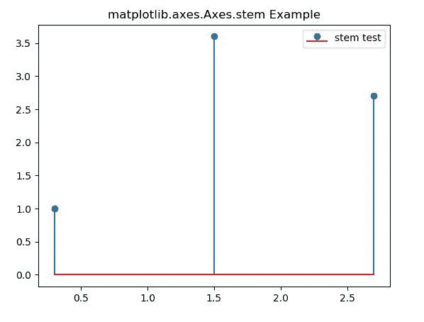

# Python 中的 Matplotlib.axes.Axes.stem()

> 原文:[https://www . geeksforgeeks . org/matplotlib-axes-axes-stem-in-python/](https://www.geeksforgeeks.org/matplotlib-axes-axes-stem-in-python/)

**[Matplotlib](https://www.geeksforgeeks.org/python-introduction-matplotlib/)** 是 Python 中的一个库，是 NumPy 库的数值-数学扩展。**轴类**包含了大部分的图形元素:轴、刻度、线二维、文本、多边形等。，并设置坐标系。Axes 的实例通过回调属性支持回调。

## matplotlib.axes.Axes.stem()函数

matplotlib 库的 Axes 模块中的 **Axes.stem()函数**用于创建 stem 图。

> **语法:** Axes.stem(self，*args，linefmt=None，markerfmt=None，basefmt=None，bottom=0，label=None，use_line_collection=False，data=None)
> 
> **参数:**该方法接受以下描述的参数:
> 
> *   **x:** 这个参数是茎的 x 坐标序列。
> *   **y:** 该参数是茎头的 y 坐标序列。
> *   **linefmt:** 此参数是定义垂直线属性的字符串。
> *   **标记符:**该参数是定义茎头标记符属性的字符串。
> *   **basefmt:** 此参数是定义基线属性的字符串。
> *   **底部:**此参数为基线的 y 位置。
> *   **标签:**此参数是图例中用于茎的标签。
> 
> **返回:**这将返回以下内容:
> 
> *   **StemContainer:** 这将返回可能被视为元组的容器(标记线、stemlines、基线)。

下面的例子说明了 matplotlib.axes . axes . break _ barh()函数在 matplotlib . axes 中的作用:

**示例-1:**

```py
# Implementation of matplotlib function
import matplotlib.pyplot as plt

fig, ax = plt.subplots()

ax.stem([0.3, 1.5, 2.7], 
        [1, 3.6, 2.7], 
        label ="stem test")

ax.legend()
ax.set_title('matplotlib.axes.Axes.stem Example')
plt.show()
```

**输出:**

**例-2:**

```py
# Implementation of matplotlib function
import matplotlib.pyplot as plt
import numpy as np

x = np.linspace(0.1, 2 * np.pi, 41)
y = np.exp(np.sin(x))

fig, ax = plt.subplots()

ax.stem(x, y, linefmt ='grey', 
        markerfmt ='D', 
        bottom = 1.1, 
        use_line_collection = True)

ax.set_title('matplotlib.axes.Axes.stem Example')
plt.show()
```

