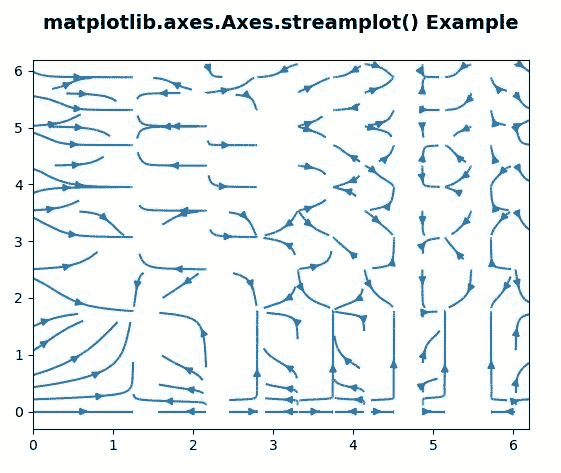
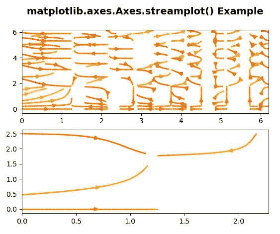

# matplotlib . axes . stream plot()用 Python

表示

> 哎哎哎:# t0]https://www . geeksforgeeks . org/matplot lib-axes-stream plot-in-python/

**[Matplotlib](https://www.geeksforgeeks.org/python-introduction-matplotlib/)** 是 Python 中的一个库，是 NumPy 库的数值-数学扩展。**轴类**包含了大部分的图形元素:轴、刻度、线二维、文本、多边形等。，并设置坐标系。Axes 的实例通过回调属性支持回调。

## matplotlib . axes . axes . stream plot()函数

matplotlib 库的 Axes 模块中的 **Axes.streamplot()函数**也用于绘制矢量流的流线..

> **语法:** Axes.streamplot(axes，x，y，u，v，density=1，linewidth=None，color=None，cmap=None，norm=None，arrowsize=1，arrowstyle='-| >'，minlength=0.1，transform=None，zorder=None，start_points=None，maxlength=4.0，integration_direction='both '，*，data=None)
> 
> **参数:**该方法接受以下描述的参数:
> 
> *   **X，Y :** 这些参数是等间距网格的 X 和 Y 坐标。
> *   **U，V:** 此参数为行和列的数量必须与 y 和 x 的长度相匹配。
> *   **密度:**此参数用于控制流线的紧密度。
> *   **线宽:**该参数为流线的宽度。
> *   **颜色:**该参数为流线颜色。
> *   **cmap :** 此参数用于绘制流线和箭头。
> *   **范数:**此参数用于将用于缩放亮度数据的对象归一化为 0，1。
> *   **箭头尺寸:**该参数是箭头尺寸的比例因子。
> *   **最小长度:**此参数是轴坐标中流线的最小长度..
> *   **最大长度:**此参数是轴坐标中流线的最大长度。
> *   **zorder :** 该参数是流线和箭头的 zorder。
> 
> **返回:**该方法返回以下内容:
> 
> *   **stream_container :** 这将返回带有属性的 **StreamplotSet**
>     容器对象

下面的例子说明了 matplotlib.axes . axes . stream plot()函数在 matplotlib . axes 中的作用:

**例 1:**

```
# Implementation of matplotlib function
import matplotlib.pyplot as plt
import numpy as np

X, Y = np.meshgrid(np.arange(0, 2 * np.pi, .2),
                   np.arange(0, 2 * np.pi, .2))
U = np.cos(X**2)
V = np.sin(Y**2)

fig, ax = plt.subplots()
ax.streamplot(X, Y, U, V, density =[0.5, 1])

ax.set_title('matplotlib.axes.Axes.streamplot()\
 Example\n', fontsize = 14, fontweight ='bold')
plt.show()
```

**输出:**


**例 2:**

```
# Implementation of matplotlib function

import matplotlib.pyplot as plt
import numpy as np

X, Y = np.meshgrid(np.arange(0, 2 * np.pi, .2),
                   np.arange(0, 2 * np.pi, .2))
U = np.cos(X**2)
V = np.sin(Y**2)

fig, (ax, ax1)= plt.subplots(nrows = 2, ncols = 1)
ax.streamplot(X, Y, U, V, density =[0.5, 1],
             color = V * U, linewidth = 2,
             cmap ='autumn')
val = np.array([[2, 1, 0, 1, 2, 1],
                [2, 1,  0, 1, 2, 2]])

ax1.streamplot(X, Y, U, V, color = V * U, linewidth = 2,
               cmap ='autumn', 
               start_points = val.T)

ax.set_title('matplotlib.axes.Axes.streamplot() \
Example\n', fontsize = 14, fontweight ='bold')
plt.show()
```

**输出:**
