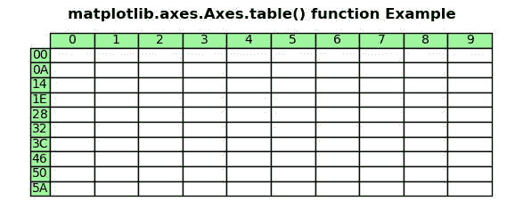
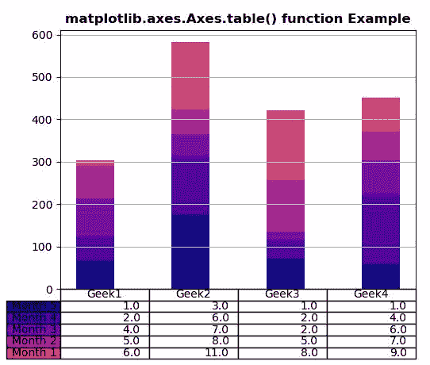

# Python 中的 Matplotlib.axes.Axes.table()

> 原文:[https://www . geeksforgeeks . org/matplotlib-axes-axes-table-in-python/](https://www.geeksforgeeks.org/matplotlib-axes-axes-table-in-python/)

**[Matplotlib](https://www.geeksforgeeks.org/python-introduction-matplotlib/)** 是 Python 中的一个库，是 NumPy 库的数值-数学扩展。**轴类**包含了大部分的图形元素:轴、刻度、线二维、文本、多边形等。，并设置坐标系。Axes 的实例通过回调属性支持回调。

## matplotlib.axes.Axes.table()函数

matplotlib 库的 axes 模块中的 **Axes.table()函数**也用于向 Axes 添加表格。

> **语法:** Axes.table(ax，cellText=None，cellColours = None，cellLoc='right '，colWidths = None，rowLabels=None，rowColours = None，rowLoc='left '，colLabels=None，colColours = None，colLoc = ' center '，loc='bottom '，bbox=None，edges='closed '，**kwargs)
> 
> **参数:**该方法接受以下描述的参数:
> 
> *   **单元格文本:**此参数包含要放入表格单元格的文本。
> *   **单元格颜色:**该参数是单元格的背景颜色。
> *   **cellLoc :** 此参数是单元格内文本的对齐方式。
> *   **列宽:**此参数是以轴为单位的列宽。
> *   **行标签:**此参数是行标题单元格的文本。
> *   **行颜色:**此参数是行标题单元格的颜色。
> *   **rowLoc :** 此参数是行标题单元格的文本对齐方式。
> *   **colLabels :** 此参数为列标题单元格的文本。
> *   **colcolors:**此参数是列标题单元格的颜色。
> *   **Coloc:**此参数是列
>     标题单元格的文本对齐方式。
> *   **Loc :** 该参数是细胞相对于 ax 的位置。
> *   **bbox :** 这个参数是绘制表格的边界框。
> *   **边:**此参数是要用线绘制的单元格边。
> 
> **返回:**这将返回以下内容:
> 
> *   **表:**此方法返回创建的表。

下面的例子说明了 matplotlib.axes.Axes.table()函数在 matplotlib.axes 中的作用:

**例 1:**

```py
# Implementation of matplotlib function
import matplotlib.pyplot as plt

val1 = ["{:X}".format(i) for i in range(10)]
val2 = ["{:02X}".format(10 * i) for i in range(10)]
val3 = [["" for c in range(10)] for r in range(10)]

fig, ax = plt.subplots()
ax.set_axis_off()
table = ax.table(
    cellText = val3, 
    rowLabels = val2, 
    colLabels = val1,
    rowColours =["palegreen"] * 10, 
    colColours =["palegreen"] * 10,
    cellLoc ='center', 
    loc ='upper left')        

ax.set_title('matplotlib.axes.Axes.table() function Example',
             fontweight ="bold")

plt.show()
```

**输出:**


**例 2:**

```py
# Implementation of matplotlib function
import numpy as np
import matplotlib.pyplot as plt

data = [[ 66, 174,  71, 58],
        [ 58, 139,  45, 164],
        [ 89,  52, 18, 81],
        [ 78,  58, 123,  68],
        [13, 159, 164, 80]]

val1 = ('Geek1', 'Geek2', 'Geek3', 'Geek4')
val2 = ['Month % d' % x for x in (5, 4, 3, 2, 1)]
val3 = np.arange(0, 2500, 500)
val4 = 1000
val5 = plt.cm.plasma(np.linspace(0, 0.5, len(val2)))
val6 = len(data)
val7 = np.arange(len(val1)) + 0.3
val8 = 0.4
val9 = np.zeros(len(val1))

lista = []

fig, ax = plt.subplots()

for row in range(val6):

    ax.bar(val7, data[row], val8, bottom = val9,
           color = val5[row])
    val9 = val9 + data[row]

    lista.append([(x // 50) for x in val9])

the_table = ax.table(cellText = lista,
                      rowLabels = val2,
                      rowColours = val5,
                      colLabels = val1,
                      loc ='bottom')

plt.subplots_adjust(left = 0.2, bottom = 0.2)

ax.set_xticks([])

ax.set_title('matplotlib.axes.Axes.table() function Example',
              fontweight ="bold")

plt.grid()
plt.show()
```

**输出:**
