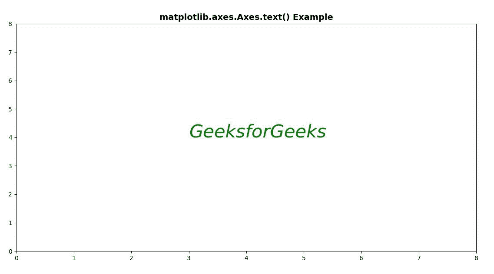
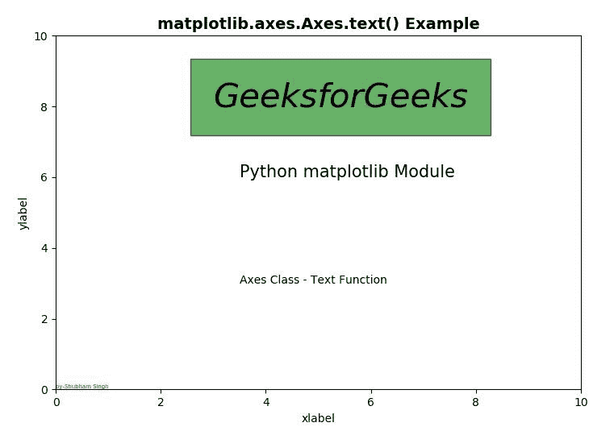

# Python 中的 Matplotlib.axes.Axes.text()

> 原文:[https://www . geeksforgeeks . org/matplotlib-axes-axes-text-in-python/](https://www.geeksforgeeks.org/matplotlib-axes-axes-text-in-python/)

**[Matplotlib](https://www.geeksforgeeks.org/python-introduction-matplotlib/)** 是 Python 中的一个库，是 NumPy 库的数值-数学扩展。**轴类**包含了大部分的图形元素:轴、刻度、线二维、文本、多边形等。，并设置坐标系。Axes 的实例通过回调属性支持回调。

## matplotlib.axes.Axes.text()函数

matplotlib 库的 Axes 模块中的 **Axes.text()函数**也用于将文本 s 添加到数据坐标中 x，y 位置的轴上。

> **语法:**
> 
> ```py
> Axes.text(self, x, y, s, fontdict=None, withdash=, **kwargs)
> 
> ```
> 
> **参数:**该方法接受以下描述的参数:
> 
> *   **s:** 此参数是要添加的文本。
> *   **xy:** 此参数是放置文本的点(x，y)。
> *   **fontdict:** 该参数是可选参数，也是覆盖默认文本属性的字典。
> *   **带灰:**该参数也是可选参数，创建带灰的文本实例，而不是文本实例。
> 
> **返回:**该方法返回**文本**，这是一个创建的文本实例..

下面的例子说明了 matplotlib.axes.Axes.text()函数在 matplotlib.axes 中的作用:

**示例-1:**

```py
# Implementation of matplotlib function
import matplotlib.pyplot as plt

fig, ax = plt.subplots()
ax.text(3, 4, 'GeeksforGeeks', style ='italic',
        fontsize = 30, color ="green")

ax.set(xlim =(0, 8), ylim =(0, 8))
ax.set_title('matplotlib.axes.Axes.text() Example',
             fontsize = 14, fontweight ='bold')

plt.show()
```

**输出:**


**示例-2:**

```py
# Implementation of matplotlib function
import matplotlib.pyplot as plt

fig, ax = plt.subplots()
ax.set_xlabel('xlabel')
ax.set_ylabel('ylabel')

ax.text(3, 8, 'GeeksforGeeks',
        style ='italic',
        fontsize = 30,
        bbox ={'facecolor':'green',
               'alpha':0.6, 'pad':20})

ax.text(3.5, 6, 'Python matplotlib Module',
        fontsize = 15)

ax.text(3.5, 3, 'Axes Class - Text Function')

ax.text(0, 0, 'by-Shubham Singh',
        verticalalignment ='bottom',
        horizontalalignment ='left',
        transform = ax.transAxes,
        color ='green', fontsize = 5)

ax.set(xlim =(0, 10), ylim =(0, 10))
ax.set_title('matplotlib.axes.Axes.text() Example',
              fontsize = 14, fontweight ='bold')
plt.show()
```

**输出:**
