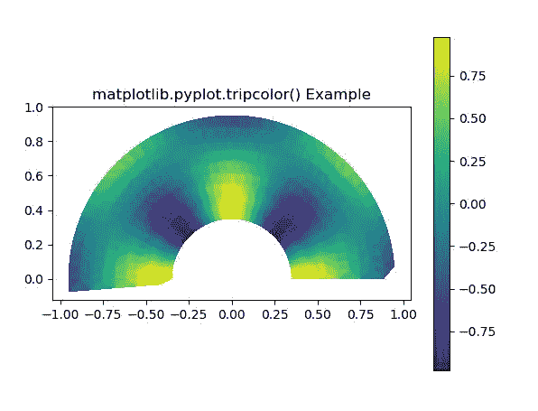
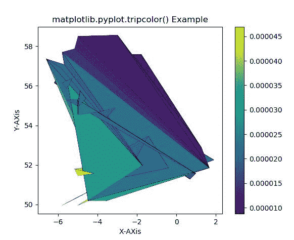

# matplot lib . axes . axes . tripcolor()用 Python

表示

> 哎哎哎:# t0]https://www . geeksforgeeks . org/matplot lib-axes-tricolor-in-python/

**[Matplotlib](https://www.geeksforgeeks.org/python-introduction-matplotlib/)** 是 Python 中的一个库，是 NumPy 库的数值-数学扩展。**轴类**包含了大部分的图形元素:轴、刻度、线二维、文本、多边形等。，并设置坐标系。Axes 的实例通过回调属性支持回调。

## matplotlib.axes.Axes.tripcolor()函数

matplotlib 库的 Axes 模块中的 **Axes.tripcolor()函数**也用于创建非结构化三角形网格的伪彩色图。

> **语法:**
> 
> > Axes.tripcolor(ax，*args，alpha=1.0，norm=None，cmap=None，vmin=None，vmax=None，底纹='flat '，facecolors=None，**kwargs)
> 
> **参数:**该方法接受以下描述的参数:
> 
> *   **x，y:** 这些参数是要绘制的数据的 x 和 y 坐标。
> *   **三角测量:**该参数是一个**三角测量**对象。
> *   ****kwargs:** This parameter is *Text* properties that is used to control the appearance of the labels.
>     
>     所有剩余的参数和 kwargs 与 matplotlib.pyplot.plot()相同。
>     
>     
> 
> **返回:**返回包含以下内容的 2 **行 2D** 列表:
> 
> *   为三角形边缘绘制的线。
> *   为三角形节点绘制的标记

下面的例子说明了 matplotlib.axes.Axes.tripcolor()函数在 matplotlib.axes 中的作用:

**示例-1:**

```
# Implementation of matplotlib function
import matplotlib.pyplot as plt
import matplotlib.tri as tri
import numpy as np

ang = 40
rad = 10
radm = 0.35
radii = np.linspace(radm, 0.95, rad)

angles = np.linspace(0, np.pi, ang)
angles = np.repeat(angles[..., np.newaxis],
                   rad, axis = 1)

angles[:, 1::2] += np.pi / ang

x = (radii * np.cos(angles)).flatten()
y = (radii * np.sin(angles)).flatten()
z = (np.sin(4 * radii) * np.cos(4 * angles)).flatten()

triang = tri.Triangulation(x, y)
triang.set_mask(np.hypot(x[triang.triangles].mean(axis = 1),
                         y[triang.triangles].mean(axis = 1))
                < radm)

fig1, ax1 = plt.subplots()
ax1.set_aspect('equal')
tpc = ax1.tripcolor(triang, z,
                    shading ='flat')

fig1.colorbar(tpc)
ax1.set_title('matplotlib.pyplot.tripcolor() Example')
plt.show()
```

**输出:**


**示例-2:**

```
# Implementation of matplotlib function
import matplotlib.pyplot as plt
import matplotlib.tri as tri
import numpy as np

xy = np.asarray([
    [-0.101, 0.872], [-0.080, 0.883],
    [-0.069, 0.888], [-0.054, 0.890],
    [-0.097, 0.975], [-0.092, 0.984], 
    [-0.101, 0.980], [-0.108, 0.980],
    [-0.104, 0.987], [-0.102, 0.993],
    [-0.115, 1.001], [-0.099, 0.996],
    [-0.057, 0.881], [-0.062, 0.876],
    [-0.078, 0.876], [-0.087, 0.872],
    [-0.030, 0.907], [-0.007, 0.905], 
    [-0.057, 0.916], [-0.025, 0.933],
    [-0.045, 0.897], [-0.057, 0.895], 
    [-0.073, 0.900], [-0.087, 0.898],
    [-0.090, 0.904], [-0.069, 0.907], 
    [-0.069, 0.921], [-0.080, 0.919],
    [-0.073, 0.928], [-0.052, 0.930], 
    [-0.048, 0.942], [-0.062, 0.949],
    [-0.054, 0.958], [-0.069, 0.954], 
    [-0.087, 0.952], [-0.087, 0.959],
    [-0.080, 0.966], [-0.085, 0.973],
    [-0.087, 0.965], [-0.097, 0.965],
    [-0.097, 0.975], [-0.092, 0.984],
    [-0.101, 0.980], [-0.108, 0.980],
    [-0.104, 0.987], [-0.102, 0.993],
    [-0.115, 1.001], [-0.099, 0.996],
    [-0.101, 1.007], [-0.090, 1.010],
    [-0.087, 1.021], [-0.069, 1.021],
    [-0.052, 1.022], [-0.052, 1.017],
    [-0.069, 1.010], [-0.064, 1.005],
    [-0.048, 1.005], [-0.031, 1.005], 
    [-0.031, 0.996], [-0.040, 0.987],
    [-0.045, 0.980], [-0.052, 0.975], 
    [-0.040, 0.973], [-0.026, 0.968],
    [-0.020, 0.954], [-0.006, 0.947],
    [ 0.003, 0.935], [ 0.006, 0.926],
    [ 0.005, 0.921], [ 0.022, 0.923], 
    [ 0.033, 0.912], [ 0.029, 0.905],
    [ 0.017, 0.900], [ 0.012, 0.895],
    [ 0.027, 0.893], [ 0.019, 0.886],
    [ 0.001, 0.883], [-0.012, 0.884],
    [-0.029, 0.883], [-0.038, 0.879],
    [-0.073, 0.928], [-0.052, 0.930], 
    [-0.048, 0.942], [-0.062, 0.949],
    [-0.054, 0.958], [-0.069, 0.954],
    [-0.087, 0.952], [-0.087, 0.959],
    [-0.080, 0.966], [-0.085, 0.973],
    [-0.087, 0.965], [-0.097, 0.965],
    [-0.077, 0.990], [-0.059, 0.993]])
x, y = np.rad2deg(xy).T

triangles = np.asarray([
    [60, 59, 57], [ 2, 64,  3],
    [ 3, 63,  4], [ 0, 67,  1], 
    [62,  4, 63], [57, 59, 56], 
    [59, 58, 56], [61, 60, 69], 
    [57, 69, 60], [ 4, 62, 68],
    [67, 66,  1], [65,  2, 66], 
    [ 1, 66,  2], [64,  2, 65],
    [63,  3, 64], [ 6,  5,  9],
    [61, 68, 62], [69, 68, 61],
    [ 9,  5, 70], [ 6,  8,  7],
    [21, 24, 22], [17, 16, 45],
    [20, 17, 45], [21, 25, 24],
    [27, 26, 28], [20, 72, 21], 
    [25, 21, 72], [45, 72, 20],
    [25, 28, 26], [44, 73, 45],
    [72, 45, 73], [28, 25, 29], 
    [29, 25, 31], [43, 73, 44],
    [73, 43, 40], [72, 73, 39],
    [72, 31, 25], [42, 40, 43],
    [31, 30, 29], [39, 73, 40],
    [ 4, 70,  5], [ 8,  6,  9],
    [56, 69, 57], [69, 56, 52],
    [70, 10,  9], [54, 53, 55],
    [56, 55, 53], [68, 70,  4],
    [52, 56, 53], [11, 10, 12],
    [69, 71, 68], [68, 13, 70],
    [10, 70, 13], [51, 50, 52],
    [13, 68, 71], [52, 71, 69], 
    [12, 10, 13], [71, 52, 50],
    [71, 14, 13], [50, 49, 71],
    [49, 48, 71], [14, 16, 15], 
    [14, 71, 48], [17, 19, 18],
    [17, 20, 19], [48, 16, 14], 
    [48, 47, 16], [47, 46, 16],
    [16, 46, 45], [23, 22, 24],
    [42, 41, 40], [72, 33, 31],
    [32, 31, 33], [39, 38, 72],
    [33, 72, 38], [33, 38, 34], 
    [37, 35, 38], [34, 38, 35],
    [35, 37, 36]])

xmid = x[triangles].mean(axis = 1)
ymid = y[triangles].mean(axis = 1)
x0 = -15
y0 = 12
zfaces = np.exp(-0.2 * ((xmid - x0) + (ymid - y0) ))

fig3, ax3 = plt.subplots()
ax3.set_aspect('equal')
tpc = ax3.tripcolor(x, y, triangles, facecolors = zfaces, 
                    edgecolors ='k')
fig3.colorbar(tpc)
ax3.set_title('matplotlib.pyplot.tripcolor() Example')
ax3.set_xlabel('X-AXis')
ax3.set_ylabel('Y-AXis')

plt.show()
```

**输出:**
