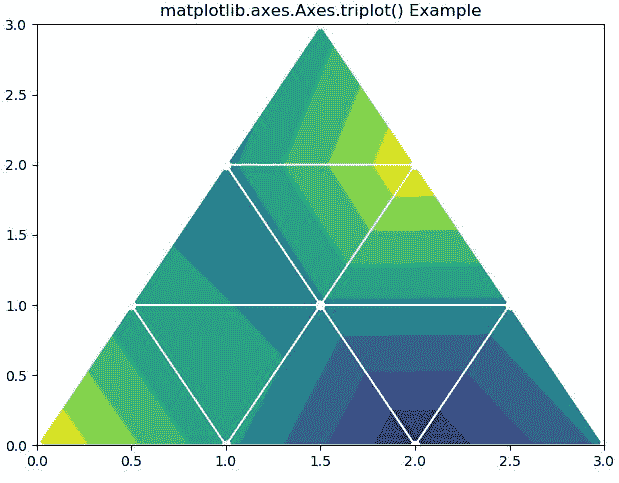
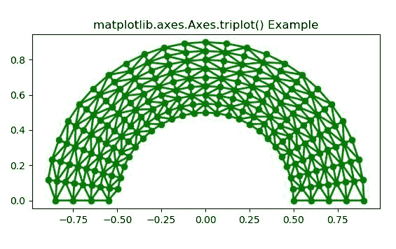

# python 中的 Matplotlib.axes.Axes.triplot()

> 哎哎哎:# t0]https://www . geeksforgeeks . org/matplot lib-axes-trilot-in-python/

**[Matplotlib](https://www.geeksforgeeks.org/python-introduction-matplotlib/)** 是 Python 中的一个库，是 NumPy 库的数值-数学扩展。**轴类**包含了大部分的图形元素:轴、刻度、线二维、文本、多边形等。，并设置坐标系。Axes 的实例通过回调属性支持回调。

## matplotlib.axes.Axes.triplot()函数

matplotlib 库的 Axes 模块中的 **Axes.triplot()函数**也用于创建非结构化的三角形网格作为线和/或标记。

> **语法:**
> 
> ```
> Axes.triplot(ax, *args, **kwargs)
> ```
> 
> **参数:**该方法接受以下描述的参数:
> 
> *   **x，y:** 这些参数是要绘制的数据的 x 和 y 坐标。
> *   **三角测量:**该参数是一个**三角测量**对象。
> *   ****kwargs:** This parameter is *Text* properties that is used to control the appearance of the labels.
>     
>     所有剩余的参数和 kwargs 与 matplotlib.pyplot.plot()相同。
>     
>     
> 
> **返回:**返回包含以下内容的 2 **行 2D** 列表:
> 
> *   为三角形边缘绘制的线。
> *   为三角形节点绘制的标记

下面的例子说明了 matplotlib.axes.Axes.triplot()函数在 matplotlib.axes 中的作用:

**示例-1:**

```
# Implementation of matplotlib function
import matplotlib.pyplot as plt
import matplotlib.tri as mtri
import numpy as np

# Create triangulation.
x = np.asarray([0, 1, 2, 3, 0.5, 1.5, 2.5, 1, 2, 1.5])
y = np.asarray([0, 0, 0, 0, 1.0, 1.0, 1.0, 2, 2, 3.0])
triangles = [[0, 1, 4], [1, 5, 4], [2, 6, 5], [4, 5, 7],
             [5, 6, 8], [5, 8, 7], [7, 8, 9], [1, 2, 5],
             [2, 3, 6]]

triang = mtri.Triangulation(x, y, triangles)
z = np.cos(1.5 * x) * np.cos(1.5 * y)

fig, axs = plt.subplots()
axs.tricontourf(triang, z)
axs.triplot(triang, 'go-', color ='white')
fig.tight_layout()

axs.set_title('matplotlib.axes.Axes.triplot() Example')
plt.show()
```

**输出:**


**示例-2:**

```
# Implementation of matplotlib function
import matplotlib.pyplot as plt
import matplotlib.tri as tri
import numpy as np

n_angles = 24
n_radii = 9
min_radius = 0.5
radii = np.linspace(min_radius, 0.9, n_radii)

angles = np.linspace(0, np.pi, n_angles, endpoint = False)
angles = np.repeat(angles[..., np.newaxis], n_radii, axis = 1)
angles[:, 1::2] += np.pi / n_angles

x = (radii * np.cos(angles)).flatten()
y = (radii * np.sin(angles)).flatten()
triang = tri.Triangulation(x, y)

triang.set_mask(np.hypot(x[triang.triangles].mean(axis = 1),
                         y[triang.triangles].mean(axis = 1))
                < min_radius)

fig1, ax1 = plt.subplots()
ax1.set_aspect('equal')
ax1.triplot(triang, 'go-', lw = 2)
ax1.set_title('matplotlib.axes.Axes.triplot() Example')
plt.show()
```

**输出:**
