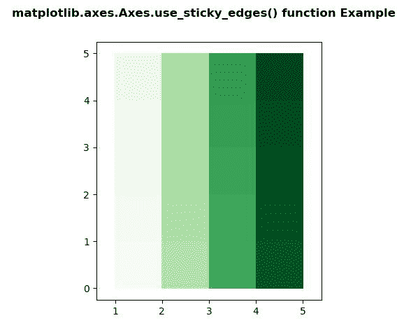
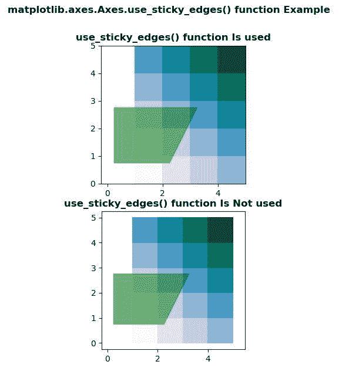

# Python 中的 matplotlib . axes . axes . use _ sticky _ edges()

> 原文:[https://www . geeksforgeeks . org/matplotlib-axes-axes-use _ sticky _ edges-in-python/](https://www.geeksforgeeks.org/matplotlib-axes-axes-use_sticky_edges-in-python/)

**[Matplotlib](https://www.geeksforgeeks.org/python-introduction-matplotlib/)** 是 Python 中的一个库，是 NumPy 库的数值-数学扩展。**轴类**包含了大部分的图形元素:轴、刻度、线二维、文本、多边形等。，并设置坐标系。Axes 的实例通过回调属性支持回调。

## matplotlib . axes . axes . use _ sticky _ edges()函数

matplotlib 库的 Axes 模块中的 **Axes.use_sticky_edges()函数**用于判断是否服从所有的 Artist.sticky_edges。

**语法:**

```
Axes.use_sticky_edges

```

下面的例子说明了 matplotlib.axes . axes . use _ sticky _ edges()函数在 matplotlib . axes 中的作用:

**例 1:**

```
# Implementation of matplotlib function  
import numpy as np
import matplotlib.pyplot as plt

y, x = np.mgrid[:6, 1:6]
poly_coords = [
    (0.25, 2.75), (3.25, 2.75),
    (2.25, 0.75), (0.25, 0.75)
]
fig, ax = plt.subplots()

ax.use_sticky_edges = False

ax.pcolor(x, y, y + 20 * x, cmap ='Greens')

ax.margins(x = 0.1, y = 0.05)
ax.set_aspect('equal')

fig.suptitle('matplotlib.axes.Axes.use_sticky_edges() \
function Example\n', fontweight ="bold")
fig.canvas.draw()
plt.show()
```

**输出:**


**例 2:**

```
# Implementation of matplotlib function  
import numpy as np
import matplotlib.pyplot as plt

y, x = np.mgrid[:6, 1:6]
poly_coords = [
    (0.25, 2.75), (3.25, 2.75),
    (2.25, 0.75), (0.25, 0.75)
]
fig, (ax1, ax2) = plt.subplots(nrows = 2)

ax2.use_sticky_edges = False

for ax, status in zip((ax1, ax2), 
                      ('Is', 'Is Not')):

    # sticky
    cells = ax.pcolor(x, y, x + y, 
                      cmap ='PuBuGn')
    ax.add_patch(
        plt.Polygon(poly_coords, color ='green',
                    alpha = 0.5)
    )  # not sticky
    ax.margins(x = 0.1, y = 0.05)
    ax.set_aspect('equal')
    ax.set_title('use_sticky_edges() function {} used'.format(status), 
                 fontweight ="bold")

fig.suptitle('matplotlib.axes.Axes.use_sticky_edges() function \
Example\n', fontweight ="bold")
fig.canvas.draw()
plt.show()
```

**输出:**
