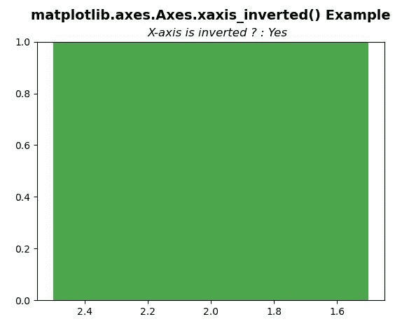
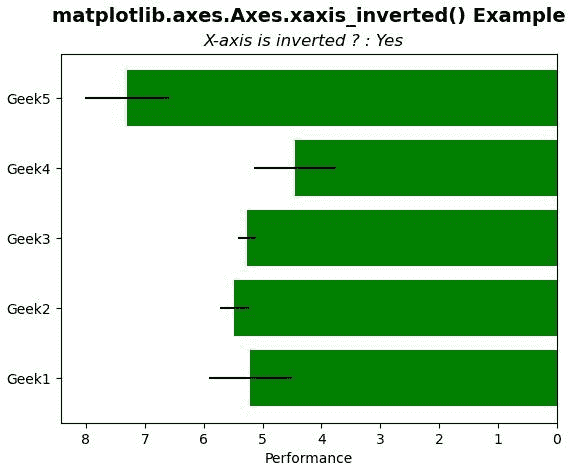

# Python 中的 matplotlib . axes . axes . xaxis _ inverted()

> 原文:[https://www . geeksforgeeks . org/matplotlib-axes-axes-xaxis _ inverted-in-python/](https://www.geeksforgeeks.org/matplotlib-axes-axes-xaxis_inverted-in-python/)

**[Matplotlib](https://www.geeksforgeeks.org/python-introduction-matplotlib/)** 是 Python 中的一个库，是 NumPy 库的数值-数学扩展。**轴类**包含了大部分的图形元素:轴、刻度、线二维、文本、多边形等。，并设置坐标系。Axes 的实例通过回调属性支持回调。

## matplotlib . axes . axes . xaxis _ inverted()函数

matplotlib 库的 Axes 模块中的**axis . xaxis _ inverted()函数**返回 x 轴是否反转。

> **语法:**axis . xaxis _ inverted(self)
> 
> **参数:**该方法不接受任何参数。
> 
> **返回:**该方法返回 x 轴是否反转。

下面的例子说明了 matplotlib.axes . axes . xaxis _ inverted()函数在 matplotlib . axes 中的作用:

**例 1:**

```py
# Implementation of matplotlib function
import matplotlib.pyplot as plt
import numpy as np

fig, ax = plt.subplots()

ax.axvspan(1.5, 2.5, facecolor ='g', alpha = 0.7)
ax.invert_xaxis()

ax.set_title('matplotlib.axes.Axes.xaxis_inverted()\
 Example\n',
             fontsize = 14, fontweight ='bold')
x = ax.xaxis_inverted()
ans ="No"
if x:
    ans ="Yes"
ax.text(2.2, 1.02, "X-axis is inverted ? : " + ans,
        style ='italic', fontsize = 12)

plt.show()
```

**输出:**


**例 2:**

```py
# Implementation of matplotlib function
import matplotlib.pyplot as plt
import numpy as np

np.random.seed(19680801)
plt.rcdefaults()
fig, ax = plt.subplots()

people = ('Geek1', 'Geek2', 'Geek3',
          'Geek4', 'Geek5')
y_pos = np.arange(len(people))
performance = 3 + 4.5 * np.random.rand(len(people))**2
error = np.random.rand(len(people))

ax.barh(y_pos, performance, xerr = error, 
        align ='center', color ="green")
ax.set_yticks(y_pos)
ax.set_yticklabels(people)

ax.invert_xaxis()  
ax.set_xlabel('Performance')
x = ax.xaxis_inverted()
ans ="No"
if x:
    ans ="Yes"

ax.set_title('matplotlib.axes.Axes.xaxis_inverted()\
Example\n',
             fontsize = 14, fontweight ='bold')
ax.text(6, 4.75, "X-axis is inverted ? : " + ans, 
        style ='italic', fontsize = 12)

plt.show()
```

**输出:**
