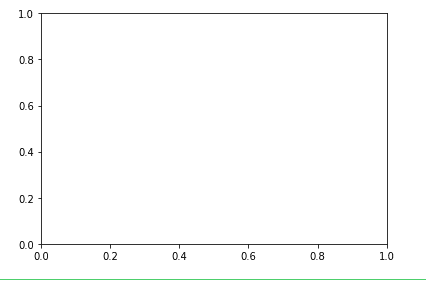
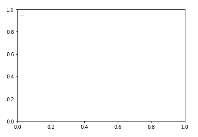
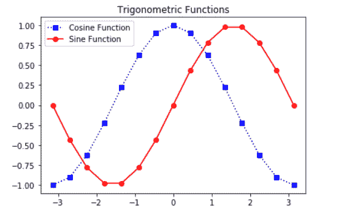

# matplot lib–axis class

> 哎哎哎:# t0]https://www . geeksforgeeks . org/matplot lib-axes-class/

**[Matplotlib](https://www.geeksforgeeks.org/python-matplotlib-an-overview/)** 是用于数据可视化的 Python 包之一。您可以使用 [NumPy](https://www.geeksforgeeks.org/python-numpy/) 库将数据转换为 Python 的数组和数值数学扩展。Matplotlib 库用于从数组中的数据制作 2D 图。

## 轴类

**轴**是创建子地块最基本、最灵活的单元。轴允许将图放置在图形中的任何位置。给定的图形可以包含许多轴，但是给定的 axes 对象只能在一个图形中。轴包含两个 2D 轴对象，以及三维情况下的三轴对象。让我们看看这个类的一些基本函数。

### axes()函数

**`axes()`** 函数使用参数创建 axes 对象，其中参数是 4 个元素的列表[左、底、宽、高]。现在让我们简单了解一下*斧()*的功能。

**语法:**

```py
axes([left, bottom, width, height])
```

**示例:**

```py
import matplotlib.pyplot as plt

fig = plt.figure()

#[left, bottom, width, height]
ax = plt.axes([0.1, 0.1, 0.8, 0.8]) 
```

**输出:**



这里在`axes([0.1, 0.1, 0.8, 0.8])`中，第一个*‘0.1’*是指图形窗口左侧轴与边框的距离为图形窗口总宽度的 10%。第二个*‘0.1’*是指底侧轴线与图窗边框的距离为图窗总高度的 10%。第一个*‘0.8’*表示从左到右的轴宽为 80%，后一个*‘0.8’*表示从下到上的轴高为 80%。

### add_axes()函数

或者，也可以通过调用 **`add_axes()`** 方法将轴对象添加到图形中。它返回 axes 对象，并在位置[左、底、宽、高]添加轴，所有量都是图形宽度和高度的分数。

**语法:**

```py
add_axes([left, bottom, width, height])
```

**示例:**

```py
import matplotlib.pyplot as plt

fig = plt.figure()

#[left, bottom, width, height]
ax = fig.add_axes([0, 0, 1, 1])
```

**输出:**


### ax.legend()函数

通过调用 axes 类的 **legend()** 函数，可以为图添加图例。它由三个论点组成。

**语法:**

```py
ax.legend(handles, labels, loc)
```

其中*标签*指的是一系列字符串，*处理*，一系列 Line2D 或 Patch 实例， *loc* 可以是指定图例位置的字符串或整数。

**示例:**

```py
import matplotlib.pyplot as plt

fig = plt.figure()

#[left, bottom, width, height]
ax = plt.axes([0.1, 0.1, 0.8, 0.8]) 

ax.legend(labels = ('label1', 'label2'), 
          loc = 'upper left')
```

**输出:**



### ax.plot()函数

`plot()`axes 类的函数将一个数组的值与另一个数组的值绘制成线或标记。

> **语法:** plt.plot(X，Y，' CLM ')
> 
> **参数:**
> X 为 X 轴。
> Y 为 Y 轴。
> “CLM”代表颜色、线条和标记。

**注意:**线可以是不同的样式，如虚线`(':')`、虚线`('—')`、实线`('-')`等等。

**标记代码**

| 特性 | 描述 |
| --- | --- |
| '.' | 点标记 |
| 的 | 圆形标记 |
| '+' | 加记号 |
| s | 正方形制造者 |
| d′ | 钻石标记 |
| ' h ' | 六边形标记 |

**示例:**以下示例显示了**正弦**和**余弦**函数的图形。

```py
import matplotlib.pyplot as plt
import numpy as np

X = np.linspace(-np.pi, np.pi, 15)
C = np.cos(X)
S = np.sin(X)

# [left, bottom, width, height]
ax = plt.axes([0.1, 0.1, 0.8, 0.8]) 

# 'bs:' mentions blue color, square 
# marker with dotted line.
ax1 = ax.plot(X, C, 'bs:') 

#'ro-' mentions red color, circle 
# marker with solid line.
ax2 = ax.plot(X, S, 'ro-') 

ax.legend(labels = ('Cosine Function', 
                    'Sine Function'), 
          loc = 'upper left')

ax.set_title("Trigonometric Functions")

plt.show()
```

**输出:**
