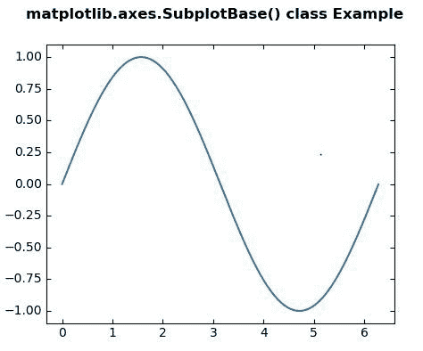
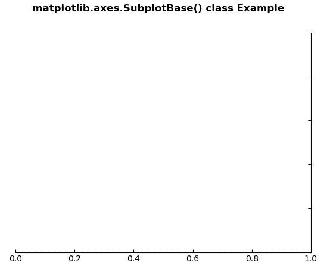

# Matplotlib.axes.SubplotBase()用 Python

表示

> 哎哎哎:# t0]https://www . geeksforgeeks . org/matplotlib-axes-subplot base-in-python/

**[Matplotlib](https://www.geeksforgeeks.org/python-introduction-matplotlib/)** 是 Python 中的一个库，是 NumPy 库的数值-数学扩展。**轴类**包含了大部分的图形元素:轴、刻度、线二维、文本、多边形等。，并设置坐标系。Axes 的实例通过回调属性支持回调。

## matplotlib.axes.SubplotBase()类

这是一个子类的基类，也就是 Axes 实例。它提供了各种新方法，用于在图形对象中生成和操作一组轴。
**注:**在子批次库中，**基地**为对象。

> **语法:**类 matplotlib.axes.SubplotBase(图、*args、**kwargs)
> 
> **参数:**这接受下面描述的以下参数:
> 
> *   **图:**该参数为**matplotlib . figure**。
> *   ***args:** 此参数包含值的元组(nrows、ncols、index)。换句话说，就是图中的子图数组有维度(nrows，ncols)，index 是正在创建的子图的索引。

以下示例说明了 matplotlib . axes . sublotbase()类在 matplotlib.axes:
**示例 1:**

```
# Implementation of matplotlib function
import matplotlib.pyplot as plt
from mpl_toolkits.axisartist.axislines import SubplotZero
import numpy as np

fig = plt.figure(figsize =(4, 3))

# Zero is the base
ax = SubplotZero(fig, 1, 1, 1)
fig.add_subplot(ax)

xx = np.arange(0, 2 * np.pi, 0.01)
ax.plot(xx, np.sin(xx))

fig.suptitle('matplotlib.axes.SubplotBase() class Example\n\n', 
             fontweight ="bold")

plt.show()
```

**输出:**


**例 2:**

```
# Implementation of matplotlib function
import matplotlib.pyplot as plt
from mpl_toolkits.axisartist.axislines import Subplot

fig = plt.figure()

ax = Subplot(fig, 111)
fig.add_subplot(ax)

ax.axis["left"].set_visible(False)
ax.axis["top"].set_visible(False)

fig.suptitle('matplotlib.axes.SubplotBase() class Example\n\n',
              fontweight ="bold")

plt.show()
```

**输出:**
