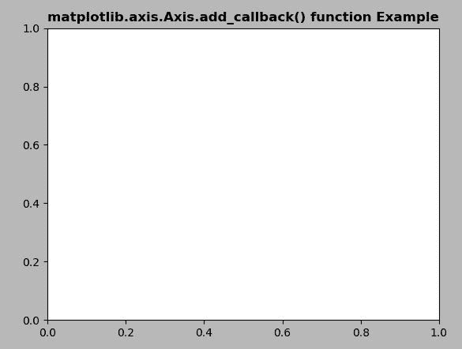

# Python 中的 matplotlib . axis . axis . add _ callback()

> 原文:[https://www . geesforgeks . org/matplotlib-axis-axis-add _ callback-in-python/](https://www.geeksforgeeks.org/matplotlib-axis-axis-add_callback-in-python/)

[**Matplotlib**](https://www.geeksforgeeks.org/python-introduction-matplotlib/) 是 Python 中的一个库，是 NumPy 库的数值-数学扩展。这是一个神奇的 Python 可视化库，用于 2D 数组图，并用于处理更广泛的 SciPy 堆栈。

## matplotlib . axis . axis . add _ 回调()函数

matplotlib 库的 Axis 模块中的 **Axis.add_callback()函数**用于添加一个回调函数，每当 Artist 的某个属性发生变化时都会调用该函数。

> **语法:** Artist.add_callback(self，func)
> 
> **参数:**该方法接受以下参数。
> 
> *   **功能:**该参数为回调函数。
> 
> **返回值:**该方法返回与回调相关联的观察者 id。

下面的例子说明了 matplotlib . axis . axis . add _ callback()函数在 matplotlib.axis:

**例 1:**

## 蟒蛇 3

```py
# Implementation of matplotlib function
from matplotlib.axis import Axis
import matplotlib.pyplot as plt 
import numpy as np 
import time 

def update():
    plt.get_current_fig_manager()\
    .canvas.figure.patch.\
    set_facecolor(str(np.random.random())) 
    plt.draw() 
    print("Draw at time :", time.time())

def start_animation():
    timer = fig.canvas.new_timer(interval = 200) 
    timer.add_callback(update) 
    timer.start() 

fig, ax = plt.subplots() 
start_animation() 

ax.set_title('matplotlib.axis.Axis.add_callback() \
function Example', fontweight ="bold")  

plt.show() 
```

**输出:**



**例 2:**

## 蟒蛇 3

```py
# Implementation of matplotlib function
from matplotlib.axis import Axis
from random import randint, choice  
import time  
import matplotlib.pyplot as plt  
import matplotlib.patches as mpatches  

back_color = "black"
colors = ['red', 'green', 'blue', 'purple']  
width, height = 4, 4

fig, ax = plt.subplots()  
ax.set(xlim =[0, width], ylim =[0, height])  

fig.canvas.draw()  

def update():  
    x = randint(0, width - 1)  
    y = randint(0, height - 1)  

    arti = mpatches.Rectangle(  
        (x, y), 1, 1,  
        facecolor = choice(colors),  
        edgecolor = back_color  
    )  
    ax.add_artist(arti) 

    ax.draw_artist(arti)  
    fig.canvas.blit(ax.bbox)  
    print("Draw at time :", time.time())  

timer = fig.canvas.new_timer(interval = 1)  
timer.add_callback(update)  
timer.start()  

ax.set_title('matplotlib.axis.Axis.add_callback() \
function Example', fontweight ="bold")  

plt.show() 
```

**输出:**

<video class="wp-video-shortcode" id="video-425191-1" width="665" height="374" preload="metadata" controls=""><source type="video/webm" src="https://media.geeksforgeeks.org/wp-content/cdn-uploads/20200605212619/python-matplotlib-on-callback-axis.webm?_=1">[https://media.geeksforgeeks.org/wp-content/cdn-uploads/20200605212619/python-matplotlib-on-callback-axis.webm](https://media.geeksforgeeks.org/wp-content/cdn-uploads/20200605212619/python-matplotlib-on-callback-axis.webm)</video>

```py
Draw at time : 1591263025.354224
Draw at time : 1591263025.4612164
Draw at time : 1591263025.6232233
Draw at time : 1591263025.748225
Draw at time : 1591263025.8842134
...... so on...

```