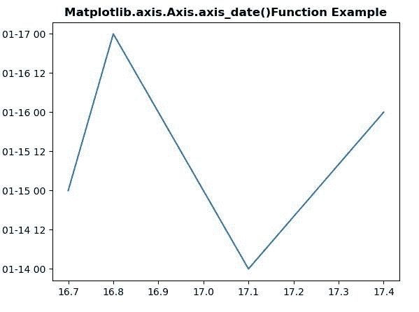
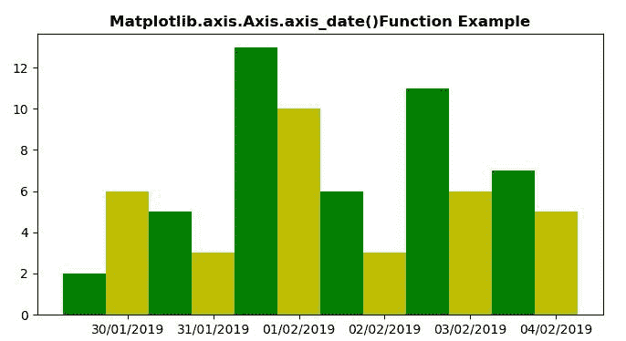

# Python 中的 Matplotlib.axis.Axis.axis_date()函数

> 原文:[https://www . geesforgeks . org/matplotlib-axis-axis-axis _ date-python 中的函数/](https://www.geeksforgeeks.org/matplotlib-axis-axis-axis_date-function-in-python/)

[**Matplotlib**](https://www.geeksforgeeks.org/python-introduction-matplotlib/) 是 Python 中的一个库，是 NumPy 库的数值-数学扩展。这是一个神奇的 Python 可视化库，用于 2D 数组图，并用于处理更广泛的 SciPy 堆栈。

## matplotlib.axis.Axis.axis_date()

matplotlib 库的 Axis 模块中的 **Axis.axis_date()函数**用于设置将沿该轴的数据视为日期的轴记号和标签。

> **语法:** Axis.axis_date(self，tz=None)
> 
> **参数:**该方法接受以下参数。
> 
> *   **tz :** 此参数是用于创建日期标签的时区。
> 
> **返回值:**此方法不返回值。

下面的例子说明了 matplotlib.axis.Axis.axis_date()函数在 matplotlib.axis 中的作用:

**例 1:**

## 蟒蛇 3

```
# Implementation of matplotlib function 
from matplotlib.axis import Axis
import datetime as dt
import matplotlib.pyplot as plt
from matplotlib.dates import DateFormatter, MinuteLocator

x = [16.7,16.8,17.1,17.4]
y = [15,17,14,16]
plt.plot(x, y)

plt.gca().yaxis.axis_date()

plt.title("Matplotlib.axis.Axis.axis_date()\
Function Example", fontsize = 12, fontweight ='bold')

plt.show()
```

**输出:**



**例 2:**

## 蟒蛇 3

```
# Implementation of matplotlib function 
from matplotlib.axis import Axis  
from datetime import datetime 
import matplotlib.pyplot as plt 
from matplotlib.dates import ( 
    DateFormatter, AutoDateLocator, AutoDateFormatter, datestr2num 
) 

days = [ 
    '30/01/2019', 
    '31/01/2019',  
    '01/02/2019', 
    '02/02/2019',  
    '03/02/2019',  
    '04/02/2019'
] 
data1 = [2, 5, 13, 6, 11, 7] 
data2 = [6, 3, 10, 3, 6, 5] 

z = datestr2num([ 
    datetime.strptime(day, '%d/%m/%Y').strftime('%m/%d/%Y') 
    for day in days 
]) 

r = 0.25

figure = plt.figure(figsize =(8, 4)) 
axes = figure.add_subplot(111) 

axes.bar(z - r, data1, width = 2 * r, 
         color ='g', align ='center', 
         tick_label = days)  
axes.bar(z + r, data2, width = 2 * r, 
         color ='y', align ='center',  
         tick_label = days) 

axes.xaxis.axis_date()

plt.title("Matplotlib.axis.Axis.axis_date()\
Function Example", fontsize = 12, fontweight ='bold') 

plt.show()
```

**输出:**

