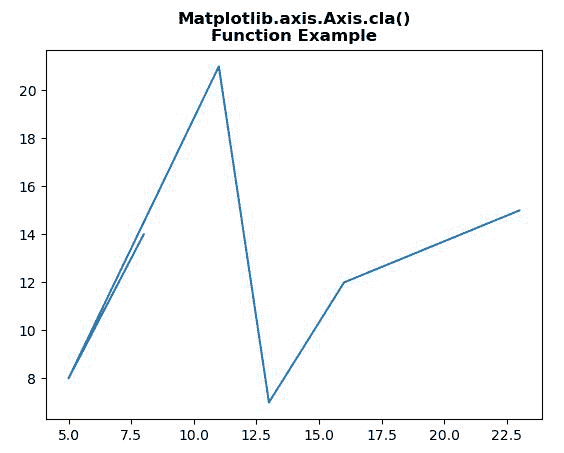
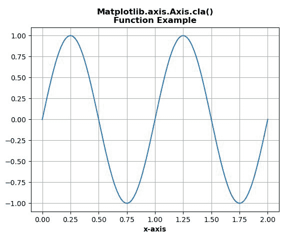

# Python 中的 Matplotlib.axis.Axis.cla()函数

> 原文:[https://www . geeksforgeeks . org/matplotlib-axis-axis-cla-function-in-python/](https://www.geeksforgeeks.org/matplotlib-axis-axis-cla-function-in-python/)

[**Matplotlib**](https://www.geeksforgeeks.org/python-introduction-matplotlib/) 是 Python 中的一个库，是 NumPy 库的数值-数学扩展。这是一个神奇的 Python 可视化库，用于 2D 数组图，并用于处理更广泛的 SciPy 堆栈。

## matplotlib.axis.Axis.cla()函数

matplotlib 库的轴模块中的 **Axis.cla()函数**用于清除该轴。

> **语法:** Axis.cla(self)
> 
> **参数:**该方法不接受任何参数。
> 
> **返回值:**此方法不返回值。

下面的例子说明了 matplotlib.axis.Axis.cla()函数在 matplotlib.axis 中的作用:

**例 1:**

## 蟒蛇 3

```py
# Implementation of matplotlib function
from matplotlib.axis import Axis 
from matplotlib.artist import Artist  
import matplotlib.pyplot as plt   

# providing values to x and y   
x = [8, 5, 11, 13, 16, 23]  
y = [14, 8, 21, 7, 12, 15]  

fig, ax = plt.subplots()  
ax.plot(x, y)
ax.set_xlabel("X-axis")
ax.set_ylabel("Y-axis")

Axis.cla(ax.xaxis)
Axis.cla(ax.yaxis)

plt.title("Matplotlib.axis.Axis.cla()\n\
Function Example", fontsize = 12, fontweight ='bold') 
plt.show()
```

**输出:**



**例 2:**

## 蟒蛇 3

```py
# Implementation of matplotlib function 
import numpy as np
from matplotlib.axis import Axis  
import matplotlib.pyplot as plt   

t = np.linspace(0.0, 2.0, 201) 
s = np.sin(2 * np.pi * t) 

fig, ax= plt.subplots()

ax.plot(t, s) 
ax.grid(True)
ax.set_ylabel('y-axis', fontweight ='bold') 
ax.set_xlabel('x-axis', fontweight ='bold') 

Axis.cla(ax.yaxis)

plt.title("Matplotlib.axis.Axis.cla()\n\
Function Example", fontsize = 12, fontweight ='bold') 
plt.show()
```

**输出:**

