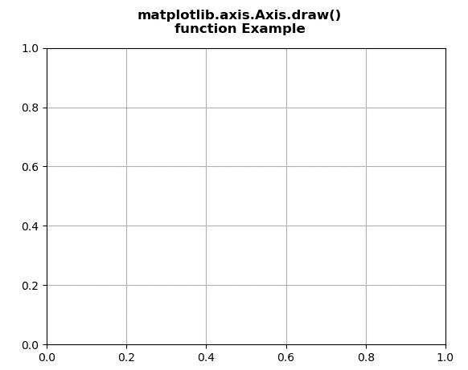
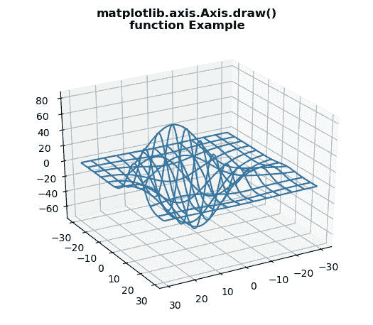

# Python 中的 Matplotlib.axis.Axis.draw()函数

> 原文:[https://www . geesforgeks . org/matplotlib-axis-axis-draw-function-in-python/](https://www.geeksforgeeks.org/matplotlib-axis-axis-draw-function-in-python/)

[**Matplotlib**](https://www.geeksforgeeks.org/python-introduction-matplotlib/) 是 Python 中的一个库，是 NumPy 库的数值-数学扩展。这是一个神奇的 Python 可视化库，用于 2D 数组图，并用于处理更广泛的 SciPy 堆栈。

## Matplotlib.axis.Axis.draw()函数

matplotlib 库的轴模块中的 **Axis.draw()函数**用于绘制轴线、网格线、刻度线和标签。

> **语法:** Axis.draw(self，渲染器，*args，*\*kwargs)
> 
> **参数:**该方法接受以下参数。
> 
> *   **渲染器:**这个参数是 RendererBase 子类。
> 
> **返回值:**此方法不返回值。

下面的例子说明了 matplotlib.axis.Axis.draw()函数在 matplotlib.axis 中的作用:

**例 1:**

## 蟒蛇 3

```py
# Implementation of matplotlib function
from matplotlib.axis import Axis
from mpl_toolkits.mplot3d import axes3d   
import matplotlib.pyplot as plt   

fig, ax = plt.subplots()   

def tellme(s):     
    fig.canvas.draw()  
    renderer = fig.canvas.renderer 
    Axis.draw(ax, renderer)

ax.grid() 

fig.suptitle("""matplotlib.axis.Axis.draw()
function Example\n""", fontweight ="bold")  

plt.show()
```

**输出:**



**例 2:**

## 蟒蛇 3

```py
# Implementation of matplotlib function
from matplotlib.axis import Axis
from mpl_toolkits.mplot3d import axes3d   
import matplotlib.pyplot as plt   

fig = plt.figure()   
ax = fig.add_subplot(111, projection ='3d')   

X, Y, Z = axes3d.get_test_data(0.1)   
ax.plot_wireframe(X, Y, Z, rstride = 5,    
                  cstride = 5)   

ax.view_init(30, 60)  
fig.canvas.draw()  
renderer = fig.canvas.renderer  
ax.draw(renderer)   

ax.grid() 

fig.suptitle("""matplotlib.axis.Axis.draw()
function Example\n""", fontweight ="bold")  

plt.show()
```

**输出:**

