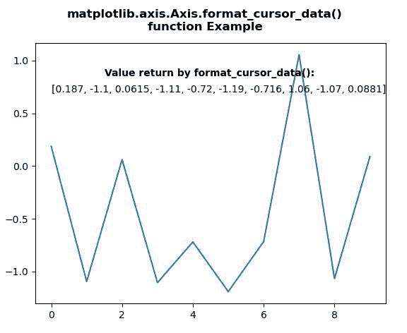
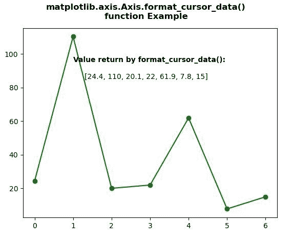

# Python 中的 matplotlib . axis . axis . format _ cursor _ data()函数

> 原文:[https://www . geeksforgeeks . org/matplotlib-axis-axis-format _ cursor _ data-function-in-python/](https://www.geeksforgeeks.org/matplotlib-axis-axis-format_cursor_data-function-in-python/)

[**Matplotlib**](https://www.geeksforgeeks.org/python-introduction-matplotlib/) 是 Python 中的一个库，是 NumPy 库的数值-数学扩展。这是一个神奇的 Python 可视化库，用于 2D 数组图，并用于处理更广泛的 SciPy 堆栈。

## matplotlib . axis . axis . format _ cursor _ data()函数

matplotlib 库的 Axis 模块中的 **Axis.format_cursor_data()函数**用于获取数据的字符串表示。

> **语法:**axis . format _ cursor _ data(self，data)
> 
> **参数:**该方法接受以下参数。
> 
> *   **数据:**该参数是曾经使用过的数据。
> 
> **返回值:**这个方法返回数据的字符串表示。

下面的例子说明了 matplotlib . axis . axis . format _ cursor _ data()函数在 matplotlib.axis:
中的作用

**例 1:**

## 蟒蛇 3

```py
# Implementation of matplotlib function
from matplotlib.axis import Axis
import numpy as np 
import matplotlib.pyplot as plt        

np.random.seed(10**7) 
geeksx = np.random.randn(10) 

fig, ax = plt.subplots() 
ax.plot(geeksx) 

ax.text(1.5, 0.85,  
        "Value return by format_cursor_data():",  
        fontweight ="bold") 

ax.text(0, 0.7, 
        Axis.format_cursor_data(ax, data = geeksx)) 

fig.suptitle("""matplotlib.axis.Axis.format_cursor_data()
function Example\n""", fontweight ="bold")  

plt.show()
```

**输出:**



**例 2:**

## 蟒蛇 3

```py
# Implementation of matplotlib function
from matplotlib.axis import Axis
import numpy as np 
import matplotlib.pyplot as plt        

geeksx = np.array([24.40, 110.25, 20.05, 
                   22.00, 61.90, 7.80, 
                   15.00]) 

fig, ax = plt.subplots() 
ax.plot(geeksx, 'go-') 

ax.text(1, 95, 
        "Value return by format_cursor_data():", 
        fontweight ="bold") 

ax.text(1.3, 85, 
        Axis.format_cursor_data(ax, 
                                  data = geeksx)) 

fig.suptitle("""matplotlib.axis.Axis.format_cursor_data()
function Example\n""", fontweight ="bold")  

plt.show()
```

**输出:**

