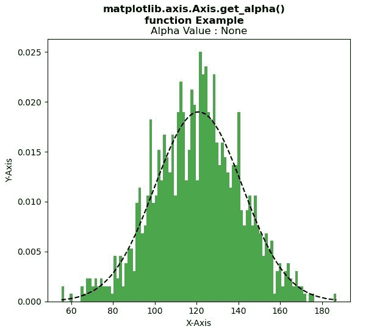
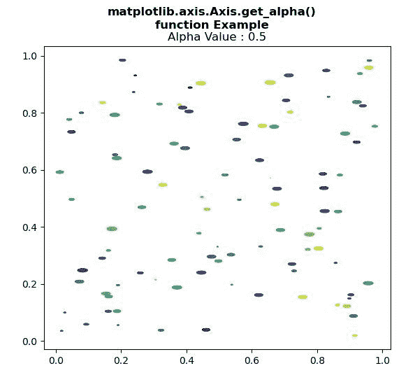

# Python 中的 Matplotlib.axis.Axis.get_alpha()函数

> 原文:[https://www . geesforgeks . org/matplotlib-axis-axis-get _ alpha-python 中的函数/](https://www.geeksforgeeks.org/matplotlib-axis-axis-get_alpha-function-in-python/)

[**Matplotlib**](https://www.geeksforgeeks.org/python-introduction-matplotlib/) 是 Python 中的一个库，是 NumPy 库的数值-数学扩展。这是一个神奇的 Python 可视化库，用于 2D 数组图，并用于处理更广泛的 SciPy 堆栈。

## Matplotlib.axis.Axis.get_alpha()函数

matplotlib 库的 Axis 模块中的 **Axis.get_alpha()函数**用于获取用于混合的 alpha 值。

> **语法:** Axis.get_alpha(self)
> 
> **参数:**该方法不接受任何参数。
> 
> **返回值:**此方法返回用于混合的 alpha 值。

下面的例子说明了 matplotlib.axis.Axis.get_alpha()函数在 matplotlib.axis:
中的作用

**例 1:**

## 蟒蛇 3

```py
# Implementation of matplotlib function
from matplotlib.axis import Axis
import matplotlib  
import numpy as np  
import matplotlib.pyplot as plt  

np.random.seed(10**7)  
mu = 121 
sigma = 21
x = mu + sigma * np.random.randn(1000)  

num_bins = 100
fig, ax = plt.subplots()  

n, bins, patches = ax.hist(x, num_bins,  
                           density = 1,  
                           color ='green',  
                           alpha = 0.7)  

y = ((1 / (np.sqrt(2 * np.pi) * sigma)) *
     np.exp(-0.5 * (1 / sigma * (bins - mu))**2))  

ax.plot(bins, y, '--', color ='black')  

ax.set_xlabel('X-Axis')  
ax.set_ylabel('Y-Axis')  

w = Axis.get_alpha(ax)  
ax.set_title("Alpha Value : "+str(w))

fig.suptitle("""matplotlib.axis.Axis.get_alpha()
function Example\n""", fontweight ="bold")  

plt.show()
```

**输出:**



**例 2:**

## 蟒蛇 3

```py
# Implementation of matplotlib function
from matplotlib.axis import Axis
import matplotlib.pyplot as plt  
import numpy as np  

rx, ry = 3., 1.

value1 = rx * ry * np.pi  
value2 = np.arange(0, 3 * np.pi + 0.01, 0.2)  
value3 = np.column_stack([rx / value1 * np.cos(value2),  
                          ry / value1 * np.sin(value2)])  

x, y, s, c = np.random.rand(4, 99)  
s *= 10**2.

fig, ax = plt.subplots()  
ax.scatter(x, y, s, c, marker = value3)  

Axis.set_alpha(ax, 0.5)  

w = Axis.get_alpha(ax)  
ax.set_title("Alpha Value : "+str(w))

fig.suptitle("""matplotlib.axis.Axis.get_alpha()
function Example\n""", fontweight ="bold")  

plt.show()
```

**输出:**

