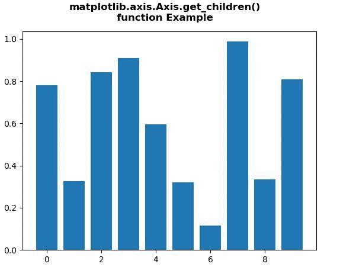
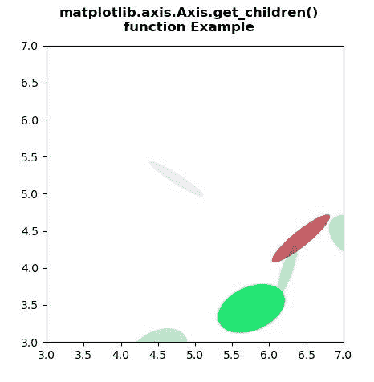

# Python 中的 matplotlib . axis . axis . get _ children()函数

> 原文:[https://www . geesforgeks . org/matplotlib-axis-axis-get _ children-function-in-python/](https://www.geeksforgeeks.org/matplotlib-axis-axis-get_children-function-in-python/)

[**Matplotlib**](https://www.geeksforgeeks.org/python-introduction-matplotlib/) 是 Python 中的一个库，是 NumPy 库的数值-数学扩展。这是一个神奇的 Python 可视化库，用于 2D 数组图，并用于处理更广泛的 SciPy 堆栈。

## matplotlib . axis . axis . get _ children()函数

matplotlib 库的 Axis 模块中的 **Axis.get_children()函数**用于获取该艺术家的子艺术家列表。

> **语法:** Axis.get_children(self)
> 
> **参数:**该方法不接受任何参数。
> 
> **返回值:**该方法返回该艺术家的子艺术家列表。

下面的例子说明了 matplotlib.axis . axis . get _ children()函数在 matplotlib . axis 中的作用:

**例 1:**

## 蟒蛇 3

```py
# Implementation of matplotlib function
from matplotlib.axis import Axis
import matplotlib.pyplot as plt  
from matplotlib.lines import Line2D  
import numpy as np  
from numpy.random import rand  

fig, ax2 = plt.subplots()  

ax2.bar(range(10), rand(10), picker = True)  

print("List of the child Artists of this Artist \n",  
      *list(ax2.get_children()), sep ="\n")

fig.suptitle("""matplotlib.axis.Axis.get_children()
function Example\n""", fontweight ="bold")  

plt.show()
```

**输出:**



> 该艺术家的子艺术家列表
> 
> 矩形(xy=(-0.4，0)，宽度=0.8，高度=0.78207，角度=0)
> 矩形(xy=(0.6，0)，宽度=0.8，高度=0.325622，角度=0)
> 矩形(xy=(1.6，0)，宽度=0.8，高度=0.842425，角度=0)
> 矩形(xy=(2.6，0)，宽度=0.8，高度= 0.0

**例 2:**

## 蟒蛇 3

```py
# Implementation of matplotlib function
from matplotlib.axis import Axis
import matplotlib.pyplot as plt  
import numpy as np  
from matplotlib.patches import Ellipse  

NUM = 20

ells = [Ellipse(xy = np.random.rand(2) * 10,  
                width = np.random.rand(),  
                height = np.random.rand(),  
                angle = np.random.rand() * 360)  
        for i in range(NUM)]  

fig, ax = plt.subplots(subplot_kw ={'aspect': 'equal'})  

print("List of the child Artists of this Artist \n") 
for e in ells:  
    ax.add_artist(e)  
    e.set_clip_box(ax.bbox)  
    e.set_alpha(np.random.rand())  
    e.set_facecolor(np.random.rand(4)) 

print(*list(ax.get_children()), sep = "\n") 

ax.set_xlim(3, 7)  
ax.set_ylim(3, 7)  

fig.suptitle("""matplotlib.axis.Axis.get_children()
function Example\n""", fontweight ="bold")  

plt.show()
```

**输出:**



> 该艺术家的子艺术家列表
> 
> 椭圆(xy=(6.251681831206875，3.9966267142138587)，宽度=0.15749720821862734，高度=0.7428173898961268，角度= 341.6495959566060367)
> 椭圆(xy =(9.69461616166 高度=0.21677557044006557，角度=39.01953674151486)
> 椭圆(xy=(9.542282251932058，6.24341448874013)，宽度= 0.71816586220924，高度= 0.34000001