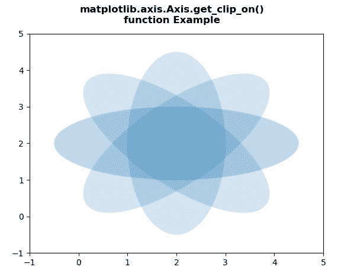
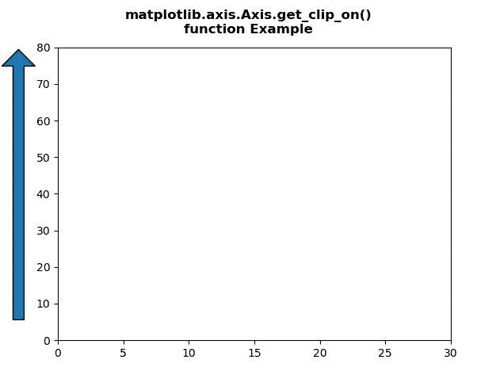

# Python 中的 matplotlib . axis . axis . get _ clip _ on()函数

> 原文:[https://www . geeksforgeeks . org/matplotlib-axis-axis-get _ clip _ on-function-in-python/](https://www.geeksforgeeks.org/matplotlib-axis-axis-get_clip_on-function-in-python/)

[**Matplotlib**](https://www.geeksforgeeks.org/python-introduction-matplotlib/) 是 Python 中的一个库，是 NumPy 库的数值-数学扩展。这是一个神奇的 Python 可视化库，用于 2D 数组图，并用于处理更广泛的 SciPy 堆栈。

## matplotlib . axis . axis . get _ clip _ on()函数

matplotlib 库的 Axis 模块中的 **Axis.get_clip_on()函数**用于获取艺术家是否使用剪辑。

> **语法:** Axis.get_clip_on(self)
> 
> **参数:**该方法不接受任何参数。
> 
> **返回值:**此方法返回艺术家是否使用剪裁。

下面的例子说明了 matplotlib . axis . get _ clip _ on()函数在 matplotlib.axis:
中的作用

**例 1:**

## 蟒蛇 3

```
# Implementation of matplotlib function
from matplotlib.axis import Axis
import matplotlib.pyplot as plt  
import numpy as np  
from matplotlib.patches import Ellipse  

delta = 45.0

angles = np.arange(0, 360 + delta, delta)  
ells = [Ellipse((2, 2), 5, 2, a) for a in angles]  

fig, ax = plt.subplots()  

for e in ells:  
    e.set_alpha(0.1)  
    ax.add_artist(e)  

ax.set_xlim(-1, 5)  
ax.set_ylim(-1, 5)  

print("Value Return by get_clip_on() : ",  
      Axis.get_clip_on(ax))

fig.suptitle("""matplotlib.axis.Axis.get_clip_on()
function Example\n""", fontweight ="bold")  

plt.show()
```

**输出:**



```
Value Return by get_clip_on() :  True

```

**例 2:**

## 蟒蛇 3

```
# Implementation of matplotlib function
from matplotlib.axis import Axis
import matplotlib.pyplot as plt  
import matplotlib.patches as mpatches  
import matplotlib.transforms as mtransforms  

x0 = -0.1

arrow_style ="simple, head_length = 15, \
head_width = 30, tail_width = 10"  

rect_style ="simple, tail_width = 25"
line_style ="simple, tail_width = 1"

fig, ax = plt.subplots()  

trans = mtransforms.blended_transform_factory(ax.transAxes,  
                                              ax.transData)  

y_tail = 5
y_head = 80
arrow1 = mpatches.FancyArrowPatch((x0, y_tail),   
                                  (x0, y_head),   
                                  arrowstyle = arrow_style,  
                                  transform = trans)  

Axis.set_clip_on(arrow1, False)  
ax.add_patch(arrow1)  

ax.set_xlim(0, 30)  
ax.set_ylim(0, 80)  

print("Value Return by get_clip_on() : ",  
      Axis.get_clip_on(arrow1))

fig.suptitle("""matplotlib.axis.Axis.get_clip_on()
function Example\n""", fontweight ="bold")  

plt.show()
```

**输出:**



```
Value Return by get_clip_on() :  False

```