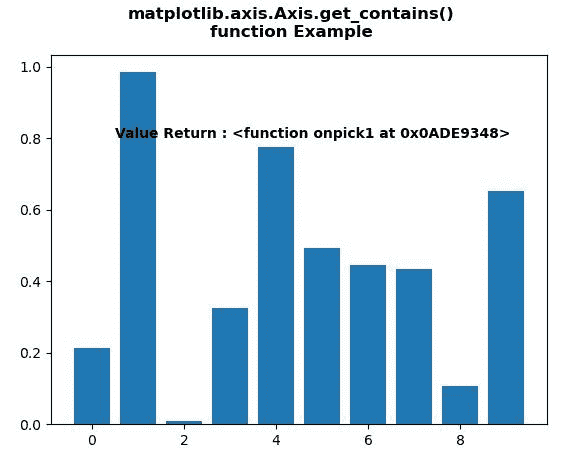
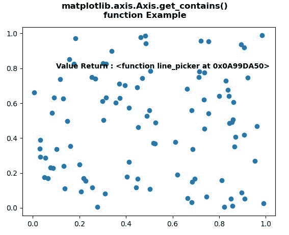

# Python 中的 matplotlib . axis . axis . get _ contains()

> 原文:[https://www . geesforgeks . org/matplotlib-axis-axis-get _ contains-in-python/](https://www.geeksforgeeks.org/matplotlib-axis-axis-get_contains-in-python/)

[**Matplotlib**](https://www.geeksforgeeks.org/python-introduction-matplotlib/) 是 Python 中的一个库，是 NumPy 库的数值-数学扩展。这是一个神奇的 Python 可视化库，用于 2D 数组图，并用于处理更广泛的 SciPy 堆栈。

## matplotlib . axis . axis . get _ contains()函数

matplotlib 库的 Axis 模块中的 **Axis.get_contains()函数**用于获取艺术家的自定义 contains 函数。

> **语法:** Axis.get_contains(self)
> 
> **参数:**该方法不接受任何参数。
> 
> **返回值:**该方法返回自定义包含功能的艺术家。

下面的例子说明了 matplotlib . axis . axis . get _ contains()函数在 matplotlib.axis:

**例 1:**

## 蟒蛇 3

```
# Implementation of matplotlib function
from matplotlib.axis import Axis
import matplotlib.pyplot as plt  
from matplotlib.lines import Line2D  
import numpy as np  
from numpy.random import rand  

fig, ax2 = plt.subplots()  

ax2.bar(range(10), rand(10), picker = True)  

for label in ax2.get_xticklabels():   
    label.set_picker(True)  

def onpick1(event):  

    if isinstance(event.artist, Line2D):  
        thisline = event.artist  
        xdata = thisline.get_xdata()  
        ydata = thisline.get_ydata()  
        ind = event.ind  
        print('onpick1 line:',  
               np.column_stack([xdata[ind],   
                               ydata[ind]]))  

    elif isinstance(event.artist, Rectangle):  
        patch = event.artist  
        print('onpick1 patch:', patch.get_path())  

    elif isinstance(event.artist, Text):  
        text = event.artist  
        print('onpick1 text:', text.get_text()) 

Axis.set_contains(ax2, picker = onpick1) 

ax2.text(0.5, 0.8,  
         "Value Return : "
         + str(Axis.get_contains(ax2)),   
         fontweight ="bold", fontsize = 10) 

fig.suptitle("""matplotlib.axis.Axis.get_contains()
function Example\n""", fontweight ="bold")  

plt.show()
```

**输出:**



**例 2:**

## 蟒蛇 3

```
# Implementation of matplotlib function
from matplotlib.axis import Axis
import matplotlib.pyplot as plt  
from matplotlib.lines import Line2D  
import numpy as np  
from numpy.random import rand  

fig, ax = plt.subplots()  
ax.plot(rand(100), rand(100), 'o')  

def line_picker(line, mouseevent):  

    if mouseevent.xdata is None:  
        return False, dict()  

    xdata = line.get_xdata()  
    ydata = line.get_ydata()  
    maxd = 0.05
    d = np.sqrt(  
        (xdata - mouseevent.xdata)**2 + (ydata - mouseevent.ydata)**2)  

    ind, = np.nonzero(d <= maxd)  

    if len(ind):  

        pickx = xdata[ind]  
        picky = ydata[ind]  
        props = dict(ind = ind, pickx = pickx,
                     picky = picky)  
        return True, props  

    else:  
        return False, dict()  

Axis.set_contains(ax, picker = line_picker) 

ax.text(0.1, 0.8,  
         "Value Return : "
         + str(Axis.get_contains(ax)),   
         fontweight ="bold", fontsize = 10)

fig.suptitle("""matplotlib.axis.Axis.get_contains()
function Example\n""", fontweight ="bold")  

plt.show()
```

**输出:**

