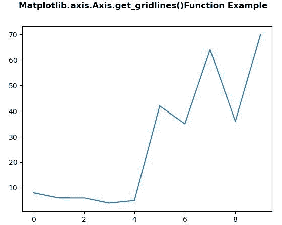
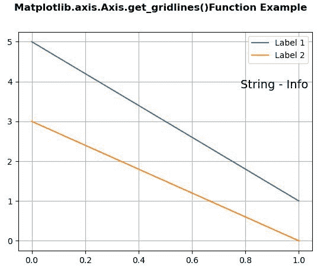

# Python 中的 matplotlib . axis . axis . get _ gridline()函数

> 原文:[https://www . geeksforgeeks . org/matplotlib-axis-axis-get _ gridline-function-in-python/](https://www.geeksforgeeks.org/matplotlib-axis-axis-get_gridlines-function-in-python/)

[**Matplotlib**](https://www.geeksforgeeks.org/python-introduction-matplotlib/) 是 Python 中的一个库，是 NumPy 库的数值-数学扩展。这是一个神奇的 Python 可视化库，用于 2D 数组图，并用于处理更广泛的 SciPy 堆栈。

## matplotlib . axis . axis . get _ gridline()函数

matplotlib 库的 Axis 模块中的 **Axis.get_gridlines()函数**用来获取网格线作为 Line2D 实例的列表。

> **语法:**坐标轴. _ gridlines(自身)
> 
> **参数:**该方法不接受任何参数。
> 
> **Return value:** This method returns the grid lines as a list of Line2D instance.

以下示例说明 matplotlib . axis . axis . get _ gridlines()函数在 matplotlib.axis:
**示例 1:**

## 蟒蛇 3

```py
# Implementation of matplotlib function 
from matplotlib.axis import Axis
import numpy as np
import matplotlib.pyplot as plt
import random

fig, ax2 = plt.subplots()
x = []

for i in range(1,11):
    j = random.randint(1,10)
    x.append(i*j)
ax2.plot(x)

print("Value of get_gridlines() :")
for i in ax2.xaxis.get_gridlines():
    print(i)

fig.suptitle("Matplotlib.axis.Axis.get_gridlines()\
Function Example", fontsize = 12, fontweight ='bold') 

plt.show()
```

**输出:**



```py
Value of get_gridlines() :
Line2D((0,0),(0,1))
Line2D((0,0),(0,1))
Line2D((0,0),(0,1))
Line2D((0,0),(0,1))
Line2D((0,0),(0,1))
Line2D((0,0),(0,1))
Line2D((0,0),(0,1))

```

**例 2:**

## 蟒蛇 3

```py
# Implementation of matplotlib function 
from matplotlib.axis import Axis  
import matplotlib.pyplot as plt 
import matplotlib.text 

fig, ax = plt.subplots() 

ax.plot([5,1], label="Label 1") 
ax.plot([3,0], label="Label 2") 

legend = ax.legend(loc="upper right") 
offset = matplotlib.text.OffsetFrom(legend, (1.0, 0.0))

ax.annotate("String - Info", 
            xy = (0,0),  
            size = 14, 
            xycoords = 'figure fraction', 
            xytext = (0,-20),  
            textcoords = offset,  
            horizontalalignment = 'right',  
            verticalalignment = 'top') 

fig.canvas.draw() 
ax.grid()

print("Value of get_gridlines() :")
for i in ax.yaxis.get_gridlines():
    print(i)

fig.suptitle("Matplotlib.axis.Axis.get_gridlines()\
Function Example", fontsize = 12, fontweight ='bold') 

plt.show()
```

**输出:**



```py
Value of get_gridlines() :
Line2D((0,0),(1,0))
Line2D((0,0),(1,0))
Line2D((0,0),(1,0))
Line2D((0,0),(1,0))
Line2D((0,0),(1,0))
Line2D((0,0),(1,0))
Line2D((0,0),(1,0))
Line2D((0,0),(1,0))

```