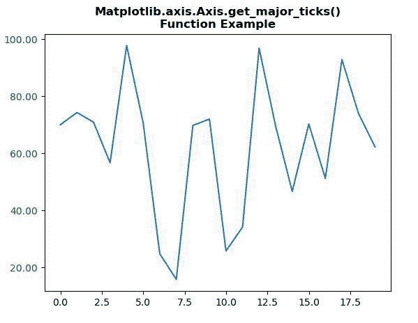
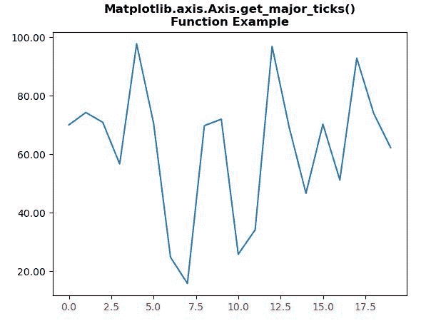

# Python 中的 matplotlib . axis . axis . get _ main _ ticks()函数

> 原文:[https://www . geeksforgeeks . org/matplotlib-axis-axis-get _ major _ tics-python 中的函数/](https://www.geeksforgeeks.org/matplotlib-axis-axis-get_major_ticks-function-in-python/)

[**Matplotlib**](https://www.geeksforgeeks.org/python-introduction-matplotlib/) 是 Python 中的一个库，是 NumPy 库的数值-数学扩展。这是一个神奇的 Python 可视化库，用于 2D 数组图，并用于处理更广泛的 SciPy 堆栈。

## matplotlib . axis . axis . get _ main _ ticks()函数

matplotlib 库的 Axis 模块中的**axis . get _ main _ ticks()函数**用于获取 tick 实例。

> **语法:** Axis.get_major_ticks(self，numtics = None)
> 
> **参数:**该方法接受以下参数。
> 
> *   **数量:**此参数为刻度数。
> 
> **返回值:**此方法返回刻度实例。

下面的例子说明了 matplotlib.axis . axis . get _ main _ ticks()函数在 matplotlib . axis 中的作用:

**例 1:**

## 蟒蛇 3

```py
# Implementation of matplotlib function 
import numpy as np
from matplotlib.axis import Axis  
import matplotlib.pyplot as plt
import matplotlib.ticker as ticker

np.random.seed(19680801)

fig, ax = plt.subplots()
ax.plot(100*np.random.rand(20))

formatter = ticker.FormatStrFormatter('%1.2f')
Axis.set_major_formatter(ax.yaxis, formatter)

print("Value of get_major_ticks() :")
for tick in ax.yaxis.get_major_ticks(2):
    tick.label1.set_color('green')
    print(tick)

plt.title("Matplotlib.axis.Axis.get_major_ticks()\n\
Function Example", fontsize = 12, fontweight ='bold') 

plt.show()
```

**输出:**



```py
Value of get_major_ticks() :
<matplotlib.axis.XTick object at 0x08A46250>
<matplotlib.axis.XTick object at 0x08A46230>

```

**例 2:**

## 蟒蛇 3

```py
# Implementation of matplotlib function 
import numpy as np
from matplotlib.axis import Axis  
import matplotlib.pyplot as plt
import matplotlib.ticker as ticker

np.random.seed(19680801)

fig, ax = plt.subplots()
ax.plot(100*np.random.rand(20))

formatter = ticker.FormatStrFormatter('%1.2f')
Axis.set_major_formatter(ax.yaxis, formatter)

print("Value of get_major_ticks() :")
for tick in ax.xaxis.get_major_ticks():
    tick.label1.set_color('red')
    print(tick)

plt.title("Matplotlib.axis.Axis.get_major_ticks()\n\
Function Example", fontsize = 12, fontweight ='bold') 

plt.show()
```

**输出:**



```py
Value of get_major_ticks() :
<matplotlib.axis.YTick object at 0x07EB79F0>
<matplotlib.axis.YTick object at 0x07EB7670>
<matplotlib.axis.YTick object at 0x07EA8EB0>
<matplotlib.axis.YTick object at 0x090A30B0>
<matplotlib.axis.YTick object at 0x090A32D0>
<matplotlib.axis.YTick object at 0x090A3570>
<matplotlib.axis.YTick object at 0x090A3830>

```