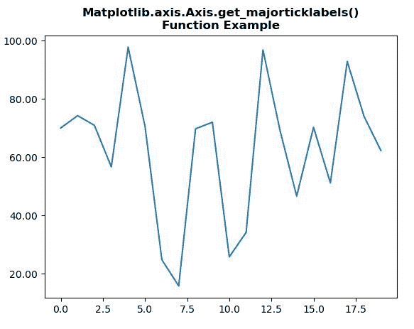
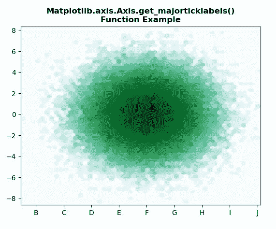

# Python 中的 matplotlib . axis . axis . get _ majoticlklabels()函数

> 原文:[https://www . geeksforgeeks . org/matplotlib-axis-axis-get _ majorticklabels-python 中的函数/](https://www.geeksforgeeks.org/matplotlib-axis-axis-get_majorticklabels-function-in-python/)

[**Matplotlib**](https://www.geeksforgeeks.org/python-introduction-matplotlib/) 是 Python 中的一个库，是 NumPy 库的数值-数学扩展。这是一个神奇的 Python 可视化库，用于 2D 数组图，并用于处理更广泛的 SciPy 堆栈。

## matplotlib . axis . axis . get _ majotick labels()函数

matplotlib 库的 Axis 模块中的**axis . get _ majoticlabels()函数**用于获取主要 ticklabels 的文本实例列表。

> **语法:**axis . get _ majorticklabels(self)
> 
> **参数:**该方法不接受任何参数。
> 
> **返回值:**该方法返回主要标签的文本实例列表。

下面的例子说明了 matplotlib.axis . axis . get _ majotick labels()函数在 matplotlib . axis 中的作用:

**例 1:**

## 蟒蛇 3

```py
# Implementation of matplotlib function 
import numpy as np
from matplotlib.axis import Axis  
import matplotlib.pyplot as plt
import matplotlib.ticker as ticker

np.random.seed(19680801)

fig, ax = plt.subplots()
ax.plot(100*np.random.rand(20))

formatter = ticker.FormatStrFormatter('%1.2f')
Axis.set_major_formatter(ax.yaxis, formatter)

print("Value of get_major_ticks() :")
for i in ax.xaxis.get_majorticklabels():
    print(i)

plt.title("Matplotlib.axis.Axis.get_majorticklabels()\n\
Function Example", fontsize = 12, fontweight ='bold') 
plt.show()
```

**输出:**



```py
Value of get_majorticklabels() :
Text(0, 0, '')
Text(0, 0, '')
Text(0, 0, '')
Text(0, 0, '')
Text(0, 0, '')
Text(0, 0, '')
Text(0, 0, '')
Text(0, 0, '')
Text(0, 0, '')
Text(0, 0, '')

```

**例 2:**

## 蟒蛇 3

```py
# Implementation of matplotlib function 
from matplotlib.axis import Axis  
from matplotlib.artist import Artist  
import matplotlib.pyplot as plt  
import numpy as np  

np.random.seed(19680801)  

n = 100000
x = np.random.standard_normal(n)  
y = 2 * np.random.standard_normal(n)  
z =[1, 2, 3, 4]  

xmin = x.min()  
xmax = x.max()  
ymin = y.min()  
ymax = y.max()  

fig, ax = plt.subplots()  
hb = ax.hexbin(x, y, 
               gridsize = 50, 
               bins ='log', 
               cmap ='BuGn')  

ax.set(xlim =(xmin, xmax), ylim =(ymin, ymax)) 
ax.xaxis.set_ticklabels(["A","B","C","D","E","F","G","H","I","J","K"])
print("Value of get_majorticklabels() :")
for i in ax.xaxis.get_majorticklabels():
    print(i)

plt.title("Matplotlib.axis.Axis.get_majorticklabels()\n\
Function Example", fontsize = 12, fontweight ='bold') 
plt.show()
```

**输出:**



```py
Value of get_majorticklabels() :
Text(0, 0, 'A')
Text(0, 0, 'B')
Text(0, 0, 'C')
Text(0, 0, 'D')
Text(0, 0, 'E')
Text(0, 0, 'F')
Text(0, 0, 'G')
Text(0, 0, 'H')
Text(0, 0, 'I')
Text(0, 0, 'J')
Text(0, 0, 'K')

```