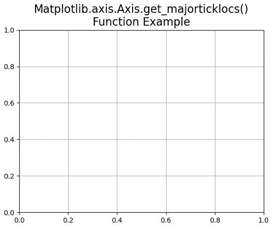
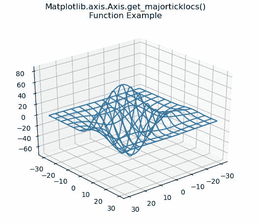

# Python 中的 matplotlib . axis . axis . get _ majoticlocs()函数

> 原文:[https://www . geeksforgeeks . org/matplotlib-axis-axis-get _ majoticlocs-python 中的函数/](https://www.geeksforgeeks.org/matplotlib-axis-axis-get_majorticklocs-function-in-python/)

[**Matplotlib**](https://www.geeksforgeeks.org/python-introduction-matplotlib/) 是 Python 中的一个库，是 NumPy 库的数值-数学扩展。这是一个神奇的 Python 可视化库，用于 2D 数组图，并用于处理更广泛的 SciPy 堆栈。

## matplotlib . axis . axis . get _ majoticlocs()函数

matplotlib 库的 Axis 模块中的**axis . get _ majoticlocs()函数**用于获取数据坐标中主要刻度位置的数组。

> **语法:**axis . get _ majoticlocs(self)
> **参数:**此方法不接受任何参数。
> **返回值:**该方法返回数据坐标中主要刻度位置的数组。

下面的例子说明了 matplotlib.axis . axis . get _ majoticlocs()函数在 matplotlib . axis 中的作用:

**例 1:**

## 蟒蛇 3

```
# Implementation of matplotlib function 
from matplotlib.axis import Axis  
from matplotlib.artist import Artist 
from mpl_toolkits.mplot3d import axes3d   
import matplotlib.pyplot as plt   

fig, ax = plt.subplots()   

def tellme(s):   
    ax.set_title(s, fontsize = 16)   
    fig.canvas.draw()  
    renderer = fig.canvas.renderer  
    Artist.draw(ax, renderer)  

tellme("Matplotlib.axis.Axis.get_majorticklocs()\n\
Function Example")
ax.grid()  

print("Value of get_majorticklocs() :")
for i in ax.xaxis.get_majorticklocs():
    print(i)

plt.show()
```

**输出:**


```
Value of get_majorticklocs() :
0.0
0.2
0.4
0.6000000000000001
0.8
1.0
```

**例 2:**

## 蟒蛇 3

```
# Implementation of matplotlib function 
from matplotlib.axis import Axis  
from matplotlib.artist import Artist 
from mpl_toolkits.mplot3d import axes3d   
import matplotlib.pyplot as plt   

fig = plt.figure()   
ax = fig.add_subplot(111, projection ='3d')   

X, Y, Z = axes3d.get_test_data(0.1)   
ax.plot_wireframe(X, Y, Z, rstride = 5,    
                  cstride = 5)   

ax.view_init(30, 50)  
fig.canvas.draw()  
renderer = fig.canvas.renderer  
Artist.draw(ax, renderer)   

fig.suptitle('Matplotlib.axis.Axis.get_majorticklocs()\n\
Function Example')  
ax.grid()

print("Value of get_majorticklocs() :")
for i in ax.xaxis.get_majorticklocs():
    print(i)

plt.show()
```

**输出:**


```
Value of get_majorticklocs() :
-40.0
-30.0
-20.0
-10.0
0.0
10.0
20.0
30.0
40.0

```