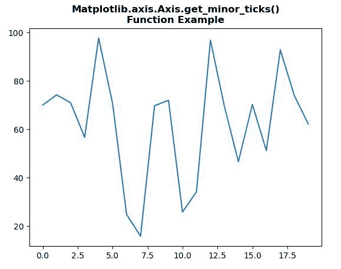
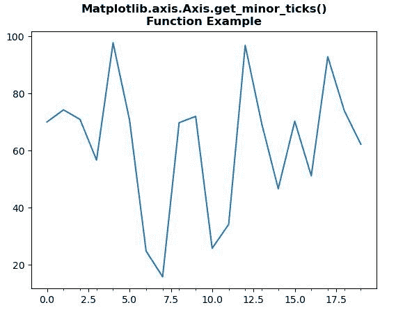

# Python 中的 matplotlib . axis . axis . get _ minor _ ticks()函数

> 原文:[https://www . geeksforgeeks . org/matplotlib-axis-axis-get _ minor _ ticks-python 中的函数/](https://www.geeksforgeeks.org/matplotlib-axis-axis-get_minor_ticks-function-in-python/)

[**Matplotlib**](https://www.geeksforgeeks.org/python-introduction-matplotlib/) 是 Python 中的一个库，是 NumPy 库的数值-数学扩展。这是一个神奇的 Python 可视化库，用于 2D 数组图，并用于处理更广泛的 SciPy 堆栈。

## matplotlib . axis . axis . get _ minor _ ticks()函数

matplotlib 库的 Axis 模块中的 **Axis.get_minor_ticks()函数**用于获取 minor tick 实例。

> **语法:** Axis.get_minor_ticks(self，numticks=None)
> 
> **参数:**该方法接受以下参数。
> 
> *   **数量:**此参数为刻度数。
> 
> **返回值:**此方法返回次要刻度实例。

下面的例子说明了 matplotlib.axis . axis . get _ minor _ ticks()函数在 matplotlib . axis 中的作用:

**例 1:**

## 蟒蛇 3

```
# Implementation of matplotlib function 
import numpy as np
from matplotlib.axis import Axis  
import matplotlib.pyplot as plt
import matplotlib.ticker as ticker

np.random.seed(19680801)

fig, ax = plt.subplots()
ax.plot(100*np.random.rand(20))

formatter = ticker.FormatStrFormatter('%1.2f')
Axis.set_minor_formatter(ax.yaxis, formatter)

print("Value of get_minor_ticks() :")
for tick in ax.yaxis.get_minor_ticks(2):
    tick.label1.set_color('green')
    print(tick)

plt.title("Matplotlib.axis.Axis.get_minor_ticks()\n\
Function Example", fontsize = 12, fontweight ='bold') 

plt.show()
```

**输出:**



```
Value of get_minor_ticks() :
<matplotlib.axis.YTick object at 0x0A770DB0>
<matplotlib.axis.YTick object at 0x07E09DF0>

```

**例 2:**

## 蟒蛇 3

```
# Implementation of matplotlib function 
import numpy as np
from matplotlib.axis import Axis  
import matplotlib.pyplot as plt
import matplotlib.ticker as ticker

np.random.seed(19680801)

fig, ax = plt.subplots()
ax.plot(100*np.random.rand(20))

ax.xaxis.set_minor_locator(ticker.MultipleLocator(1))

print("Value of get_minor_ticks() :")
for tick in ax.xaxis.get_minor_ticks():
    tick.label1.set_color('red')
    print(tick)

plt.title("Matplotlib.axis.Axis.get_minor_ticks()\n\
Function Example", fontsize = 12, fontweight ='bold') 

plt.show()
```

**输出:**



```
Value of get_minor_ticks() :
<matplotlib.axis.XTick object at 0x0AD502F0>
<matplotlib.axis.XTick object at 0x083D9850>
<matplotlib.axis.XTick object at 0x0AD5DFD0>
<matplotlib.axis.XTick object at 0x0AD74270>
<matplotlib.axis.XTick object at 0x0AD74510>
<matplotlib.axis.XTick object at 0x0AD747B0>
<matplotlib.axis.XTick object at 0x0AD74A70>
<matplotlib.axis.XTick object at 0x0AD74D10>
<matplotlib.axis.XTick object at 0x0AD74EB0>
<matplotlib.axis.XTick object at 0x0AD7E270>
<matplotlib.axis.XTick object at 0x0AD7E4D0>
<matplotlib.axis.XTick object at 0x0AD74DD0>
<matplotlib.axis.XTick object at 0x0AD74250>
<matplotlib.axis.XTick object at 0x0AD7E070>
<matplotlib.axis.XTick object at 0x0AD7E8B0>
<matplotlib.axis.XTick object at 0x0AD7EB50>
<matplotlib.axis.XTick object at 0x0AD7EDF0>

```