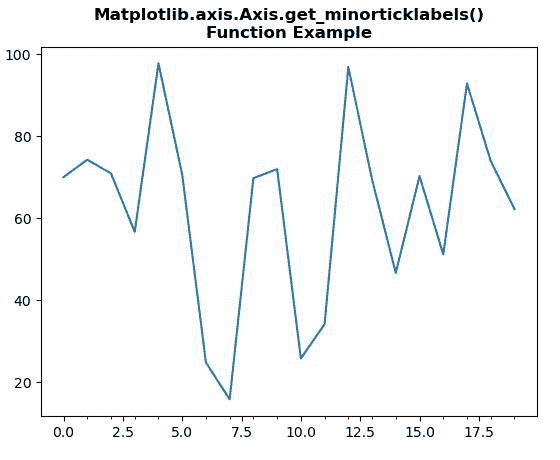
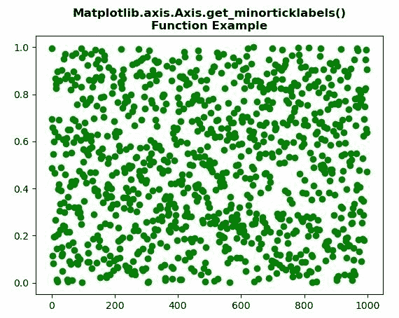

# Python 中的 matplotlib . axis . axis . get _ minorticklabels()函数

> 原文:[https://www . geeksforgeeks . org/matplotlib-axis-axis-get _ minorticklabels-python 中的函数/](https://www.geeksforgeeks.org/matplotlib-axis-axis-get_minorticklabels-function-in-python/)

[**Matplotlib**](https://www.geeksforgeeks.org/python-introduction-matplotlib/) 是 Python 中的一个库，是 NumPy 库的数值-数学扩展。这是一个神奇的 Python 可视化库，用于 2D 数组图，并用于处理更广泛的 SciPy 堆栈。

## matplotlib . axis . axis . get _ minorticklabels()函数

matplotlib 库的 Axis 模块中的 **Axis.get_minorticklabels()函数**用于获取次要标签的文本实例列表。

> **语法:**axis . get _ minarticlabels(self)
> 
> **参数:**该方法不接受任何参数。
> 
> **返回值:**该方法返回次要标签的文本实例列表。

下面的例子说明了 matplotlib . axis . axis . get _ minorticklabels()函数在 matplotlib.axis:

**例 1:**

## 蟒蛇 3

```py
# Implementation of matplotlib function 
import numpy as np
from matplotlib.axis import Axis  
import matplotlib.pyplot as plt
import matplotlib.ticker as ticker

np.random.seed(19680801)

fig, ax = plt.subplots()
ax.plot(100*np.random.rand(20))

Axis.set_minor_locator(ax.xaxis, ticker.MultipleLocator(1)) 

print("Value of get_minorticklabels() :")
for i in ax.xaxis.get_minorticklabels():
    print(i)

plt.title("Matplotlib.axis.Axis.get_minorticklabels()\n\
Function Example", fontsize = 12, fontweight ='bold') 

plt.show()
```

**输出:**



```py
Value of get_minorticklabels() :
Text(0, 0, '')
Text(0, 0, '')
Text(0, 0, '')
Text(0, 0, '')
Text(0, 0, '')
Text(0, 0, '')
Text(0, 0, '')
Text(0, 0, '')
Text(0, 0, '')
Text(0, 0, '')
Text(0, 0, '')
Text(0, 0, '')
Text(0, 0, '')
Text(0, 0, '')
Text(0, 0, '')
Text(0, 0, '')
Text(0, 0, '')

```

**例 2:**

## 蟒蛇 3

```py
# Implementation of matplotlib function 
import numpy as np
from matplotlib.axis import Axis  
import matplotlib.pyplot as plt
import matplotlib.ticker as ticker

fig, ax = plt.subplots()
ax.plot(np.random.rand(1000),'go')

Axis.set_minor_locator(ax.yaxis, ticker.MultipleLocator(1))

print("Value of get_minorticklabels() :")
for i in ax.yaxis.get_minorticklabels():
    print(i)

plt.title("Matplotlib.axis.Axis.get_minorticklabels()\n\
Function Example", fontsize = 12, fontweight ='bold') 

plt.show()
```

**输出:**



```py
Value of get_minorticklabels() :
Text(0, 0, '')
Text(0, 0, '')
```