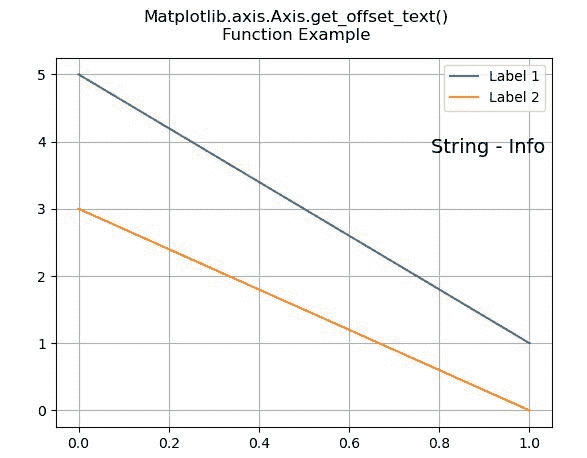
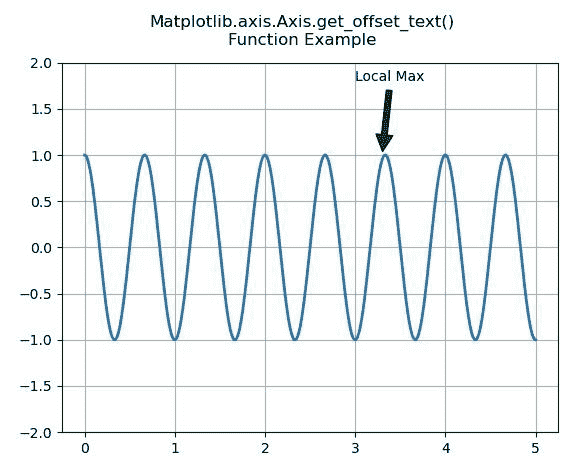

# Python 中的 matplotlib . axis . axis . get _ offset _ text()函数

> 原文:[https://www . geeksforgeeks . org/matplotlib-axis-axis-get _ offset _ text-in-function-python/](https://www.geeksforgeeks.org/matplotlib-axis-axis-get_offset_text-function-in-python/)

[**Matplotlib**](https://www.geeksforgeeks.org/python-introduction-matplotlib/) 是 Python 中的一个库，是 NumPy 库的数值-数学扩展。这是一个神奇的 Python 可视化库，用于 2D 数组图，并用于处理更广泛的 SciPy 堆栈。

## matplotlib . axis . axis . get _ offset _ text()函数

matplotlib 库的 Axis 模块中的 **Axis.get_offset_text()函数**用于获取作为 text 实例的 axis offsetText。

> **语法:** Axis.get_offset_text(self)
> 
> **参数:**该方法不接受任何参数。
> 
> **返回值:**该方法将轴偏移文本作为文本实例返回。

下面的例子说明了 matplotlib . axis . axis . get _ offset _ text()函数在 matplotlib.axis:
中的作用

**例 1:**

## 蟒蛇 3

```py
# Implementation of matplotlib function 
from matplotlib.axis import Axis  
import matplotlib.pyplot as plt 
import matplotlib.text 

fig, ax = plt.subplots() 

ax.plot([5,1], label="Label 1") 
ax.plot([3,0], label="Label 2") 

legend = ax.legend(loc="upper right") 
offset = matplotlib.text.OffsetFrom(legend, (1.0, 0.0))

ax.annotate("String - Info", 
            xy = (0,0),  
            size = 14, 
            xycoords = 'figure fraction', 
            xytext = (0,-20),  
            textcoords = offset,  
            horizontalalignment = 'right',  
            verticalalignment = 'top') 

fig.canvas.draw() 
fig.suptitle('Matplotlib.axis.Axis.get_offset_text()\n\
Function Example')  
ax.grid()

print("Value of get_offset_text() :",ax.xaxis.get_offset_text())

plt.show()
```

**输出:**



```py
Value of get_offset_text() : Text(1, 24.911111111111108, '')

```

**例 2:**

## 蟒蛇 3

```py
# Implementation of matplotlib function 
from matplotlib.axis import Axis  
import matplotlib.pyplot as plt 
import numpy as np 

fig, geeeks = plt.subplots() 

t = np.arange(0.0, 5.0, 0.001) 
s = np.cos(3 * np.pi * t) 
line = geeeks.plot(t, s, lw = 2) 

# Annotation 
geeeks.annotate('Local Max', xy =(3.3, 1), 
                xytext =(3, 1.8),  
                arrowprops = dict(facecolor ='green', 
                                  shrink = 0.05),) 

geeeks.set_ylim(-2, 2) 
fig.suptitle('Matplotlib.axis.Axis.get_offset_text()\n\
Function Example')  
geeeks.grid()

print("Value of get_offset_text() :",geeeks.xaxis.get_offset_text())

plt.show()
```

**输出:**



```py
Value of get_offset_text() : Text(1, 0, '')

```