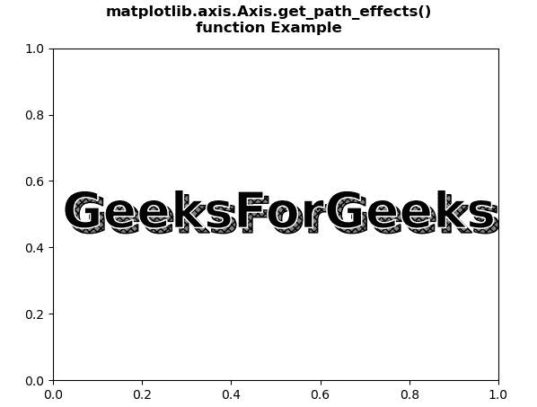
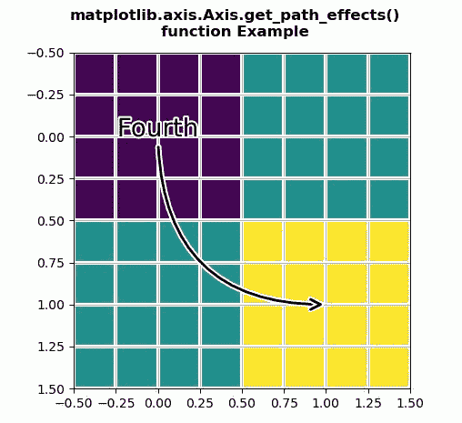

# Python 中的 matplotlib . axis . axis . get _ path _ effects()函数

> 原文:[https://www . geeksforgeeks . org/matplotlib-axis-axis-get _ path _ effects-python 中的函数/](https://www.geeksforgeeks.org/matplotlib-axis-axis-get_path_effects-function-in-python/)

[**Matplotlib**](https://www.geeksforgeeks.org/python-introduction-matplotlib/) 是 Python 中的一个库，是 NumPy 库的数值-数学扩展。这是一个神奇的 Python 可视化库，用于 2D 数组图，并用于处理更广泛的 SciPy 堆栈。

## matplotlib . axis . axis . get _ path _ effects()函数

matplotlib 库的 Axis 模块中的 **Axis.get_path_effects()函数**用来获取 set_path_effects 的属性。

> **语法:**axis . get _ path _ effects(self)
> 
> **参数:**该方法不接受任何参数。
> 
> **返回值:**此方法返回 set_path_effects 的属性

下面的例子说明了 matplotlib . axis . axis . get _ path _ effects()函数在 matplotlib.axis:
中的作用

**例 1:**

## 蟒蛇 3

```py
# Implementation of matplotlib function
from matplotlib.axis import Axis
import matplotlib.pyplot as plt  
import numpy as np  
import matplotlib.patheffects as path_effects  

fig, ax = plt.subplots()  
t = ax.text(0.02, 0.5,  
            'GeeksForGeeks',   
            fontsize = 40,  
            weight = 1000,   
            va ='center')  

t.set_path_effects([path_effects.PathPatchEffect(offset =(4, -4),   
                                                 hatch ='xxxx',  
                                                 facecolor ='gray'),  
                    path_effects.PathPatchEffect(edgecolor ='white',  
                                                 linewidth = 1.1,  
                                                 facecolor ='black')])  

print("Value Return by get_path_effects() : \n")  
for i in Axis.get_path_effects(t):  
    print(i)  

fig.suptitle("""matplotlib.axis.Axis.get_path_effects()
function Example\n""", fontweight ="bold")  

plt.show()
```

**输出:**



```py
Value Return by get_path_effects() : 

<matplotlib.patheffects.PathPatchEffect object at 0x0A6EDBD0>
<matplotlib.patheffects.PathPatchEffect object at 0x0A6EDDB0>

```

**例 2:**

## 蟒蛇 3

```py
# Implementation of matplotlib function
from matplotlib.axis import Axis
import matplotlib.pyplot as plt  
import matplotlib.patheffects as PathEffects  
import numpy as np  

fig, ax1 = plt.subplots()  
ax1.imshow([[1, 2], [2, 3]])  
txt = ax1.annotate("Fourth",  
                   (1., 1.),   
                   (0., 0),  
                   arrowprops = dict(arrowstyle ="->",  
                                     connectionstyle ="angle3", 
                                     lw = 2),  
                   size = 20,   
                   ha ="center",   
                   path_effects =[PathEffects.withStroke(linewidth = 3,  
                                                         foreground ="w")])  

txt.arrow_patch.set_path_effects([  
    PathEffects.Stroke(linewidth = 5, foreground ="w"),  
    PathEffects.Normal()])  

ax1.grid(True, linestyle ="-")  

pe = [PathEffects.withStroke(linewidth = 3,  
                             foreground ="w")]  

for l in ax1.get_xgridlines() + ax1.get_ygridlines():  
    l.set_path_effects(pe)  

print("Value Return by get_path_effects() : \n")  

for l in ax1.get_xgridlines() + ax1.get_ygridlines():  
    for i in Axis.get_path_effects(l): 
        print(i)  

fig.suptitle("""matplotlib.axis.Axis.get_path_effects()
function Example\n""", fontweight ="bold")  

plt.show()
```

**输出:**



```py
Value Return by get_path_effects() : 

<matplotlib.patheffects.withStroke object at 0x0A98EF50>
<matplotlib.patheffects.withStroke object at 0x0A98EF50>
<matplotlib.patheffects.withStroke object at 0x0A98EF50>
<matplotlib.patheffects.withStroke object at 0x0A98EF50>
<matplotlib.patheffects.withStroke object at 0x0A98EF50>
<matplotlib.patheffects.withStroke object at 0x0A98EF50>
<matplotlib.patheffects.withStroke object at 0x0A98EF50>
<matplotlib.patheffects.withStroke object at 0x0A98EF50>
<matplotlib.patheffects.withStroke object at 0x0A98EF50>
<matplotlib.patheffects.withStroke object at 0x0A98EF50>
<matplotlib.patheffects.withStroke object at 0x0A98EF50>
<matplotlib.patheffects.withStroke object at 0x0A98EF50>
<matplotlib.patheffects.withStroke object at 0x0A98EF50>
<matplotlib.patheffects.withStroke object at 0x0A98EF50>
<matplotlib.patheffects.withStroke object at 0x0A98EF50>
<matplotlib.patheffects.withStroke object at 0x0A98EF50>
<matplotlib.patheffects.withStroke object at 0x0A98EF50>
<matplotlib.patheffects.withStroke object at 0x0A98EF50>

```