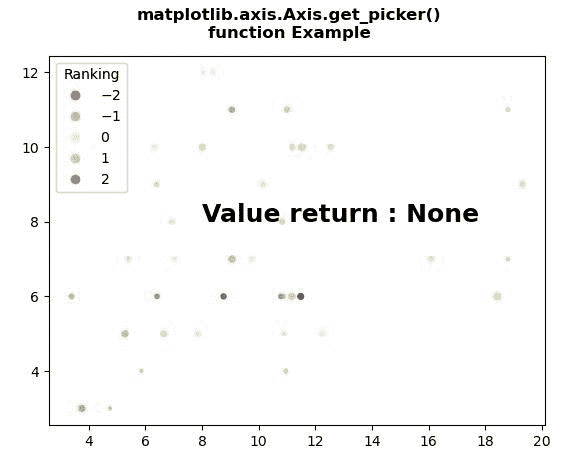
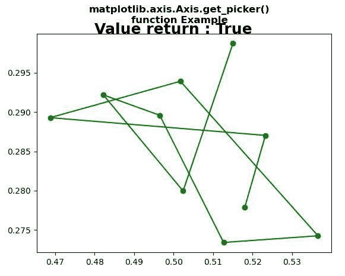

# Python 中的 matplotlib . axis . axis . get _ picker()函数

> 原文:[https://www . geesforgeks . org/matplotlib-axis-axis-get _ picker-python 中的函数/](https://www.geeksforgeeks.org/matplotlib-axis-axis-get_picker-function-in-python/)

[**Matplotlib**](https://www.geeksforgeeks.org/python-introduction-matplotlib/) 是 Python 中的一个库，是 NumPy 库的数值-数学扩展。这是一个神奇的 Python 可视化库，用于 2D 数组图，并用于处理更广泛的 SciPy 堆栈。

## matplotlib . axis . axis . get _ picker()函数

matplotlib 库的 Axis 模块中的 **Axis.get_picker()函数**用于定义艺术家的拾取行为。

> **语法:** Axis.get_picker(self)
> 
> **参数:**该方法不接受任何参数。
> 
> **返回值:**此方法返回艺术家的采摘行为。

下面的例子说明了 matplotlib . axis . axis . get _ picker()函数在 matplotlib.axis:

**例 1:**

## 蟒蛇 3

```
# Implementation of matplotlib function
from matplotlib.axis import Axis
import numpy as np  
import matplotlib.pyplot as plt  

np.random.seed(19680801)  

volume = np.random.rayleigh(7, size = 40)  
amount = np.random.poisson(7, size = 40)  
ranking = np.random.normal(size = 40)  
price = np.random.uniform(1, 7, size = 40)  

fig, ax = plt.subplots()  

scatter = ax.scatter(volume,  
                     amount,  
                     c = ranking,  
                     s = price * 3,  
                     vmin = -3,   
                     vmax = 3,  
                     cmap = "Spectral")  

legend1 = ax.legend(*scatter.legend_elements(num = 5),  
                    loc = "upper left",  
                    title = "Ranking")  

ax.add_artist(legend1)  

ax.text(8, 8, "Value return : "
        + str(Axis.get_picker(ax)),  
        fontweight = "bold",  
        fontsize = 18) 

fig.suptitle("""matplotlib.axis.Axis.get_picker()
function Example\n""", fontweight ="bold")  

plt.show()
```

**输出:**



**例 2:**

## 蟒蛇 3

```
# Implementation of matplotlib function
from matplotlib.axis import Axis
import numpy as np  
import matplotlib.pyplot as plt  

X = np.random.rand(10, 200)  
xs = np.mean(X, axis = 1)  
ys = np.std(X, axis = 1)  

fig = plt.figure()  
ax = fig.add_subplot(111)  
line, = ax.plot(xs, ys, 'go-', picker = 5)  

ax.set_picker(True)  

ax.text(0.48, 0.3, "Value return : " 
        +  str(Axis.get_picker(ax)),  
        fontweight = "bold",  
        fontsize = 18)  

fig.suptitle("""matplotlib.axis.Axis.get_picker()
function Example\n""", fontweight ="bold")  

plt.show()
```

**输出:**

