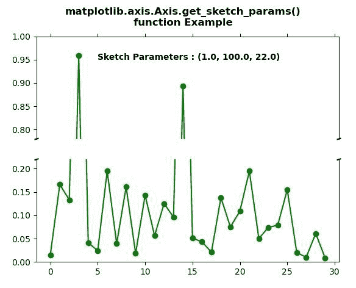

# Python 中的 matplotlib . axis . axis . get _ sketch _ params()函数

> 原文:[https://www . geeksforgeeks . org/matplotlib-axis-axis-get _ sketch _ params-python 中的函数/](https://www.geeksforgeeks.org/matplotlib-axis-axis-get_sketch_params-function-in-python/)

[**Matplotlib**](https://www.geeksforgeeks.org/python-introduction-matplotlib/) 是 Python 中的一个库，是 NumPy 库的数值-数学扩展。这是一个神奇的 Python 可视化库，用于 2D 数组图，并用于处理更广泛的 SciPy 堆栈。

## matplotlib . axis . axis . get _ sketch _ params()函数

matplotlib 库的 Axis 模块中的 **Axis.get_sketch_params()函数**用于获取艺术家的草图参数。

> **语法:**axis . get _ sketch _ params(self)
> 
> **参数:**该方法不接受任何参数。
> 
> **返回值:**此方法返回艺术家的草图参数。

以下示例说明 matplotlib . axis . axis . get _ sketch _ params()函数在 matplotlib.axis:
中的作用

**例 1:**

## 蟒蛇 3

```
# Implementation of matplotlib function
from matplotlib.axis import Axis
import matplotlib.pyplot as plt  
import matplotlib.colors as mcolors  
import matplotlib.gridspec as gridspec  
import numpy as np  

plt.rcParams['savefig.facecolor'] = "0.8"
plt.rcParams['figure.figsize'] = 6, 5

fig, ax = plt.subplots()  

ax.plot([1, 2])  

ax.locator_params("x", nbins = 3)  
ax.locator_params("y", nbins = 5)  

ax.set_xlabel('x-label')  
ax.set_ylabel('y-label')  

ax.text(0.2, 1.8, "Sketch Parameters : "
        +str(Axis.get_sketch_params(ax)),   
        fontweight ="bold")

fig.suptitle("""matplotlib.axis.Axis.get_sketch_params()
function Example\n""", fontweight ="bold")  

plt.show()
```

**输出:**


**例 2:**

## 蟒蛇 3

```
# Implementation of matplotlib function
from matplotlib.axis import Axis
import matplotlib.pyplot as plt  
import numpy as np  

values = np.array([  
    0.015, 0.166, 0.133,  
    0.159, 0.041, 0.024,  
    0.195, 0.039, 0.161,  
    0.018, 0.143, 0.056,  
    0.125, 0.096, 0.094,  
    0.051, 0.043, 0.021,  
    0.138, 0.075, 0.109,  
    0.195, 0.050, 0.074,  
    0.079, 0.155, 0.020,  
    0.010, 0.061, 0.008])  

values[[3, 14]] += .8

fig, (ax, ax2) = plt.subplots(2, 1,  
                              sharex = True)  

ax.plot(values, "o-", color ="green")  
ax2.plot(values, "o-", color ="green")  

ax.set_ylim(.78, 1.)   
ax2.set_ylim(0, .22)  

ax.spines['bottom'].set_visible(False)  
ax2.spines['top'].set_visible(False)  

ax.xaxis.tick_top()  
ax.tick_params(labeltop = False)  
ax2.xaxis.tick_bottom()  

d = .005
kwargs = dict(transform = ax.transAxes,   
              color ='k',   
              clip_on = False)  

ax.plot((-d, +d), (-d, +d), **kwargs)         
ax.plot((1 - d, 1 + d), (-d, +d), **kwargs)   

kwargs.update(transform = ax2.transAxes)    
ax2.plot((-d, +d), (1 - d, 1 + d), **kwargs)  
ax2.plot((1 - d, 1 + d), (1 - d, 1 + d), **kwargs)   

Axis.set_sketch_params(ax, 1.0, 100.0, 22.0)  
Axis.set_sketch_params(ax2, 1.0, 10.0, 22.0) 

ax.text(5, .95, "Sketch Parameters : "
        + str(Axis.get_sketch_params(ax)),   
        fontweight ="bold") 

fig.suptitle("""matplotlib.axis.Axis.get_sketch_params()
function Example\n""", fontweight ="bold")  

plt.show()
```

**输出:**

