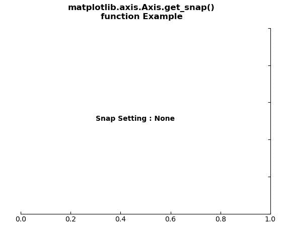
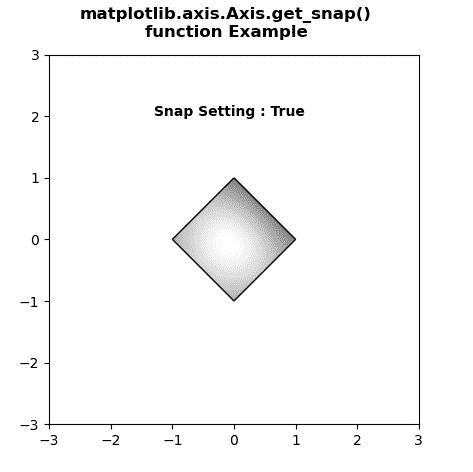

# Python 中的 Matplotlib.axis.Axis.get_snap()函数

> 原文:[https://www . geesforgeks . org/matplotlib-axis-axis-get _ snap-python 中的函数/](https://www.geeksforgeeks.org/matplotlib-axis-axis-get_snap-function-in-python/)

[**Matplotlib**](https://www.geeksforgeeks.org/python-introduction-matplotlib/) 是 Python 中的一个库，是 NumPy 库的数值-数学扩展。这是一个神奇的 Python 可视化库，用于 2D 数组图，并用于处理更广泛的 SciPy 堆栈。

## Matplotlib.axis.Axis.get_snap()函数

matplotlib 库的轴模块中的 **Axis.get_snap()函数**用于获取捕捉设置。

> **语法:** Axis.get_snap(self)
> 
> **参数:**该方法不接受任何参数。
> 
> **返回值:**此方法返回捕捉设置。

下面的例子说明了 matplotlib.axis.Axis.get_snap()函数在 matplotlib.axis:
中的作用

**例 1:**

## 蟒蛇 3

```py
# Implementation of matplotlib function
from matplotlib.axis import Axis
import matplotlib.pyplot as plt  
from mpl_toolkits.axisartist.axislines import Subplot  

fig = plt.figure()  

ax = Subplot(fig, 111)  
fig.add_subplot(ax)  

ax.axis["left"].set_visible(False)  
ax.axis["top"].set_visible(False)  

ax.text(0.3, 0.5, "Snap Setting : "
        +str(Axis.get_snap(ax)),   
        fontweight ="bold") 

fig.suptitle("""matplotlib.axis.Axis.get_snap()
function Example\n""", fontweight ="bold")  

plt.show()
```

**输出:**



**例 2:**

## 蟒蛇 3

```py
# Implementation of matplotlib function
from matplotlib.axis import Axis
import numpy as np  
import matplotlib.cm as cm  
import matplotlib.pyplot as plt  
import matplotlib.cbook as cbook  
from matplotlib.path import Path  
from matplotlib.patches import PathPatch  

delta = 0.025
x = y = np.arange(-3.0, 3.0, delta)  
X, Y = np.meshgrid(x, y)  

Z1 = np.exp(-X**2 - Y**2)  
Z2 = np.exp(-(X - 1)**2 - (Y - 1)**2)  
Z = (Z1 - Z2) * 2

path = Path([[0, 1], [1, 0], [0, -1],   
            [-1, 0], [0, 1]])  
patch = PathPatch(path, facecolor ='none')  

fig, ax = plt.subplots()  
ax.add_patch(patch)  

im = ax.imshow(Z, interpolation ='bilinear',  
               cmap = cm.gray,  
               origin ='lower',  
               extent =[-3, 3, -3, 3],  
               clip_path = patch,   
               clip_on = True)  

im.set_clip_path(patch)  

Axis.set_snap(ax, True)  

ax.text(-1.3, 2, "Snap Setting : "
        + str(Axis.get_snap(ax)),  
        fontweight ="bold") 

fig.suptitle("""matplotlib.axis.Axis.get_snap()
function Example\n""", fontweight ="bold")  

plt.show()
```

**输出:**

