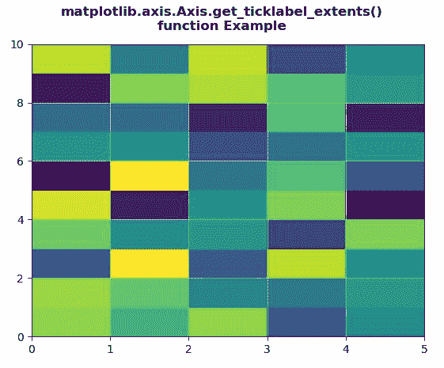

# Python 中的 matplotlib . axis . axis . get _ tick label _ extensions()函数

> 原文:[https://www . geeksforgeeks . org/matplotlib-axis-axis-get _ tick label _ extensions-function-in-python/](https://www.geeksforgeeks.org/matplotlib-axis-axis-get_ticklabel_extents-function-in-python/)

[**Matplotlib**](https://www.geeksforgeeks.org/python-introduction-matplotlib/) 是 Python 中的一个库，是 NumPy 库的数值-数学扩展。这是一个神奇的 Python 可视化库，用于 2D 数组图，并用于处理更广泛的 SciPy 堆栈。

## matplotlib . axis . axis . get _ tick label _ extensions()函数

matplotlib 库的轴模块中的**axis . get _ tick label _ extensions()函数**用于获取轴两侧刻度标签的范围

> **语法:**axis . get _ tick label _ extensions(self，渲染器)
> 
> **参数:**该方法接受以下参数。
> 
> *   **渲染器:**该参数是渲染器渲染实例
>     渲染器。
> 
> **返回值:**该方法返回坐标轴任一侧刻度标签的范围

下面的例子说明了 matplotlib . axis . get _ tick label _ extensions()函数在 matplotlib.axis:

**例 1:**

## 蟒蛇 3

```py
# Implementation of matplotlib function
from matplotlib.axis import Axis
import matplotlib.pyplot as plt 
import numpy as np 

X = np.arange(-5, 5, 1) 
Y = np.arange(-5, 5, 1) 
U, V = np.meshgrid(X, Y) 

fig, ax = plt.subplots() 
ax.quiver(X, Y, U, V) 
ax.invert_xaxis() 
w = Axis.get_ticklabel_extents(ax.xaxis,
                               fig.canvas.get_renderer()) 

print("Value Return :\n"+str(w)) 
ax.grid()

fig.suptitle("""matplotlib.axis.Axis.get_ticklabel_extents()
function Example\n""", fontweight ="bold")  

plt.show()
```

**输出:**


> 值返回:
> (Bbox([[98.1079545454545453，29.07777777777777776]，[513.603535353535353，43.0777777777777]])，Bbox([[0.0，0.0]，[0.0，0.0]))

**例 2:**

## 蟒蛇 3

```py
# Implementation of matplotlib function
from matplotlib.axis import Axis
import numpy as np  
import matplotlib.pyplot as plt  

xx = np.random.rand(10, 5)  

fig, ax = plt.subplots()  

m = ax.pcolor(xx)  
m.set_zorder(-2)

w = Axis.get_ticklabel_extents(ax.xaxis, fig.canvas.get_renderer()) 

print("Value Return :\n"+str(w)) 
ax.grid()

fig.suptitle("""matplotlib.axis.Axis.get_ticklabel_extents()
function Example\n""", fontweight ="bold")  

plt.show()
```

**输出:**



> 值返回:
> (Bbox([[75.5625，29.07777777777776]，[580.4375，43.077777777776]])，Bbox([[0.0，0.0]，[0.0，0.0]])