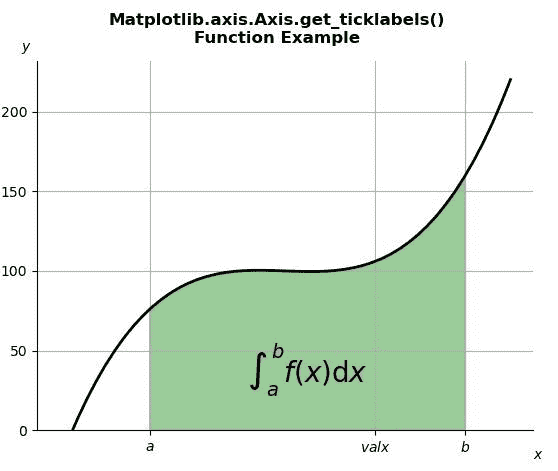
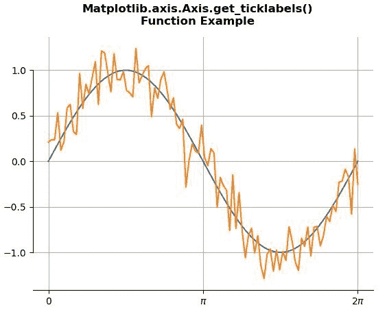

# Python 中的 matplotlib . axis . axis . get _ tick labels()函数

> 原文:[https://www . geeksforgeeks . org/matplotlib-axis-axis-get _ tick labels-python 中的函数/](https://www.geeksforgeeks.org/matplotlib-axis-axis-get_ticklabels-function-in-python/)

[**Matplotlib**](https://www.geeksforgeeks.org/python-introduction-matplotlib/) 是 Python 中的一个库，是 NumPy 库的数值-数学扩展。这是一个神奇的 Python 可视化库，用于 2D 数组图，并用于处理更广泛的 SciPy 堆栈。

## matplotlib . axis . axis . get _ tick labels()函数

matplotlib 库的 Axis 模块中的 **Axis.get_ticklabels()函数**用于获取作为文本实例列表的 tick 标签。

> **语法:** Axis.get_ticklabels(self，minor=False，其中=None)
> 
> **参数:**该方法接受以下参数。
> 
> *   **次要:**该参数包含布尔值。如果为真，返回次要标签，否则返回主要标签。
> *   **哪个:**该参数选择返回哪些 ticklabels。
> 
> **返回值:**该方法返回文本实例列表。

下面的例子说明了 matplotlib.axis . axis . get _ tick labels()函数在 matplotlib . axis 中的作用:

**例 1:**

## 蟒蛇 3

```py
# Implementation of matplotlib function 
from matplotlib.axis import Axis  
import numpy as np 
import matplotlib.pyplot as plt 
from matplotlib.patches import Polygon 

def func(x): 
    return (x - 4) * (x - 6) * (x - 5) + 100

a, b = 2, 9  # integral limits 
x = np.linspace(0, 10) 
y = func(x) 

fig, ax = plt.subplots() 
ax.plot(x, y, "k", linewidth = 2) 
ax.set_ylim(bottom = 0) 

# Make the shaded region 
ix = np.linspace(a, b) 
iy = func(ix) 
verts = [(a, 0), *zip(ix, iy), (b, 0)] 

poly = Polygon(verts, facecolor ='green', 
               edgecolor ='0.5', alpha = 0.4) 
ax.add_patch(poly) 

ax.text(0.5 * (a + b), 30,  
        r"$\int_a ^ b f(x)\mathrm{d}x{content}quot;, 
        horizontalalignment ='center',  
        fontsize = 20) 

fig.text(0.9, 0.05, '$x{content}apos;) 
fig.text(0.1, 0.9, '$y{content}apos;) 

ax.spines['right'].set_visible(False) 
ax.spines['top'].set_visible(False) 

ax.set_xticks((a, b-a, b)) 
ax.set_xticklabels(('$a{content}apos;, '$valx{content}apos;, '$b{content}apos;))

fig.suptitle('Matplotlib.axis.Axis.get_ticklabels()\n\
Function Example', fontweight ="bold")  
ax.grid()

print("Value of get_ticklabels() :")
for i in ax.xaxis.get_ticklabels():
    print(i)

plt.show()
```

**输出:**



```py
Value of get_ticklabels() :
Text(0, 0, '$a{content}apos;)
Text(0, 0, '$valx{content}apos;)
Text(0, 0, '$b{content}apos;)

```

**例 2:**

## 蟒蛇 3

```py
# Implementation of matplotlib function 
from matplotlib.axis import Axis  
import numpy as np 
import matplotlib.pyplot as plt 

# Fixing random state for reproducibility 
np.random.seed(19680801) 

x = np.linspace(0, 2 * np.pi, 100) 
y = np.sin(x) 
y2 = y + 0.2 * np.random.normal(size = x.shape) 

fig, ax = plt.subplots() 
ax.plot(x, y) 
ax.plot(x, y2) 

ax.set_xticks([0, np.pi, 2 * np.pi]) 
ax.set_xticklabels(['0', r'$\pi{content}apos;, r'2$\pi{content}apos;]) 

ax.spines['left'].set_bounds(-1, 1) 
ax.spines['right'].set_visible(False) 
ax.spines['top'].set_visible(False) 
fig.suptitle('Matplotlib.axis.Axis.get_ticklabels()\n\
Function Example', fontweight ="bold")  
ax.grid()

print("Value of get_ticklabels() :")
for i in ax.xaxis.get_ticklabels():
    print(i)

plt.show()
```

**输出:**



```py
Value of get_ticklabels() :
Text(0, 0, '0')
Text(0, 0, '$\\pi{content}apos;)
Text(0, 0, '2$\\pi{content}apos;)

```