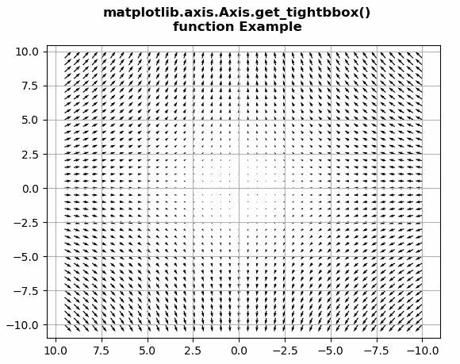
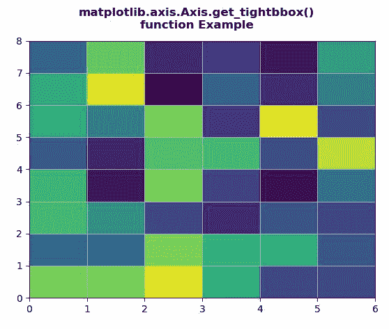

# Python 中的 matplotlib . axis . axis . get _ tigebox()函数

> 原文:[https://www . geeksforgeeks . org/matplotlib-axis-axis-get _ tigebox-python 中的函数/](https://www.geeksforgeeks.org/matplotlib-axis-axis-get_tightbbox-function-in-python/)

[**Matplotlib**](https://www.geeksforgeeks.org/python-introduction-matplotlib/) 是 Python 中的一个库，是 NumPy 库的数值-数学扩展。这是一个神奇的 Python 可视化库，用于 2D 数组图，并用于处理更广泛的 SciPy 堆栈。

## matplotlib . axis . axis . get _ tigebbox()函数

matplotlib 库的 Axis 模块中的**axis . get _ tigebbox()函数**用来获取包围该轴的包围盒。

> **语法:**axis . get _ tigebox(self，渲染器)
> 
> **参数:**该方法接受以下参数。
> 
> *   **渲染器:**该参数是渲染器渲染实例
>     渲染器
> 
> **返回值:**该方法返回包围轴的边界框。

下面的例子说明了 matplotlib . axis . axis . get _ tybbox()函数在 matplotlib.axis:
中的作用

**例 1:**

## 蟒蛇 3

```
# Implementation of matplotlib function
from matplotlib.axis import Axis
import matplotlib.pyplot as plt 
import numpy as np 

X = np.arange(-10, 10, 0.5) 
Y = np.arange(-10, 10, 0.5) 
U, V = np.meshgrid(X, Y) 

fig, ax = plt.subplots() 
ax.quiver(X, Y, U, V) 
ax.invert_xaxis() 
w = Axis.get_tightbbox(ax.xaxis, fig.canvas.get_renderer()) 

print("Value Return :\n"+str(w)) 
ax.grid()

fig.suptitle("""matplotlib.axis.Axis.get_tightbbox()
function Example\n""", fontweight ="bold")  

plt.show()
```

**输出:**



> 值返回:
> Bbox(x0=75.48368298368294，y0 = 29.077777777777776，x1 = 574.7670454545455，y1=43.077777777777776)

**例 2:**

## 蟒蛇 3

```
# Implementation of matplotlib function
from matplotlib.axis import Axis
import numpy as np  
import matplotlib.pyplot as plt  

xx = np.random.rand(8, 6)  

fig, ax = plt.subplots()  

m = ax.pcolor(xx)  
m.set_zorder(-2)  
w = Axis.get_tightbbox(ax.xaxis, fig.canvas.get_renderer()) 

print("Value Return :\n"+str(w)) 
ax.grid()

fig.suptitle("""matplotlib.axis.Axis.get_tightbbox()
function Example\n""", fontweight ="bold")  

plt.show()
```

**输出:**



> 值返回:
> Bbox(x0=75.5625，y0 = 29.077777777777776，x1=580.4375，y1 = 43.077777777777777777777776)