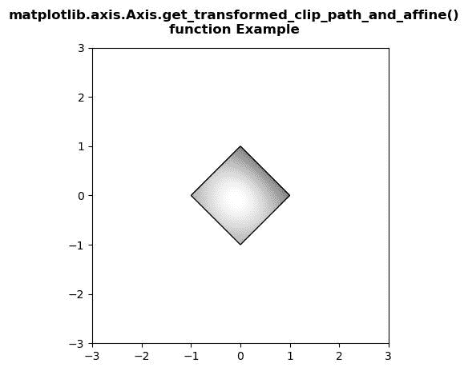

# Python 中的 matplotlib . axis . axis . get _ transformed _ clip _ path _ and _ 仿射()函数

> 原文:[https://www . geeksforgeeks . org/matplotlib-axis-axis-get _ transformed _ clip _ path _ and _ 仿射-python 中的函数/](https://www.geeksforgeeks.org/matplotlib-axis-axis-get_transformed_clip_path_and_affine-function-in-python/)

[**Matplotlib**](https://www.geeksforgeeks.org/python-introduction-matplotlib/) 是 Python 中的一个库，是 NumPy 库的数值-数学扩展。这是一个神奇的 Python 可视化库，用于 2D 数组图，并用于处理更广泛的 SciPy 堆栈。

## matplotlib . axis . axis . get _ transformed _ clip _ path _ and _ 仿射()函数

matplotlib 库的 Axis 模块中的**axis . get _ transformed _ clip _ path _ and _ affine()函数**用于获取应用了其变换的非仿射部分以及其变换的剩余仿射部分的裁剪路径。

> **语法:**axis . get _ transformed _ clip _ path _ and _ affine(self)
> 
> **参数:**该方法不接受任何参数。
> 
> **返回值:**该方法返回应用了变换的非仿射部分和变换的剩余仿射部分的剪辑路径。

下面的例子说明了 matplotlib . axis . get _ transformed _ clip _ path _ and _ 仿射()函数在 matplotlib.axis:
中的作用

**例 1:**

**所用图像:**


## 蟒蛇 3

```py
# Implementation of matplotlib function
from matplotlib.axis import Axis
import matplotlib.pyplot as plt  
import matplotlib.patches as patches  
import matplotlib.cbook as cbook  

with cbook.get_sample_data('image.PNG') as image_file:  
    image = plt.imread(image_file)  

fig, ax = plt.subplots()  
im = ax.imshow(image)  
patch = patches.Rectangle((50, 50), 200, 200,   
                          transform = ax.transData)  

# use of get_transformed_clip_path_and_affine() method 
val = Axis.get_transformed_clip_path_and_affine(im) 
ax.set_title("Value Return by get_transformed_clip_path_and_affine(): " 
             + str(val)) 

fig.suptitle("""matplotlib.axis.Axis.get_transformed_clip_path_and_affine()
function Example\n""", fontweight ="bold")  

plt.show()
```

**输出:**


**例 2:**

## 蟒蛇 3

```py
# Implementation of matplotlib function
from matplotlib.axis import Axis
import numpy as np  
import matplotlib.cm as cm  
import matplotlib.pyplot as plt  
from matplotlib.path import Path  
from matplotlib.patches import PathPatch  

delta = 0.025

x = y = np.arange(-3.0, 3.0, delta)  
X, Y = np.meshgrid(x, y)  

Z1 = np.exp(-X**2 - Y**2)  
Z2 = np.exp(-(X - 1)**2 - (Y - 1)**2)  
Z = (Z1 - Z2) * 2

path = Path([[0, 1], [1, 0], [0, -1], [-1, 0], [0, 1]])  
patch = PathPatch(path, facecolor ='none')  

fig, ax = plt.subplots()  
ax.add_patch(patch)  
im = ax.imshow(Z,  
               interpolation ='bilinear',   
               cmap = cm.gray,  
               origin ='lower',  
               extent =[-3, 3, -3, 3],  
               clip_path = patch,  
               clip_on = True) 

# use of get_transformed_clip_path_and_affine() method 
val = Axis.get_transformed_clip_path_and_affine(im) 
print("Value Return by get_transformed_clip_path_and_affine(): ") 
for i in val:  
    print(i)

fig.suptitle("""matplotlib.axis.Axis.get_transformed_clip_path_and_affine()
function Example\n""", fontweight ="bold")  

plt.show()
```

**输出:**



```py
Value Return by get_transformed_clip_path_and_affine(): 
Path(array([[ 0.,  1.],
       [ 1.,  0.],
       [ 0., -1.],
       [-1.,  0.],
       [ 0.,  1.]]), None)
Affine2D(
    [[ 82.66666667   0\.         328\.        ]
     [  0\.          61.6        237.6       ]
     [  0\.           0\.           1\.        ]])

```