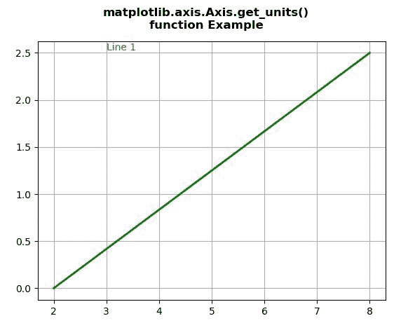
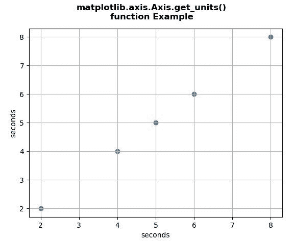

# Python 中的 Matplotlib.axis.Axis.get_units()函数

> 原文:[https://www . geesforgeks . org/matplotlib-axis-axis-get _ units-python 中的函数/](https://www.geeksforgeeks.org/matplotlib-axis-axis-get_units-function-in-python/)

[**Matplotlib**](https://www.geeksforgeeks.org/python-introduction-matplotlib/) 是 Python 中的一个库，是 NumPy 库的数值-数学扩展。这是一个神奇的 Python 可视化库，用于 2D 数组图，并用于处理更广泛的 SciPy 堆栈。

## Matplotlib.axis.Axis.get_units()函数

matplotlib 库的轴模块中的 **Axis.get_units()函数**用于获取轴的单位。

> **语法:** Axis.get_units(self)
> 
> **参数:**该方法不接受任何参数。
> 
> **返回值:**该方法返回轴的单位。

以下示例说明 matplotlib.axis.Axis.get_units()函数在 matplotlib.axis:
**示例 1:**

## 蟒蛇 3

```py
# Implementation of matplotlib function
from matplotlib.axis import Axis
import random
import matplotlib.lines as lines
import matplotlib.patches as patches
import matplotlib.text as text
import matplotlib.collections as collections
from basic_units import cm, inch
import numpy as np
import matplotlib.pyplot as plt

fig, ax = plt.subplots()
ax.xaxis.set_units(cm)
ax.yaxis.set_units(cm)

np.random.seed(19680801)

line = lines.Line2D([2*cm, 8*cm], [0*cm, 2.5*cm],
                    lw=2, color='green', axes=ax)
ax.add_line(line)

t = text.Text(3*cm, 2.5*cm, 
              'Line 1',
              ha='left',
              va='bottom',
              axes=ax,
              color='red')
ax.add_artist(t)

ax.grid(True)

print("Value return by get_units() :",
      ax.xaxis.get_units())

fig.suptitle("""matplotlib.axis.Axis.get_units()
function Example\n""", fontweight ="bold")  

plt.show()
```

**输出:**



```py
Value return by get_units() : centimeters

```

**例 2:**

## 蟒蛇 3

```py
# Implementation of matplotlib function
from matplotlib.axis import Axis
import numpy as np
import matplotlib.pyplot as plt
from basic_units import secs

# create masked array
data = (1, 2, 3, 4, 5, 6, 7, 8)
mask = (1, 0, 1, 0, 0, 0, 1, 0)
xsecs = secs * np.ma.MaskedArray(data, mask, float)

fig, ax1 = plt.subplots()

ax1.scatter(xsecs, xsecs)
ax1.yaxis.set_units(secs)

ax1.grid()

print("Value return by get_units() :",
      ax1.yaxis.get_units())

fig.suptitle("""matplotlib.axis.Axis.get_units()
function Example\n""", fontweight ="bold")  

plt.show()
```

**输出:**



```py
Value return by get_units() : seconds

```