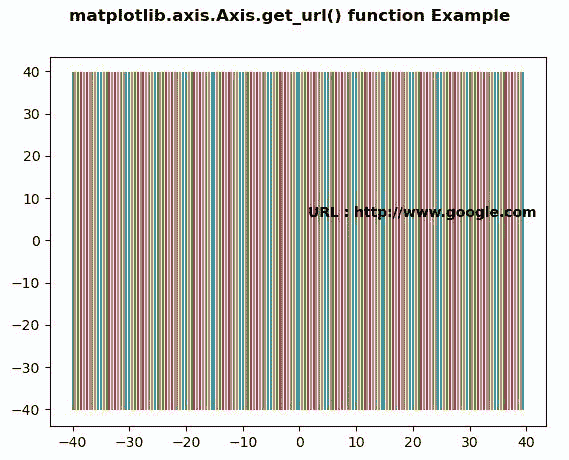
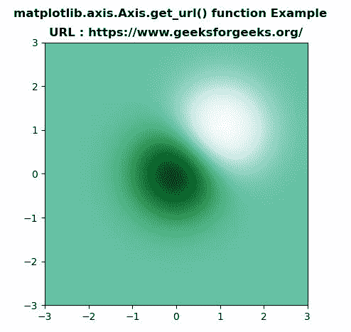

# Python 中的 Matplotlib.axis.Axis.get_url()函数

> 原文:[https://www . geesforgeks . org/matplotlib-axis-axis-get _ URL-in-function-python/](https://www.geeksforgeeks.org/matplotlib-axis-axis-get_url-in-function-python/)

[**Matplotlib**](https://www.geeksforgeeks.org/python-introduction-matplotlib/) 是 Python 中的一个库，是 NumPy 库的数值-数学扩展。这是一个神奇的 Python 可视化库，用于 2D 数组图，并用于处理更广泛的 SciPy 堆栈。

## Matplotlib.axis.Axis.get_url()函数

matplotlib 库的 Axis 模块中的 **Axis.get_url()函数**用于获取 url。

> **语法:** Axis.get_url(self)
> 
> **参数:**该方法不接受任何参数。
> 
> **返回值:**该方法返回网址。

以下示例说明 matplotlib.axis.Axis.get_url()函数在 matplotlib.axis:
**示例 1:**

## 蟒蛇 3

```
# Implementation of matplotlib function
from matplotlib.axis import Axis
import numpy as np  
import matplotlib.pyplot as plt  

X = np.arange(-40, 40, 0.5)  
Y = np.arange(-40, 40, 0.5)  
U, V = np.meshgrid(X, Y)  

fig, ax = plt.subplots()  
ax.plot(U, V)  
ax.set_url('http://www.google.com')  
fig.canvas.print_figure('scatter.svg')  

ax.text(1.5, 5.5, "URL : "
        + str( Axis.get_url(ax)),   
        fontweight ="bold")  

fig.suptitle('matplotlib.axis.Axis.get_url() \
function Example\n', fontweight ="bold")  

plt.show()
```

**输出:**



**例 2:**

## 蟒蛇 3

```
# Implementation of matplotlib function
from matplotlib.axis import Axis
import matplotlib.pyplot as plt 
import numpy as np  

fig, ax = plt.subplots()  
delta = 0.025

x = y = np.arange(-3.0, 3.0, delta)  
X, Y = np.meshgrid(x, y)  

Z1 = np.exp(-X**2 - Y**2)  
Z2 = np.exp(-(X - 1)**2 - (Y - 1)**2)  
Z = (Z1 - Z2) * 2

ax.imshow(Z, interpolation ='bilinear',   
          cmap = "BuGn",  
          origin ='lower',  
          extent =[-3, 3, -3, 3])  

ax.set_url('https://www.geeksforgeeks.org/')    
ax.set_title("URL : "+str(Axis.get_url(ax)),
             fontweight ="bold")   

fig.suptitle('matplotlib.axis.Axis.get_url() \
function Example\n', fontweight ="bold")  

plt.show() 
```

**输出:**

