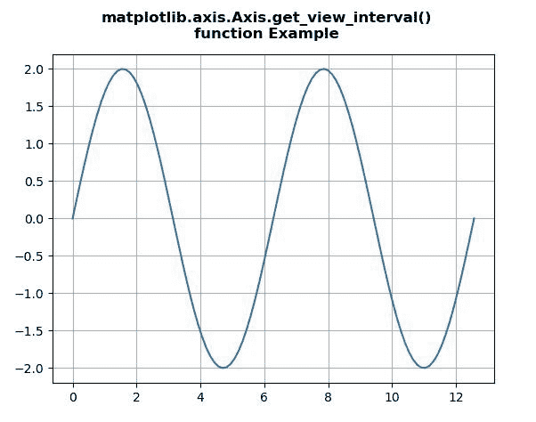
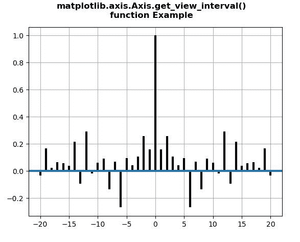

# Python 中的 matplotlib . axis . axis . get _ view _ interval()函数

> 原文:[https://www . geesforgeks . org/matplotlib-axis-axis-get _ view _ interval-in-function-python/](https://www.geeksforgeeks.org/matplotlib-axis-axis-get_view_interval-function-in-python/)

[**Matplotlib**](https://www.geeksforgeeks.org/python-introduction-matplotlib/) 是 Python 中的一个库，是 NumPy 库的数值-数学扩展。这是一个神奇的 Python 可视化库，用于 2D 数组图，并用于处理更广泛的 SciPy 堆栈。

## matplotlib . axis . axis . get _ view _ interval()函数

matplotlib 库的 Axis 模块中的 **Axis.get_view_interval()函数**用于获取该轴的视图限制(最小，最大)。

> **语法:**axis . get _ view _ interval(self)
> 
> **参数:**该方法不接受任何参数。
> 
> **返回值:**该方法返回该轴的视图限制(最小，最大)。

下面的例子说明了 matplotlib . axis . get _ view _ interval()函数在 matplotlib.axis:
中的作用

**例 1:**

## 蟒蛇 3

```py
# Implementation of matplotlib function
from matplotlib.axis import Axis
import matplotlib.pyplot as plt
import numpy as np 

fig = plt.figure()

x = np.linspace(0,4*np.pi,100)
y = 2*np.sin(x)

ax = fig.add_subplot()
ax.plot(x,y)

print("Value return by get_view_interval() :")
w = ax.xaxis.get_view_interval()
print(w)

ax.grid() 

fig.suptitle("""matplotlib.axis.Axis.get_view_interval()
function Example\n""", fontweight ="bold")  

plt.show()
```

**输出:**



```py
Value return by get_view_interval() :
[-0.62831853 13.19468915]

```

**例 2:**

## 蟒蛇 3

```py
# Implementation of matplotlib function
from matplotlib.axis import Axis
import matplotlib.pyplot as plt
import numpy as np 

np.random.seed(10**7)  
geeks = np.random.randn(40)  

fig, ax = plt.subplots()  
ax.acorr(geeks, usevlines = True,  
         normed = True,  
         maxlags = 20, lw = 3)  

ax.grid(True)

print("Value return by get_view_interval() :")
w = ax.xaxis.get_view_interval()
print(w)

fig.suptitle("""matplotlib.axis.Axis.get_view_interval()
function Example\n""", fontweight ="bold")  

plt.show()
```

**输出:**



```py
Value return by get_view_interval() :
[-22\.  22.]

```