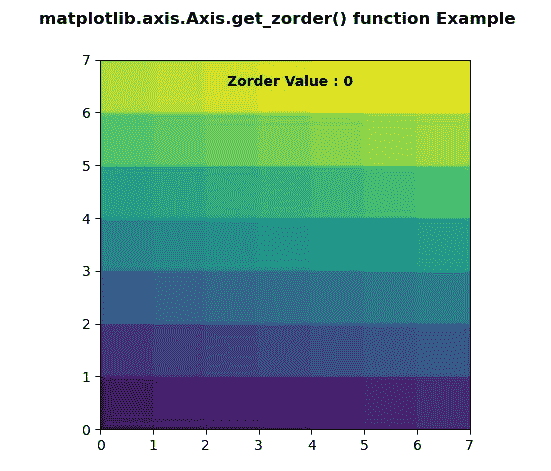
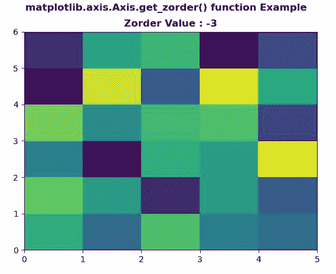

# Python 中的 matplotlib . axis . axis . get _ zorder()函数

> 原文:[https://www . geeksforgeeks . org/matplotlib-axis-axis-get _ zorder-python 中的函数/](https://www.geeksforgeeks.org/matplotlib-axis-axis-get_zorder-function-in-python/)

[**Matplotlib**](https://www.geeksforgeeks.org/python-introduction-matplotlib/) 是 Python 中的一个库，是 NumPy 库的数值-数学扩展。这是一个神奇的 Python 可视化库，用于 2D 数组图，并用于处理更广泛的 SciPy 堆栈。

## matplotlib . axis . axis . get _ zorder()函数

matplotlib 库的 Axis 模块中的 **Axis.get_zorder()函数**用于获取艺术家的 zorder。

> **语法:** Axis.get_zorder(self)
> 
> **参数:**该方法不接受任何参数。
> 
> **返回值:**此方法返回艺术家的 zorder。

下面的例子说明了 matplotlib . axis . axis . get _ zorder()函数在 matplotlib.axis:

**例 1:**

## 蟒蛇 3

```
# Implementation of matplotlib function
from matplotlib.axis import Axis
import numpy as np  
import matplotlib.pyplot as plt  

d = np.arange(49).reshape(7, 7)  
xx, yy = np.meshgrid(np.arange(8), np.arange(8))  

fig, ax = plt.subplots()  

ax.set_aspect(1)  
ax.pcolormesh(xx, yy, d)  

ax.text(2.4, 6.5, "Zorder Value : "
        + str(Axis.get_zorder(ax)),  
        fontweight ="bold")  

fig.suptitle('matplotlib.axis.Axis.get_zorder() \
function Example\n', fontweight ="bold")  

plt.show() 
```

**输出:**



**例 2:**

## 蟒蛇 3

```
# Implementation of matplotlib function
from matplotlib.axis import Axis
import numpy as np  
import matplotlib.pyplot as plt  

xx = np.random.rand(6, 5)  

fig, ax = plt.subplots()  

ax.pcolor(xx)  
ax.set_zorder(-3)  

ax.set_title( "Zorder Value : "
        + str(Axis.get_zorder(ax)),  
        fontweight ="bold")    

fig.suptitle('matplotlib.axis.Axis.get_zorder() \
function Example\n', fontweight ="bold")  

plt.show() 
```

**输出:**

