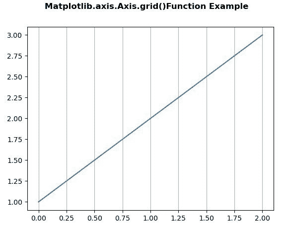
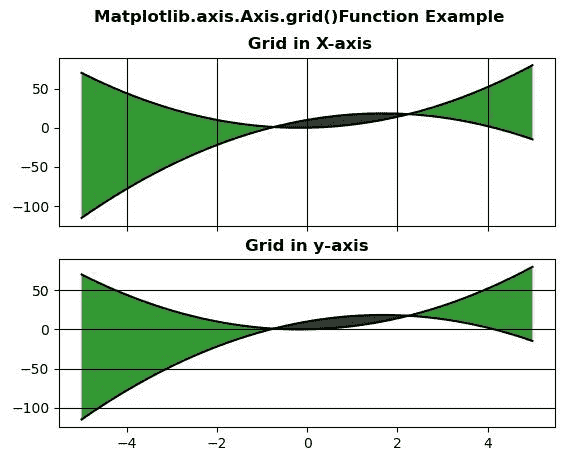

# Python 中的 Matplotlib.axis.Axis.grid()函数

> 原文:[https://www . geeksforgeeks . org/matplotlib-axis-axis-grid-function-in-python/](https://www.geeksforgeeks.org/matplotlib-axis-axis-grid-function-in-python/)

[**Matplotlib**](https://www.geeksforgeeks.org/python-introduction-matplotlib/) 是 Python 中的一个库，是 NumPy 库的数值-数学扩展。这是一个神奇的 Python 可视化库，用于 2D 数组图，并用于处理更广泛的 SciPy 堆栈。

## matplotlib.axis.Axis.grid()函数

matplotlib 库的轴模块中的 **Axis.grid()函数**用于配置网格线。

> **语法:** Axis.grid(self，b=None，其中='major '，**kwargs)
> 
> **参数:**该方法接受以下参数。
> 
> *   **b :** 该参数为可选参数，是否显示网格线。
> *   **哪个:**这个参数也是可选参数，是要应用更改的网格线。
> 
> **返回值:**此方法不返回值。

以下示例说明 matplotlib.axis.Axis.grid()函数在 matplotlib.axis:
**示例 1:**

## 蟒蛇 3

```
# Implementation of matplotlib function 
from matplotlib.axis import Axis  
import matplotlib.pyplot as plt 
import numpy as np 

fig, ax = plt.subplots() 
ax.plot([1, 2, 3]) 
ax.xaxis.grid() 

fig.suptitle("Matplotlib.axis.Axis.grid()\
Function Example", fontsize = 12, fontweight ='bold')

plt.show()
```

**输出:**



**例 2:**

## 蟒蛇 3

```
# Implementation of matplotlib function 
from matplotlib.axis import Axis  
import numpy as np 
import matplotlib.pyplot as plt 

x = np.arange(-5, 5, 0.01) 
y1 = -3 * x*x + 10 * x + 10
y2 = 3 * x*x + x 

fig, [ax, ax1] = plt.subplots(2, 1,  
                              sharex = True) 

ax.plot(x, y1, x, y2, color ='black') 
ax.fill_between(x, y1, y2, where = y2 >y1, 
                facecolor ='green', 
                alpha = 0.8) 

ax.fill_between(x, y1, y2, where = y2 <= y1,  
                facecolor ='black',  
                alpha = 0.8) 

ax.xaxis.grid(True, color ="black") 
ax.set_title('\n Grid in X-axis', 
             fontsize = 12, fontweight ='bold') 

ax1.plot(x, y1, x, y2, color ='black') 
ax1.fill_between(x, y1, y2, where = y2 >y1,  
                 facecolor ='green', 
                 alpha = 0.8) 

ax1.fill_between(x, y1, y2, where = y2 <= y1, 
                 facecolor ='black',  
                 alpha = 0.8) 

ax1.yaxis.grid(True, color ="black")
ax1.set_title('Grid in y-axis', 
             fontsize = 12, fontweight ='bold') 

fig.suptitle("Matplotlib.axis.Axis.grid()\
Function Example", fontsize = 12, fontweight ='bold') 

plt.show()
```

**输出:**

