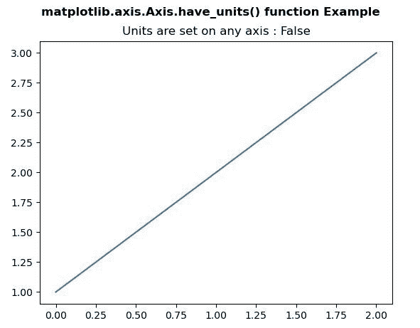
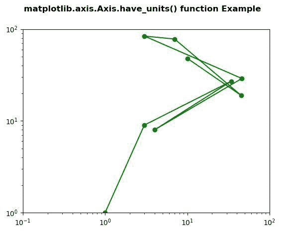

# Python 中的 matplotlib . axis . axis . have _ units()函数

> 原文:[https://www . geesforgeks . org/matplotlib-axis-axis-have _ units-function-in-python/](https://www.geeksforgeeks.org/matplotlib-axis-axis-have_units-function-in-python/)

[**Matplotlib**](https://www.geeksforgeeks.org/python-introduction-matplotlib/) 是 Python 中的一个库，是 NumPy 库的数值-数学扩展。这是一个神奇的 Python 可视化库，用于 2D 数组图，并用于处理更广泛的 SciPy 堆栈。

## matplotlib . axis . axis . have _ units()函数

matplotlib 库的轴模块中的 **Axis.have_units()功能**用于检查单位是否设置在任意轴上。

> **语法:** Axis.have_units(self)
> 
> **参数:**该方法不接受任何参数。
> 
> **返回值:**如果单位设置在任意轴上，该方法返回真。

下面的例子说明了 matplotlib . axis . axis . have _ units()函数在 matplotlib.axis:
中的作用

**例 1:**

## 蟒蛇 3

```
# Implementation of matplotlib function
from matplotlib.axis import Axis
import matplotlib.pyplot as plt 

fig, axs = plt.subplots() 
axs.plot([1, 2, 3]) 

axs.set_title("Units are set on any axis : "
              +str(axs.xaxis.have_units()))   

fig.suptitle('matplotlib.axis.Axis.have_units() \
function Example\n', fontweight ="bold")  

plt.show() 
```

**输出:**



**例 2:**

## 蟒蛇 3

```
# Implementation of matplotlib function
from matplotlib.axis import Axis
import matplotlib.pyplot as plt 

fig, ax1 = plt.subplots( ) 
ax1.set_xscale("log") 
ax1.set_yscale("log") 
ax1.set_adjustable("datalim") 

ax1.plot([1, 3, 34, 4, 46, 3, 7, 45, 10], 
         [1, 9, 27, 8, 29, 84, 78, 19, 48], 
          "o-", color ="green") 

ax1.set_xlim(1e-1, 1e2) 
ax1.set_ylim(1, 1e2) 

w = Axis.have_units(ax1.yaxis) 

print("Value Return by have_units() :", w)   

fig.suptitle('matplotlib.axis.Axis.have_units() \
function Example\n', fontweight ="bold")  

plt.show() 
```

**输出:**

