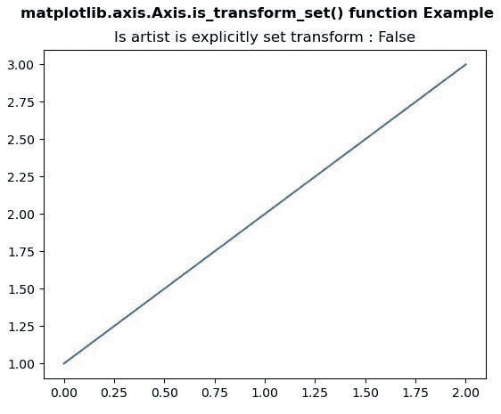
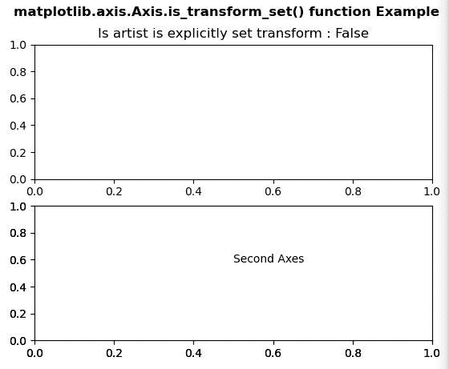

# Python 中的 matplotlib . axis . axis . is _ transform _ set()函数

> 原文:[https://www . geesforgeks . org/matplotlib-axis-axis-is _ transform _ set-python 中的函数/](https://www.geeksforgeeks.org/matplotlib-axis-axis-is_transform_set-function-in-python/)

[**Matplotlib**](https://www.geeksforgeeks.org/python-introduction-matplotlib/) 是 Python 中的一个库，是 NumPy 库的数值-数学扩展。这是一个神奇的 Python 可视化库，用于 2D 数组图，并用于处理更广泛的 SciPy 堆栈。

## matplotlib . axis . axis . is _ transform _ set()函数

matplotlib 库的轴模块中的 **Axis.is_transform_set()函数**用于获取 Artist 是否有显式设置的变换。

> **语法:**axis . is _ transform _ set(self)
> 
> **参数:**该方法不接受任何参数。
> 
> **返回值:**该方法返回艺术家是否有显式设置的变换。

以下示例说明 matplotlib . axis . axis . is _ transform _ set()函数在 matplotlib.axis:
**示例 1:**

## 蟒蛇 3

```
# Implementation of matplotlib function
from matplotlib.axis import Axis
import matplotlib.pyplot as plt 

fig, axs = plt.subplots() 
axs.plot([1, 2, 3]) 

axs.set_title("Is artist is explicitly set transform : "
              +str(Axis.is_transform_set(axs)))   

fig.suptitle('matplotlib.axis.Axis.is_transform_set() \
function Example\n', fontweight ="bold")  

plt.show() 
```

**输出:**



**例 2:**

## 蟒蛇 3

```
# Implementation of matplotlib function
from matplotlib.axis import Axis
import matplotlib.pyplot as plt 

fig, (axs, axs2) = plt.subplots(2, 1) 
gs = axs2.get_gridspec() 

axbig = fig.add_subplot(gs[1:, -1]) 
axbig.annotate("Second Axes", (0.5, 0.6), 
               xycoords ='axes fraction', 
               va ='center') 

axs.set_title("Is artist is explicitly set transform : "
              +str(Axis.is_transform_set(axs)))   

fig.suptitle('matplotlib.axis.Axis.is_transform_set() \
function Example\n', fontweight ="bold")  

plt.show() 
```

**输出:**

