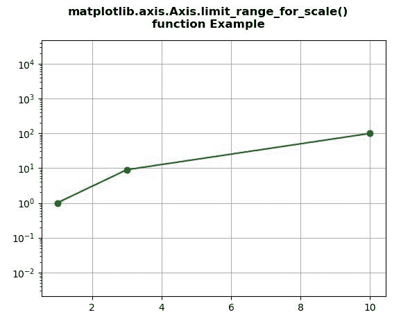
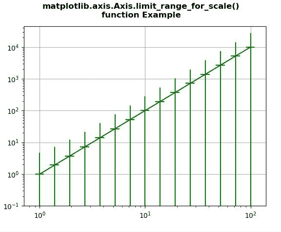

# Python 中 matplotlib . axis . axis . limit _ range _ for _ scale()函数

> 原文:[https://www . geeksforgeeks . org/matplotlib-axis-axis-limit _ range _ for _ scale-function-in-python/](https://www.geeksforgeeks.org/matplotlib-axis-axis-limit_range_for_scale-function-in-python/)

[**Matplotlib**](https://www.geeksforgeeks.org/python-introduction-matplotlib/) 是 Python 中的一个库，是 NumPy 库的数值-数学扩展。这是一个神奇的 Python 可视化库，用于 2D 数组图，并用于处理更广泛的 SciPy 堆栈。

## matplotlib . axis . axis . limit _ range _ for _ scale()函数

matplotlib 库的 Axis 模块中的 **Axis.limit_range_for_scale()函数**用于重新初始化主刻度列表和次刻度列表。

> **语法:**axis . limit _ range _ for _ scale(self，vmin，vmax)
> 
> **参数:**该方法接受以下参数。
> 
> *   **vmin:** 此参数为最小值。
> *   **vmax:** 此参数为最大值。
> 
> **返回值:**此方法不返回值。

下面的例子说明了 matplotlib . axis . limit _ range _ for _ scale()函数在 matplotlib.axis:

**例 1:**

## 蟒蛇 3

```py
# Implementation of matplotlib function
from matplotlib.axis import Axis
import matplotlib.pyplot as plt

fig, ax = plt.subplots()

ax.set_yscale("log")
ax.set_adjustable("datalim")
ax.plot([1, 3, 10], [1, 9, 100], "o-",color="green")
ax.set_aspect(1)

ax.xaxis.limit_range_for_scale(0,5)

ax.grid() 

fig.suptitle("""matplotlib.axis.Axis.limit_range_for_scale()
function Example\n""", fontweight ="bold")  

plt.show()
```

**输出:**



**例 2:**

## 蟒蛇 3

```py
# Implementation of matplotlib function
from matplotlib.axis import Axis
import numpy as np
import matplotlib.pyplot as plt

fig, ax4 = plt.subplots()

x = 10.0**np.linspace(0.0, 2.0, 15)
y = x**2.0
ax4.set_xscale("log", nonposx='clip')
ax4.set_yscale("log", nonposy='clip')

ax4.errorbar(x, y, xerr=0.1 * x, 
             yerr=2.0 + 1.75 * y,
             color="green")

ax4.set_ylim(bottom=0.1)

ax4.xaxis.limit_range_for_scale(0,5)
ax4.yaxis.limit_range_for_scale(3,5)

ax4.grid() 

fig.suptitle("""matplotlib.axis.Axis.limit_range_for_scale()
function Example\n""", fontweight ="bold")  

plt.show()
```

**输出:**

