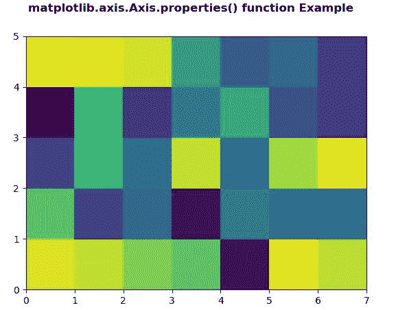
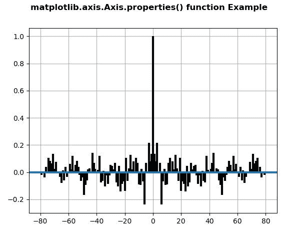

# Python 中的 matplotlib . axis . axis . properties()函数

> 原文:[https://www . geeksforgeeks . org/matplotlib-axis-axis-properties-function-in-python/](https://www.geeksforgeeks.org/matplotlib-axis-axis-properties-function-in-python/)

[**Matplotlib**](https://www.geeksforgeeks.org/python-introduction-matplotlib/) 是 Python 中的一个库，是 NumPy 库的数值-数学扩展。这是一个神奇的 Python 可视化库，用于 2D 数组图，并用于处理更广泛的 SciPy 堆栈。

## matplotlib . axis . axis . properties()函数

matplotlib 库的 Axis 模块中的 **Axis.properties()函数**用于获取艺术家所有属性的字典。

```py
Syntax: Axis.properties(self) 

Parameters: This method does not accepts any parameters. Return value: This method return dictionary of all the properties of the artist. 
```

以下示例说明 matplotlib . axis . axis . properties()函数在 matplotlib.axis:
**示例 1:**

## 蟒蛇 3

```py
# Implementation of matplotlib function
from matplotlib.axis import Axis
import numpy as np   
import matplotlib.pyplot as plt   

xx = np.random.rand(5, 7)   

fig, ax = plt.subplots()   

m = ax.pcolor(xx)   
m.set_zorder(2)  

w = Axis.properties(ax)  
print("Display all Properties\n")  
for i in w:  
    print(i, ":", w[i]) 

fig.suptitle('matplotlib.axis.Axis.properties() \
function Example\n', fontweight ="bold")  

plt.show() 
```

**输出:**



```py
Display all Properties
adjustable : box 
agg_filter : None 
alpha : None 
anchor : C 
animated : False 
aspect : auto 
autoscale_on : True 
autoscalex_on : True 
autoscaley_on : True 
axes_locator : None 
axisbelow : line 
children : [<matplotlib.collections.PolyCollection object at 0x098F9810>, <matplotlib.spines.Spine object at 0x087152B0>, <matplotlib.spines.Spine object at 0x08715350>, <matplotlib.spines.Spine object at 0x087153F0>, <matplotlib.spines.Spine object at 0x08715490>, <matplotlib.axis.XAxis object at 0x08715230>, <matplotlib.axis.YAxis object at 0x08715710>, Text(0.5, 1.0, ”), Text(0.0, 1.0, ”), Text(1.0, 1.0, ”), <matplotlib.patches.Rectangle object at 0x0873B150>] 
clip_box : None 
clip_on : True 
clip_path : None 
contains : None 
data_ratio : 0.7142857142857143 
default_bbox_extra_artists : [<matplotlib.collections.PolyCollection object at 0x098F9810>, <matplotlib.spines.Spine object at 0x087152B0>,<matplotlib.spines.Spine object at 0x08715350>, <matplotlib.spines.Spine object at 0x087153F0>, <matplotlib.spines.Spine object at 0x08715490>, <matplotlib.axis.XAxis object at 0x08715230>, <matplotlib.axis.YAxis object at 0x08715710>, Text(0.5, 1.0, ”), Text(0.0, 1.0, ”), Text(1.0, 1.0, ”), <matplotlib.patches.Rectangle object at 0x0873B150>] 
facecolor : (1.0, 1.0, 1.0, 1.0) 
fc : (1.0, 1.0, 1.0, 1.0) 
figure : Figure(640×480) 
frame_on : True 
geometry : (1, 1, 1) 
gid : None 
gridspec : GridSpec(1, 1) 
images : <a list of 0 AxesImage objects> 
in_layout : True 
label : 
legend : None 
legend_handles_labels : ([], []) 
lines :<a list of 0 Line2D objects> 
navigate : True 
navigate_mode : None 
path_effects : [] 
picker : None 
position : Bbox(x0=0.125, y0=0.10999999999999999, x1=0.9, y1=0.88) 
rasterization_zorder : None 
rasterized : None 
renderer_cache : None 
shared_x_axes : <matplotlib.cbook.Grouper object at 0x085CE210> 
shared_y_axes :<matplotlib.cbook.Grouper object at 0x085CE270> 
sketch_params : None 
snap : None 
subplotspec : <matplotlib.gridspec.SubplotSpec object at 0x079122B0> 
title : 
transform : IdentityTransform() 
transformed_clip_path_and_affine : (None, None) 
url : None 
visible : True 
window_extent : TransformedBbox( 
Bbox(x0=0.125, y0=0.10999999999999999, x1=0.9, y1=0.88), 
BboxTransformTo( 
TransformedBbox( 
Bbox(x0=0.0, y0=0.0, x1=6.4, y1=4.8), 
Affine2D( 
[[100\. 0\. 0.] 
[ 0\. 100\. 0.] 
[ 0\. 0\. 1.]])))) 
xaxis : XAxis(80.0,52.8) 
xaxis_transform : BlendedGenericTransform( 
CompositeGenericTransform( 
TransformWrapper( 
BlendedAffine2D( 
IdentityTransform(), 
IdentityTransform())), 
CompositeGenericTransform( 
BboxTransformFrom( 
TransformedBbox( 
Bbox(x0=0.0, y0=0.0, x1=7.0, y1=5.0), 
TransformWrapper( 
BlendedAffine2D( 
IdentityTransform(), 
IdentityTransform())))), 
BboxTransformTo( 
TransformedBbox( 
Bbox(x0=0.125, y0=0.10999999999999999, x1=0.9, y1=0.88), 
BboxTransformTo( 
TransformedBbox( 
Bbox(x0=0.0, y0=0.0, x1=6.4, y1=4.8), 
Affine2D( 
[[100\. 0\. 0.] 
[ 0\. 100\. 0.] 
[ 0\. 0\. 1.]]))))))), 
BboxTransformTo( 
TransformedBbox( 
Bbox(x0=0.125, y0=0.10999999999999999, x1=0.9, y1=0.88), 
BboxTransformTo( 
TransformedBbox( 
Bbox(x0=0.0, y0=0.0, x1=6.4, y1=4.8), 
Affine2D( 
[[100\. 0\. 0.] 
[ 0\. 100\. 0.] 
[ 0\. 0\. 1.]])))))) 
xbound : (0.0, 7.0) 
xgridlines : <a list of 8 Line2D gridline objects> 
xlabel : 
xlim : (0.0, 7.0) 
xmajorticklabels : <a list of 8 Text major ticklabel objects> 
xminorticklabels : <a list of 0 Text minor ticklabel objects> 
xscale : linear 
xticklabels : <a list of 8 Text major ticklabel objects> 
xticklines : <a list of 16 Line2D ticklines objects> 
xticks : [0\. 1\. 2\. 3\. 4\. 5\. 6\. 7.] 
yaxis : YAxis(80.0,52.8) 
yaxis_transform : BlendedGenericTransform( 
BboxTransformTo( 
TransformedBbox( 
Bbox(x0=0.125, y0=0.10999999999999999, x1=0.9, y1=0.88), 
BboxTransformTo( 
TransformedBbox( 
Bbox(x0=0.0, y0=0.0, x1=6.4, y1=4.8), 
Affine2D( 
[[100\. 0\. 0.] 
[ 0\. 100\. 0.] 
[ 0\. 0\. 1.]]))))), 
CompositeGenericTransform( 
TransformWrapper( 
BlendedAffine2D( 
IdentityTransform(), 
IdentityTransform())), 
CompositeGenericTransform( 
BboxTransformFrom( 
TransformedBbox( 
Bbox(x0=0.0, y0=0.0, x1=7.0, y1=5.0), 
TransformWrapper( 
BlendedAffine2D( 
IdentityTransform(), 
IdentityTransform())))), 
BboxTransformTo( 
TransformedBbox( 
Bbox(x0=0.125, y0=0.10999999999999999, x1=0.9, y1=0.88), 
BboxTransformTo( 
TransformedBbox( 
Bbox(x0=0.0, y0=0.0, x1=6.4, y1=4.8), 
Affine2D( 
[[100\. 0\. 0.] 
[ 0\. 100\. 0.] 
[ 0\. 0\. 1.]])))))))) 
ybound : (0.0, 5.0) 
ygridlines : <a list of 6 Line2D gridline objects> 
ylabel : 
ylim : (0.0, 5.0) 
ymajorticklabels : <a list of 6 Text major ticklabel objects> 
yminorticklabels : <a list of 0 Text minor ticklabel objects> 
yscale : linear 
yticklabels : <a list of 6 Text major ticklabel objects> 
yticklines : <a list of 12 Line2D ticklines objects> 
yticks : [0\. 1\. 2\. 3\. 4\. 5.] 
zorder : 0 

```

**例 2:**

## 蟒蛇 3

```py
# Implementation of matplotlib function
from matplotlib.axis import Axis
import matplotlib.pyplot as plt  
import numpy as np  

np.random.seed(10**7)  
geeks = np.random.randn(100)  

fig, ax = plt.subplots()  
ax.acorr(geeks, usevlines = True,  
         normed = True,  
         maxlags = 80, lw = 3)  

ax.grid(True)  

w = Axis.properties(ax)  
print("Display all Properties\n")  
for i in w:  
    print(i, ":", w[i]) 

fig.suptitle('matplotlib.axis.Axis.properties() \
function Example\n', fontweight ="bold")  

plt.show() 
```

**输出:**



```py
Display all Properties
adjustable : box 
agg_filter : None 
alpha : None 
anchor : C 
animated : False 
aspect : auto 
autoscale_on : True 
autoscalex_on : True 
autoscaley_on : True 
axes_locator : None 
axisbelow : line 
children : [<matplotlib.collections.LineCollection object at 0x0AAFA810>, <matplotlib.lines.Line2D object at 0x0AAFA7F0>, <matplotlib.spines.Spine object at 0x081762D0>, <matplotlib.spines.Spine object at 0x08176370>, <matplotlib.spines.Spine object at 0x08176410>, <matplotlib.spines.Spine object at 0x081764B0>, <matplotlib.axis.XAxis object at 0x08176250>, <matplotlib.axis.YAxis object at 0x081766F0>, Text(0.5, 1.0, ”), Text(0.0, 1.0, ”), Text(1.0, 1.0, ”), <matplotlib.patches.Rectangle object at 0x0819D130>] 
clip_box : None 
clip_on : True 
clip_path : None 
contains : None 
data_ratio : 0.007741698372824119 
default_bbox_extra_artists : [<matplotlib.collections.LineCollection object at 0x0AAFA810>, <matplotlib.lines.Line2D object at 0x0AAFA7F0>, <matplotlib.spines.Spine object at 0x081762D0>, <matplotlib.spines.Spine object at 0x08176370>, <matplotlib.spines.Spine object at 0x08176410>, <matplotlib.spines.Spine object at 0x081764B0>, <matplotlib.axis.XAxis object at 0x08176250>, <matplotlib.axis.YAxis object at 0x081766F0>, Text(0.5, 1.0, ”), Text(0.0, 1.0, ”), Text(1.0, 1.0, ”), <matplotlib.patches.Rectangle object at 0x0819D130>] 
facecolor : (1.0, 1.0, 1.0, 1.0) 
fc : (1.0, 1.0, 1.0, 1.0) 
figure : Figure(640×480) 
frame_on : True 
geometry : (1, 1, 1) 
gid : None 
gridspec : GridSpec(1, 1) 
images : <a list of 0 AxesImage objects> 
in_layout : True 
label : 
legend : None 
legend_handles_labels : ([], []) 
lines : <a list of 1 Line2D objects> 
navigate : True 
navigate_mode : None 
path_effects : [] 
picker : None 
position : Bbox(x0=0.125, y0=0.10999999999999999, x1=0.9, y1=0.88) 
rasterization_zorder : None 
rasterized : None 
renderer_cache : None 
shared_x_axes : <matplotlib.cbook.Grouper object at 0x0802E210> 
shared_y_axes : <matplotlib.cbook.Grouper object at 0x0802E270> 
sketch_params : None 
snap : None 
subplotspec : <matplotlib.gridspec.SubplotSpec object at 0x073722F0> 
title : 
transform : IdentityTransform() 
transformed_clip_path_and_affine : (None, None) 
url : None 
visible : True 
window_extent : TransformedBbox( 
Bbox(x0=0.125, y0=0.10999999999999999, x1=0.9, y1=0.88), 
BboxTransformTo( 
TransformedBbox( 
Bbox(x0=0.0, y0=0.0, x1=6.4, y1=4.8), 
Affine2D( 
[[100\. 0\. 0.] 
[ 0\. 100\. 0.] 
[ 0\. 0\. 1.]])))) 
xaxis : XAxis(80.0,52.8) 
xaxis_transform : BlendedGenericTransform( 
CompositeGenericTransform( 
TransformWrapper( 
BlendedAffine2D( 
IdentityTransform(), 
IdentityTransform())), 
CompositeGenericTransform( 
BboxTransformFrom( 
TransformedBbox( 
Bbox(x0=-88.0, y0=-0.300605326634452, x1=88.0, y1=1.061933586982593), 
TransformWrapper( 
BlendedAffine2D( 
IdentityTransform(), 
IdentityTransform())))), 
BboxTransformTo( 
TransformedBbox( 
Bbox(x0=0.125, y0=0.10999999999999999, x1=0.9, y1=0.88), 
BboxTransformTo( 
TransformedBbox( 
Bbox(x0=0.0, y0=0.0, x1=6.4, y1=4.8), 
Affine2D( 
[[100\. 0\. 0.] 
[ 0\. 100\. 0.] 
[ 0\. 0\. 1.]]))))))), 
BboxTransformTo( 
TransformedBbox( 
Bbox(x0=0.125, y0=0.10999999999999999, x1=0.9, y1=0.88), 
BboxTransformTo( 
TransformedBbox( 
Bbox(x0=0.0, y0=0.0, x1=6.4, y1=4.8), 
Affine2D( 
[[100\. 0\. 0.] 
[ 0\. 100\. 0.] 
[ 0\. 0\. 1.]])))))) 
xbound : (-88.0, 88.0) 
xgridlines : <a list of 11 Line2D gridline objects> 
xlabel : 
xlim : (-88.0, 88.0) 
xmajorticklabels : <a list of 11 Text major ticklabel objects> 
xminorticklabels : <a list of 0 Text minor ticklabel objects> 
xscale : linear 
xticklabels : <a list of 11 Text major ticklabel objects> 
xticklines : <a list of 22 Line2D ticklines objects> 
xticks : [-100\. -80\. -60\. -40\. -20\. 0\. 20\. 40\. 60\. 80\. 100.] 
yaxis : YAxis(80.0,52.8) 
yaxis_transform : BlendedGenericTransform( 
BboxTransformTo( 
TransformedBbox( 
Bbox(x0=0.125, y0=0.10999999999999999, x1=0.9, y1=0.88), 
BboxTransformTo( 
TransformedBbox( 
Bbox(x0=0.0, y0=0.0, x1=6.4, y1=4.8), 
Affine2D( 
[[100\. 0\. 0.] 
[ 0\. 100\. 0.] 
[ 0\. 0\. 1.]]))))), 
CompositeGenericTransform( 
TransformWrapper( 
BlendedAffine2D( 
IdentityTransform(), 
IdentityTransform())), 
CompositeGenericTransform( 
BboxTransformFrom( 
TransformedBbox( 
Bbox(x0=-88.0, y0=-0.300605326634452, x1=88.0, y1=1.061933586982593), 
TransformWrapper( 
BlendedAffine2D( 
IdentityTransform(), 
IdentityTransform())))), 
BboxTransformTo( 
TransformedBbox( 
Bbox(x0=0.125, y0=0.10999999999999999, x1=0.9, y1=0.88), 
BboxTransformTo( 
TransformedBbox( 
Bbox(x0=0.0, y0=0.0, x1=6.4, y1=4.8), 
Affine2D( 
[[100\. 0\. 0.] 
[ 0\. 100\. 0.] 
[ 0\. 0\. 1.]])))))))) 
ybound : (-0.300605326634452, 1.061933586982593) 
ygridlines : <a list of 9 Line2D gridline objects> 
ylabel : 
ylim : (-0.300605326634452, 1.061933586982593) 
ymajorticklabels : <a list of 9 Text major ticklabel objects> 
yminorticklabels : <a list of 0 Text minor ticklabel objects> 
yscale : linear 
yticklabels : <a list of 9 Text major ticklabel objects> 
yticklines : <a list of 18 Line2D ticklines objects> 
yticks : [-0.4 -0.2 0\. 0.2 0.4 0.6 0.8 1\. 1.2] 
zorder : 0 

```