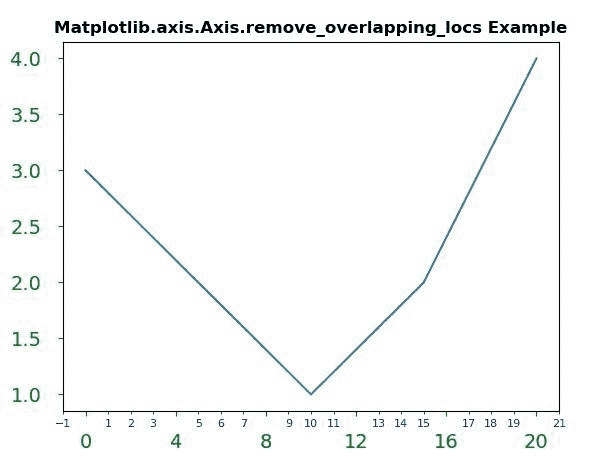
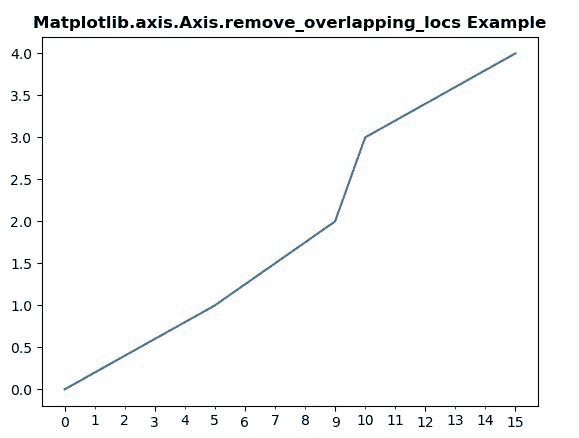

# Python 中的 matplotlib . axis . axis . remove _ overlapping _ locs()函数

> 原文:[https://www . geeksforgeeks . org/matplotlib-axis-axis-remove _ overlapping _ locs-python 中的函数/](https://www.geeksforgeeks.org/matplotlib-axis-axis-remove_overlapping_locs-function-in-python/)

[**Matplotlib**](https://www.geeksforgeeks.org/python-introduction-matplotlib/) 是 Python 中的一个库，是 NumPy 库的数值-数学扩展。这是一个神奇的 Python 可视化库，用于 2D 数组图，并用于处理更广泛的 SciPy 堆栈。

## matplotlib . axis . axis . remove _ overlapping _ locas 函数

matplotlib 库的 Axis 模块中的**axis . remove _ overlapping _ locas 函数**用于修剪与主要跑马灯位置重叠的次要跑马灯位置。

> **语法:**轴.移除重叠位置
> 
> **参数:**该方法接受以下参数。
> 
> *   **格式化程序:**该参数是*定位器*。
> 
> **返回值:**此方法不返回值。

下面的例子说明了 matplotlib.axis . axis . remove _ overlapping _ locs 函数在 matplotlib . axis 中的作用:

**例 1:**

## 蟒蛇 3

```
# Implementation of matplotlib function 
from matplotlib.axis import Axis
import matplotlib.pyplot as plt 
from matplotlib.ticker import MultipleLocator, ScalarFormatter 

fig, ax = plt.subplots() 
ax.plot([0, 5, 10, 15, 20], [3, 2, 1, 2, 4]) 

Axis.set_minor_locator(ax.xaxis, MultipleLocator(1)) 
Axis.set_minor_formatter(ax.xaxis, ScalarFormatter())
Axis.set_major_locator(ax.xaxis, MultipleLocator(4)) 

ax.tick_params(axis ='both', which ='major',  
               labelsize = 14, pad = 12,  
               colors ='g') 

ax.tick_params(axis ='both', which ='minor', 
               labelsize = 8, colors ='b')
ax.xaxis.remove_overlapping_locs

plt.title("Matplotlib.axis.Axis.remove_overlapping_locs \
Example", fontsize = 12, fontweight ='bold') 

plt.show()
```

**输出:**



**例 2:**

## 蟒蛇 3

```
# Implementation of matplotlib function 
from matplotlib.axis import Axis
import matplotlib.pyplot as plt 
import matplotlib.ticker as ticker
from matplotlib.ticker import MultipleLocator, ScalarFormatter

x = [0, 5, 9, 10, 15] 
y = [0, 1, 2, 3, 4] 

tick_spacing = 1

fig, ax = plt.subplots(1, 1) 
ax.plot(x, y)

Axis.set_major_locator(ax.xaxis, 
                       ticker.MultipleLocator(3))
Axis.set_minor_locator(ax.xaxis, 
                       ticker.MultipleLocator(tick_spacing))
Axis.set_minor_formatter(ax.xaxis, ScalarFormatter())
ax.xaxis.remove_overlapping_locs

plt.title("Matplotlib.axis.Axis.remove_overlapping_locs \
Example", fontsize = 12, fontweight ='bold') 

plt.show()
```

**输出:**

