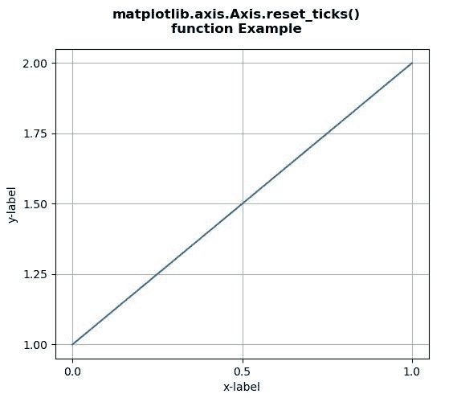
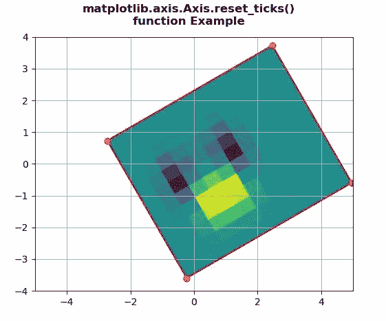

# Python 中的 matplotlib . axis . axis . reset _ ticks()函数

> 原文:[https://www . geesforgeks . org/matplotlib-axis-axis-reset _ tics-python 中的函数/](https://www.geeksforgeeks.org/matplotlib-axis-axis-reset_ticks-function-in-python/)

[**Matplotlib**](https://www.geeksforgeeks.org/python-introduction-matplotlib/) 是 Python 中的一个库，是 NumPy 库的数值-数学扩展。这是一个神奇的 Python 可视化库，用于 2D 数组图，并用于处理更广泛的 SciPy 堆栈。

## matplotlib . axis . axis . reset _ ticks()函数

matplotlib 库的 Axis 模块中的 **Axis.reset_ticks()函数**用于重新初始化主要和次要 Tick 列表。

> **语法:** Axis.reset_ticks(self)
> 
> **参数:**该方法不接受任何参数。
> 
> **返回值:**此方法不返回值。

下面的例子说明了 matplotlib . axis . axis . reset _ ticks()函数在 matplotlib.axis:
中的作用

**例 1:**

## 蟒蛇 3

```py
# Implementation of matplotlib function
from matplotlib.axis import Axis
import matplotlib.pyplot as plt
import matplotlib.colors as mcolors
import matplotlib.gridspec as gridspec
import numpy as np

plt.rcParams['savefig.facecolor'] = "0.8"
plt.rcParams['figure.figsize'] = 6, 5

fig, ax = plt.subplots()

ax.plot([1, 2])

ax.locator_params("x",nbins=3)
ax.locator_params("y",nbins=5)

ax.set_xlabel('x-label')
ax.set_ylabel('y-label')

ax.yaxis.reset_ticks()

ax.grid() 

fig.suptitle("""matplotlib.axis.Axis.reset_ticks()
function Example\n""", fontweight ="bold")  

plt.show()
```

**输出:**



**例 2:**

## 蟒蛇 3

```py
# Implementation of matplotlib function
from matplotlib.axis import Axis
import numpy as np  
import matplotlib.pyplot as plt  
import matplotlib.transforms as mtransforms  

delta = 0.5

x = y = np.arange(-2.0, 4.0, delta)  
X, Y = np.meshgrid(x**2, y)  

Z1 = np.exp(-X**2 - Y**2)  
Z2 = np.exp(-(X - 1)**2 - (Y - 1)**2)  
Z = (Z1 - Z2)  

transform = mtransforms.Affine2D().rotate_deg(30)  
fig, ax = plt.subplots()  

im = ax.imshow(Z, interpolation ='none',  
               origin ='lower',  
               extent =[-2, 4, -3, 2],   
               clip_on = True)  

trans_data = transform + ax.transData  
Axis.set_transform(im, trans_data)  

x1, x2, y1, y2 = im.get_extent()  
ax.plot([x1, x2, x2, x1, x1],   
        [y1, y1, y2, y2, y1],  
        "ro-",  
        transform = trans_data)  

ax.set_xlim(-5, 5)  
ax.set_ylim(-4, 4)  

ax.yaxis.reset_ticks()

ax.grid() 

fig.suptitle("""matplotlib.axis.Axis.reset_ticks()
function Example\n""", fontweight ="bold")  

plt.show()
```

**输出:**

