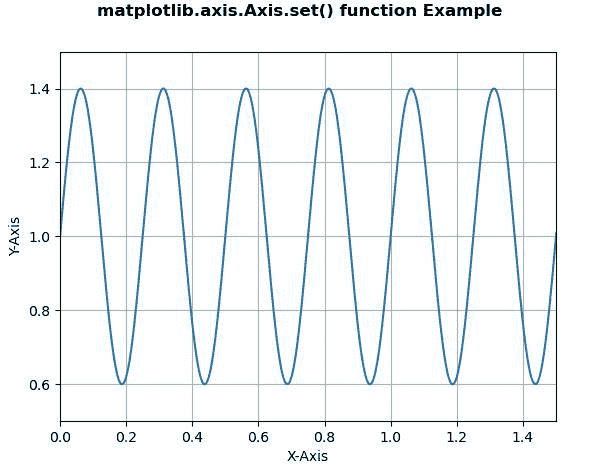
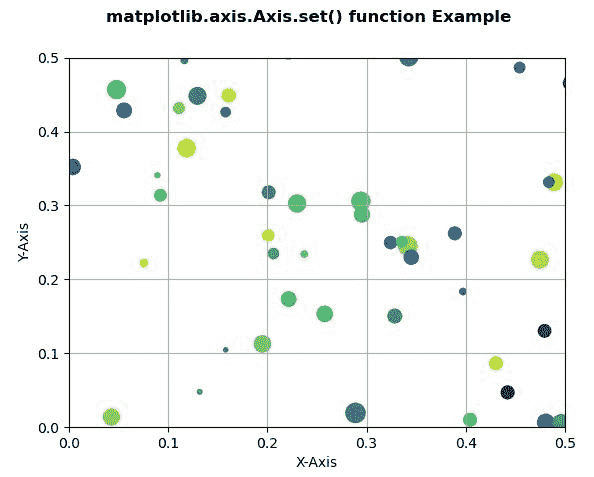

# Python 中的 Matplotlib.axis.Axis.set()函数

> 原文:[https://www . geesforgeks . org/matplotlib-axis-axis-set-function-in-python/](https://www.geeksforgeeks.org/matplotlib-axis-axis-set-function-in-python/)

[**Matplotlib**](https://www.geeksforgeeks.org/python-introduction-matplotlib/) 是 Python 中的一个库，是 NumPy 库的数值-数学扩展。这是一个神奇的 Python 可视化库，用于 2D 数组图，并用于处理更广泛的 SciPy 堆栈。

## Matplotlib.axis.Axis.set()函数

matplotlib 库的 Axis 模块中的 **Axis.set()函数**是一个属性批量设置器。传递 kwargs 以设置属性。

> **语法:** Axis.set(self，**kwargs)
> 
> **参数:**此方法不接受除**kwargs 以外的任何参数。
> 
> **返回值:**此方法不返回值。

以下示例说明 matplotlib.axis.Axis.set()函数在 matplotlib.axis:
**示例 1:**

## 蟒蛇 3

```py
# Implementation of matplotlib function
from matplotlib.axis import Axis
import matplotlib  
import matplotlib.pyplot as plt  
import numpy as np  

t = np.arange(0.0, 2, 0.001)  
s = 1 + np.sin(8 * np.pi * t)*0.4

fig, ax = plt.subplots()  
ax.plot(t, s)  

Axis.set(ax, xlabel ='X-Axis', ylabel ='Y-Axis',  
    xlim =(0, 1.5), ylim =(0.5, 1.5))  

ax.grid()  

fig.suptitle('matplotlib.axis.Axis.set() \
function Example\n', fontweight ="bold")  

plt.show() 
```

**输出:**



**例 2:**

## 蟒蛇 3

```py
# Implementation of matplotlib function
from matplotlib.axis import Axis
import numpy as np  
import matplotlib.pyplot as plt  
np.random.seed(19680801)  

fig, ax = plt.subplots()  

x, y, s, c = np.random.rand(4, 200)  
s *= 200

ax.scatter(x, y, s, c) 

Axis.set(ax, xlabel ='X-Axis', ylabel ='Y-Axis',  
   xlim =(0, 0.5), ylim =(0, 0.5))  

ax.grid()   

fig.suptitle('matplotlib.axis.Axis.set() \
function Example\n', fontweight ="bold")  

plt.show() 
```

**输出:**

