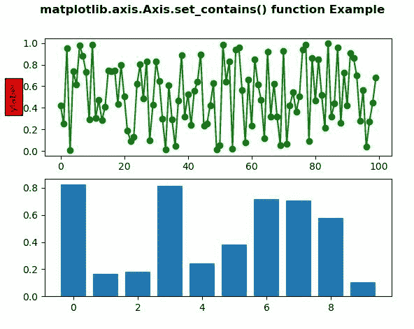
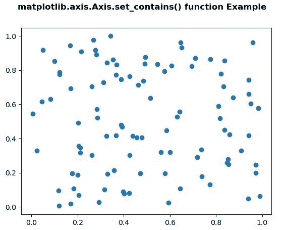

# Python 中 matplotlib . axis . axis . set _ contains()函数

> 原文:[https://www . geesforgeks . org/matplotlib-axis-axis-set _ contains-function-in-python/](https://www.geeksforgeeks.org/matplotlib-axis-axis-set_contains-function-in-python/)

[**Matplotlib**](https://www.geeksforgeeks.org/python-introduction-matplotlib/) 是 Python 中的一个库，是 NumPy 库的数值-数学扩展。这是一个神奇的 Python 可视化库，用于 2D 数组图，并用于处理更广泛的 SciPy 堆栈。

## matplotlib . axis . axis . set _ contains()函数

matplotlib 库的 Axis 模块中的 **Axis.set_contains()函数**用于为艺术家定义自定义的包含测试。

> **语法:** Axis.set_contains(self，picker)
> 
> **参数:**该方法接受以下参数。
> 
> *   **选取器:**此参数是自定义选取器功能，用于评估事件是否在艺术家内。
> 
> **返回值:**此方法不返回值。

以下示例说明 matplotlib . axis . axis . set _ contains()函数在 matplotlib.axis:
**示例 1:**

## 蟒蛇 3

```
# Implementation of matplotlib function
from matplotlib.axis import Axis
import matplotlib.pyplot as plt  
from matplotlib.lines import Line2D  
from matplotlib.patches import Rectangle  
from matplotlib.text import Text  
from matplotlib.image import AxesImage  
import numpy as np  
from numpy.random import rand  

fig, (ax1, ax2) = plt.subplots(2, 1)  
ax1.set_ylabel('ylabel', picker = True,  
               bbox = dict(facecolor ='red'))  

line, = ax1.plot(rand(100), 'go-')  

ax2.bar(range(10), rand(10), picker = True)  

for label in ax2.get_xticklabels():   
    label.set_picker(True)  

def onpick1(event):  

    if isinstance(event.artist, Line2D):  
        thisline = event.artist  
        xdata = thisline.get_xdata()  
        ydata = thisline.get_ydata()  
        ind = event.ind  
        print('onpick1 line:', np.column_stack([xdata[ind],  
                                                ydata[ind]]))  

    elif isinstance(event.artist, Rectangle):  
        patch = event.artist  
        print('onpick1 patch:', patch.get_path())  

    elif isinstance(event.artist, Text):  
        text = event.artist  
        print('onpick1 text:', text.get_text())  

Axis.set_contains(ax2, picker = onpick1) 
fig.canvas.mpl_connect('pick_event', onpick1)

fig.suptitle('matplotlib.axis.Axis.set_contains() \
function Example\n', fontweight ="bold")  

plt.show() 
```

**输出:**



**点击图:**

```
onpick1 text: ylabel
onpick1 patch: Path(array([[0., 0.],
       [1., 0.],
       [1., 1.],
       [0., 1.],
       [0., 0.]]), array([ 1,  2,  2,  2, 79], dtype=uint8))
onpick1 patch: Path(array([[0., 0.],
       [1., 0.],
       [1., 1.],
       [0., 1.],
       [0., 0.]]), array([ 1,  2,  2,  2, 79], dtype=uint8))

```

**例 2:**

## 蟒蛇 3

```
# Implementation of matplotlib function
from matplotlib.axis import Axis
import matplotlib.pyplot as plt  
from matplotlib.lines import Line2D  
from matplotlib.patches import Rectangle  
from matplotlib.text import Text  
from matplotlib.image import AxesImage  
import numpy as np  
from numpy.random import rand  

def line_picker(line, mouseevent):  

    if mouseevent.xdata is None:  
        return False, dict()  

    xdata = line.get_xdata()  
    ydata = line.get_ydata()  
    maxd = 0.05
    d = np.sqrt(  
        (xdata - mouseevent.xdata)**2 + (ydata - mouseevent.ydata)**2)  

    ind, = np.nonzero(d <= maxd)  

    if len(ind):  

        pickx = xdata[ind]  
        picky = ydata[ind]  
        props = dict(ind = ind, pickx = pickx, picky = picky)  
        return True, props  

    else:  
        return False, dict()  

def onpick2(event):  

    print('Result :', event.pickx, event.picky)  

fig, ax = plt.subplots()  
ax.plot(rand(100), rand(100), 'o')  

Axis.set_contains(ax, picker = line_picker) 

fig.canvas.mpl_connect('pick_event', onpick2) 

fig.suptitle('matplotlib.axis.Axis.set_contains() \
function Example\n', fontweight ="bold")  

plt.show() 
```

**输出:**

