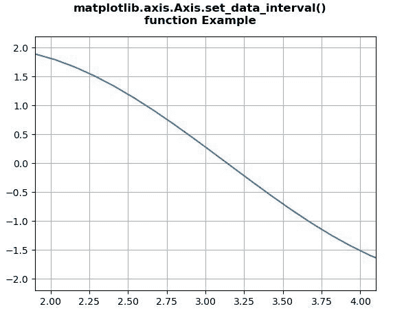
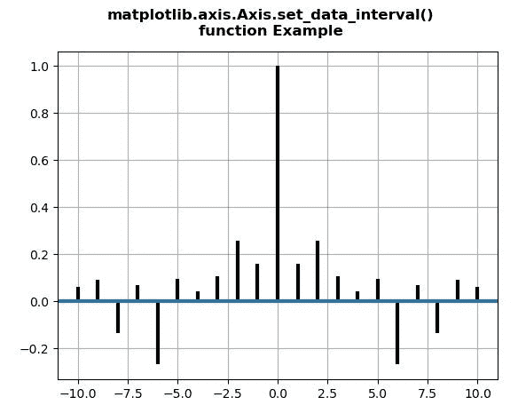

# Python 中的 matplotlib . axis . axis . set _ data _ interval()函数

> 原文:[https://www . geesforgeks . org/matplotlib-axis-axis-set _ data _ interval-python 中的函数/](https://www.geeksforgeeks.org/matplotlib-axis-axis-set_data_interval-function-in-python/)

[**Matplotlib**](https://www.geeksforgeeks.org/python-introduction-matplotlib/) 是 Python 中的一个库，是 NumPy 库的数值-数学扩展。这是一个神奇的 Python 可视化库，用于 2D 数组图，并用于处理更广泛的 SciPy 堆栈。

## matplotlib . axis . axis . set _ data _ interval()函数

matplotlib 库的轴模块中的 **Axis.set_data_interval()函数**用于设置轴数据限制。这个方法是内部使用的。

> **语法:** Axis.set_data_interval(self，vmin，vmax，ignore=False)
> 
> **参数:**该方法接受以下参数。
> 
> *   **vmin:** 此参数为最小数据限制。
> *   **vmax:** 此参数为最大数据限制。
> 
> **返回值:**此方法返回不包含任何值。

下面的例子说明了 matplotlib . axis . axis . set _ data _ interval()函数在 matplotlib.axis:
中的作用

**例 1:**

## 蟒蛇 3

```py
# Implementation of matplotlib function
from matplotlib.axis import Axis
import matplotlib.pyplot as plt
import numpy as np 

fig = plt.figure()

x = np.linspace(0,4*np.pi,100)
y = 2*np.sin(x)

ax = fig.add_subplot()
ax.plot(x,y)

ax.xaxis.set_data_interval(2, 4 ,True)

ax.grid() 

fig.suptitle("""matplotlib.axis.Axis.set_data_interval()
function Example\n""", fontweight ="bold")  

plt.show()
```

**输出:**



**例 2:**

## 蟒蛇 3

```py
# Implementation of matplotlib function
from matplotlib.axis import Axis
import matplotlib.pyplot as plt
import numpy as np 

np.random.seed(10**7)  
geeks = np.random.randn(40)  

fig, ax = plt.subplots()  
ax.acorr(geeks, usevlines = True,  
         normed = True,lw = 3)  

ax.grid(True)

ax.xaxis.set_data_interval(-10 , 10)

fig.suptitle("""matplotlib.axis.Axis.set_data_interval()
function Example\n""", fontweight ="bold")  

plt.show()
```

**输出:**

