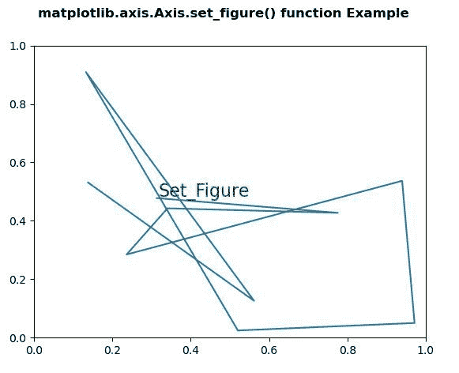
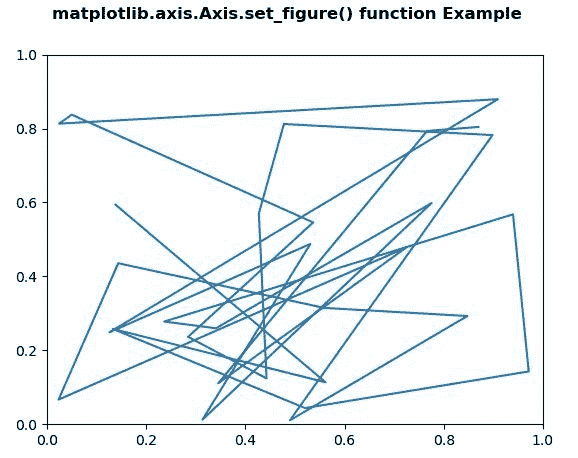

# Python 中的 matplotlib . axis . axis . set _ figure()函数

> 原文:[https://www . geesforgeks . org/matplotlib-axis-axis-set _ figure-function-in-python/](https://www.geeksforgeeks.org/matplotlib-axis-axis-set_figure-function-in-python/)

[**Matplotlib**](https://www.geeksforgeeks.org/python-introduction-matplotlib/) 是 Python 中的一个库，是 NumPy 库的数值-数学扩展。这是一个神奇的 Python 可视化库，用于 2D 数组图，并用于处理更广泛的 SciPy 堆栈。

## matplotlib . axis . axis . set _ figure()函数

matplotlib 库的轴模块中的 **Axis.set_figure()函数**用于设置该轴的图形。

> **语法:**axis . set _ fig(self，fig)
> 
> **参数:**该方法接受以下参数。
> 
> *   **fig:** 他的参数是 fig 实例。
> 
> **返回值:**此方法不返回值。

以下示例说明 matplotlib . axis . axis . set _ fig()函数在 matplotlib.axis:
**示例 1:**

## 蟒蛇 3

```
# Implementation of matplotlib function
from matplotlib.axis import Axis
import numpy as np 
import matplotlib.pyplot as plt 
import matplotlib.lines as lines 
import matplotlib.transforms as mtransforms 
import matplotlib.text as mtext 

class GFGfun(lines.Line2D): 
    def __init__(self, *args, **kwargs): 
        self.text = mtext.Text(0, 0, '') 
        lines.Line2D.__init__(self, *args, **kwargs) 
        self.text.set_text(self.get_label()) 

    def set_figure(self, figure): 
        self.text.set_figure(figure) 
        lines.Line2D.set_figure(self, figure) 

    def set_axes(self, axes): 
        self.text.set_axes(axes) 
        lines.Line2D.set_axes(self, axes) 

    def set_transform(self, transform): 
        # 2 pixel offset 
        texttrans = transform + mtransforms.Affine2D().translate(2, 2) 
        self.text.set_transform(texttrans) 
        lines.Line2D.set_transform(self, transform) 

    def set_data(self, x, y): 
        if len(x): 
            self.text.set_position((x[-1], y[-1])) 

        lines.Line2D.set_data(self, x, y) 

    def draw(self, renderer): 
        lines.Line2D.draw(self, renderer) 
        self.text.draw(renderer) 

np.random.seed(10**7) 

fig, ax = plt.subplots() 
x, y = np.random.rand(2, 10) 
line = GFGfun(x, y, mfc ='green', 
              ms = 12,  
              label ='Set_Figure') 

line.text.set_color('green') 
line.text.set_fontsize(16) 

ax.add_line(line)

fig.suptitle('matplotlib.axis.Axis.set_figure() \
function Example\n', fontweight ="bold")  

plt.show() 
```

**输出:**



**例 2:**

## 蟒蛇 3

```
# Implementation of matplotlib function
from matplotlib.axis import Axis
import numpy as np 
import matplotlib.pyplot as plt 
import matplotlib.lines as lines 
import matplotlib.transforms as mtransforms 
import matplotlib.text as mtext 

class GFGfun(lines.Line2D): 
    def __init__(self, *args, **kwargs): 
        self.text = mtext.Text(0, 0, '') 
        lines.Line2D.__init__(self, *args, **kwargs) 
        self.text.set_text(self.get_label()) 

    def set_figure(self, figure): 
        self.text.set_figure(figure) 
        lines.Line2D.set_figure(self, figure) 

np.random.seed(10**7) 

fig, ax = plt.subplots() 
x, y = np.random.rand(2, 30) 
line = GFGfun(x, y, mfc ='green', 
              ms = 12, 
              label ='Label') 

line.text.set_color('green') 
line.text.set_fontsize(16) 

ax.add_line(line) 

fig.suptitle('matplotlib.axis.Axis.set_figure() \
function Example\n', fontweight ="bold")  

plt.show() 
```

**输出:**

