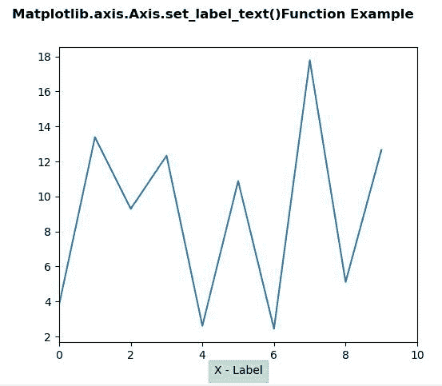
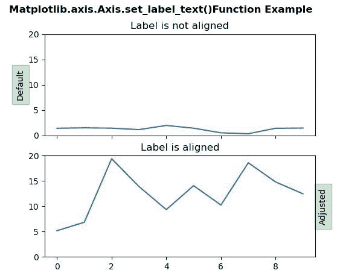

# Python 中的 matplotlib . axis . axis . set _ label _ text()函数

> 原文:[https://www . geeksforgeeks . org/matplotlib-axis-axis-set _ label _ text-in-function-python/](https://www.geeksforgeeks.org/matplotlib-axis-axis-set_label_text-function-in-python/)

[**Matplotlib**](https://www.geeksforgeeks.org/python-introduction-matplotlib/) 是 Python 中的一个库，是 NumPy 库的数值-数学扩展。这是一个神奇的 Python 可视化库，用于 2D 数组图，并用于处理更广泛的 SciPy 堆栈。

## matplotlib . axis . axis . set _ label _ text()函数

matplotlib 库的 Axis 模块中的 **Axis.set_label_text()函数**用于设置轴标签的文本值。

> **语法:** Axis.set_label_text(self，label，fontdict=None，**kwargs)
> 
> **参数:**该方法接受以下参数。
> 
> *   **标签:**该参数为文本字符串。
> *   **fontdict :** 此参数是文本属性。
> 
> **返回值:**此方法不返回值。

下面的例子说明了 matplotlib . axis . axis . set _ label _ text()函数在 matplotlib.axis:
中的作用

**例 1:**

## 蟒蛇 3

```
# Implementation of matplotlib function 
from matplotlib.axis import Axis
import numpy as np
import matplotlib.pyplot as plt

fig, ax2 = plt.subplots(sharex = True)
fig.subplots_adjust(left=0.2, wspace=0.6)
box = dict(facecolor='green', pad=5, alpha=0.2)

ax2.plot(20*np.random.rand(10))
ax2.xaxis.set_label_text('X - Label', bbox=box)
ax2.set_xlim(0, 10)

fig.suptitle("Matplotlib.axis.Axis.set_label_text()\
Function Example", fontsize = 12, fontweight ='bold') 

plt.show()
```

**输出:**



**例 2:**

## 蟒蛇 3

```
# Implementation of matplotlib function 
from matplotlib.axis import Axis
import numpy as np
import matplotlib.pyplot as plt

fig, (ax1, ax2) = plt.subplots(2, 1, sharex = True)
fig.subplots_adjust(left=0.2, wspace=0.6)
box = dict(facecolor='green', pad=5, alpha=0.2)

np.random.seed(19680801)
ax1.plot(2*np.random.rand(10))
ax1.set_title('Label is not aligned')
ax1.yaxis.set_label_text('Default', bbox=box)
ax1.set_ylim(0, 20)

ax2.set_title('\nLabel is aligned')
ax2.plot(20*np.random.rand(10))
ax2.yaxis.set_label_text('Adjusted', bbox=box)
ax2.yaxis.set_label_position('right')
ax2.set_ylim(0, 20)

fig.suptitle("Matplotlib.axis.Axis.set_label_text()\
Function Example", fontsize = 12, fontweight ='bold') 

plt.show()
```

**输出:**

